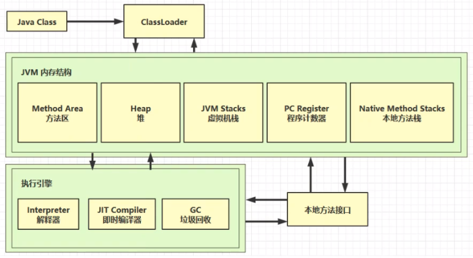

# 1. 什么是JVM

Java virtual Machine  Java程序的运行环境(Java二进制字节码的运行环境)

# 2. JVM好处

1.  一次编写，到处运行
2.  自动内存管理，垃圾回收功能
3.  数组下标越界检查
4.  多态

# 3. 比较jvm jre jdk

JDK(Java Development Kit)是用于支持Java程序开发的最小环境.

JRE(Java Runtime Environment)是支持Java 程序运行的标准环境。

Sun官方所定义的Java技术体系包括 以下几个组成部分： 

- Java程序设计语言 

- 各种硬件平台上的Java虚拟机 

- Class文件格式 

- Java API类库 

- 来自商业机构和开源社区的第三方Java类库 

