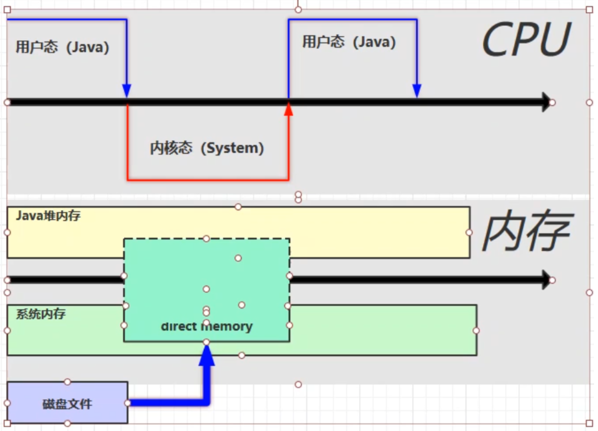

# 1. 程序计数器

程序计数器(是一个寄存器)是一个记录着当前线程所执行的字节码的行号指示器。


二进制字节码(jvm指令) -> 字节码解释器 -> 翻译成机器码 -> 交给CPU去执行

**程序计数器的特点：**

- **是线程私有的**(Java的多线程是通过CPU时间片轮转实现的，须知道它上次执行到哪个位置)

- 如果线程正在执行的是Java 方法，则这个计数器记录的是正在执行的虚拟机字节码指令地址

- 如果正在执行的是Native 方法，则这个技术器值为空（Undefined）

  (native 本地（如：System.currentTimeMillis()）方法是大多是通过C实现并未编译成需要执行的字节码指令，所以在计数器中当然是空（undefined）)

- **不会内存溢出**(此内存区域是唯一一个在Java虚拟机规范中没有规定任何OutOfMemoryError情况的区域)

# 2. 虚拟机栈

## 2.1 定义

Java虚拟机栈也是线程私有的，生命周期与线程相同。

每个方法被执行的时候，Java虚拟机都会同步创建一个**栈帧**。用于**存储局部变量表、操作数栈、动态链接、方法出口**等信息。每一个方法从调用直至执行完成的过程，就对应着一个栈帧在虚拟机栈中入栈到出栈的过程。

每个线程只能有一个活动栈帧，对应当前正在执行的那个方法。

**问题辨析：**

1.  垃圾回收是否涉及栈内存？

   不涉及，出栈即释放内存。

2.  栈内存分配越大越好？

   不是。物理内存一定，栈内存越来，可执行的线程越少。(一个线程分配一个栈内存)

3.  方法内的局部变量是否线程安全？

   - 如果方法内局部变量没有逃离方法的作用访问，他是线程安全的。
   - 如果局部变量引用了对象，并逃离方法的作用范围，需考虑线程安全。

## 2.2 内存溢出异常

线程请求的栈深度大于虚拟机所允许的深度，将抛出**StackOverflowError**异常。

如果虚拟机栈可以动态扩展（当前大部分的Java虚拟机都可动态扩展，只不过Java虚拟机规范中也允许固定长度的虚拟机栈），如果扩展时无法申请到足够的内存，就会抛出**OutOfMemoryError**异常。 

1.  栈帧过多导致内存溢出(无限递归)
2.  栈帧过大导致内存溢出

## 2.3 线程运行诊断(linux指令)

案例一：CPU占用过多(一个进程占90+%)

1.  定位
   - 用 **top** 定位那个进行对CPU的占用过高
   - **ps H -eo pid,tid,%cpu | grep 进程id**：用ps命令进一步定位是哪个线程引起的CPU占用过高
   - **jstack 进程id**：可以根据线程id找到有问题的进程，进一步定位到问题代码的源码行号

案例二：CPU运行很长时间都没有结果(死锁)

# 3. 本地方法栈

本地方法栈（Native Method Stack）与虚拟机栈所发挥的作用是非常相似的，它们之间的区别不过是**虚拟机栈为虚拟机执行Java方法**（也就是字节码）**服务**，而**本地方法栈则为虚拟机使用到的Native方法服务**。

**Navtive 方法是 Java 通过 JNI 直接调用本地 C/C++ 库**，可以认为是 **Native 方法相当于 C/C++ 暴露给 Java 的一个接口**，Java 通过调用这个接口从而调用到 C/C++ 方法。当线程调用 Java 方法时，虚拟机会创建一个栈帧并压入 Java 虚拟机栈。然而当它调用的是 native 方法时，虚拟机会保持 Java 虚拟机栈不变，也不会向 Java 虚拟机栈中压入新的栈帧，虚拟机只是简单地动态连接并直接调用指定的 native 方法。

与虚拟机栈一样，本地方法 栈区域也会抛出StackOverflowError和OutOfMemoryError异常。

# 4. 堆

## 4.1 定义

heap堆：所有的**对象实例以及数组**都要在堆上分配，但是随着JIT编译器的发展与逃逸分析技术逐渐成熟，栈上分配、标量替换优化技术将会导致一些微妙的变化发生，所有的对象都分配在堆上也渐渐变得不是那么“绝对”了。 

通过new关键字创建对象都会使用堆内存。

**特点**：

- 线程共享的，需考虑安全问题
- 有垃圾回收机制

## 4.2 堆内存溢出


## 4.3 堆内存诊断

1.  jps工具：查看当前系统中有哪些Java进程

2.  jmap工具：查看堆内存占用情况(命令：jmap -heap 进程id)

3.  jconsole工具：图形界面的，多功能的检测工具，可以连续监测

   

案例：垃圾回收后，内存占用仍然高(jvisualvm工具)

```Java
/**
 * 演示查看对象个数 堆转储 dump
 */
public class Demo1_13 {

  public static void main(String[] args) throws InterruptedException {
    List<Student> students = new ArrayList<>();
    for (int i = 0; i < 200; i++) {
      students.add(new Student());
      //            Student student = new Student();
    }
    Thread.sleep(1000000000L);
  }
}
class Student {
  private byte[] big = new byte[1024*1024];
}
```

> 每个student对象有1m，执行过程中循环200次，200m无法回收。


# 5. 方法区

## 5.1 定义

方法区（Method Area）与Java堆一样，是各个线程共享的内存区域，它用于**存储已被虚拟机加载的类信息、常量、静态变量、即时编译器编译后的代码等数据**。

## 5.2 组成


## 5.3 方法区内存溢出

1.8以前会导致**永久代**内存溢出

```
演示永久代内存溢出 java.lang.OutOfMemoryError: PermGen space 
-XX:MaxMetaspaceSize=8m
```

1.8以后会导致**元空间**内存溢出

```
演示元空间内存溢出 java.lang.OutOfMemoryError: Metaspace 
-XX:MaxMetaspaceSize=8m
```

## 5.4 运行时常量池

### 5.4.1 常量池

常量池，就是一张表，虚拟机指令根据这张常量表找到要执行的类名、方法名、参数类型、字面量等信息

**可以通过反编译来查看类的信息**：

`Javap -v 类的class字节码文件`

### 5.4.2 运行时常量池

运行时常量池，常量池是 *.class 文件中的，当该类被加载，它的常量池信息就会放入运行时常量池，并把里面的符号地址变为真实地址。

> 运行时常量池相对于常量池的另外一个重要特征是具备动态性，，Java语言并不要求常量一定只有编译期才能产生，运行期间也可能将新的常量放入池中。
>
> 既然运行时常量池是方法区的一部分，自然受到方法区内存的限制，当常量池无法再申请到内存时会抛出OutOfMemoryError异常。 

## 5.5 StringTable

几道面试题：

```Java
String s1 = "a"; 
String s2 = "b"; 
String s3 = "a" + "b";  //javac在编译期的优化，结果已经在编译期被确定为ab，放入常量池
String s4 = s1 + s2;   //new StringBUilder().append("a").append("b").toString() -> toString() = new String("ab"); new出来的对象实例放在堆中，s5在串池中，s4==s5 false
String s5 = "ab"; 
String s6 = s4.intern(); 

// 问 
System.out.println(s3 == s4);  //false
System.out.println(s3 == s5);  //true  都是常量池中的"ab"
System.out.println(s3 == s6);  //true

String x2 = new String("c") + new String("d");  //new String("cd")
String x1 = "cd"; 
x2.intern(); 

// 问，如果调换了【最后两行代码】的位置呢?true   如果是交换下jdk1.6呢?false
System.out.println(x1 == x2);  //false
```

### 5.5.1 StringTable特性

常量池中的信息，当类被加载时都会被加载到运行时常量池中，这时a b ab 都是常量池中的符号，还没有变成Java字符串对象。

当第一次使用它时(运行到那条语句)，他才变成对象，被放到串池StringTable中(没有放入，有就不放)。

> StringTable底层是 hashtable 结构，不能扩容。

```Java
/**
 * 演示字符串字面量也是【延迟】成为对象的
 */
public class TestString {
  public static void main(String[] args) {
    int x = args.length;
    System.out.println(); // 字符串个数 2158

    System.out.print("1");  //2159
    System.out.print("2");
    System.out.print("3");
    System.out.print("4");
    System.out.print("5");
    System.out.print("6");
    System.out.print("7");
    System.out.print("8");
    System.out.print("9");
    System.out.print("0");
    System.out.print("1"); // 字符串个数 2168
    System.out.print("2"); // 字符串个数 2168
    System.out.print("3");
    System.out.print("4");
    System.out.print("5");
    System.out.print("6");
    System.out.print("7");
    System.out.print("8");
    System.out.print("9");
    System.out.print("0");
    System.out.print(x); 
  }
}
```

**特性**：

- 常量池中的字符串仅是符号，第一次用到时才变为对象
- 利用串池的机制，来避免重复创建字符串对象
- 字符串**变量拼接的原理是 StringBuilder** （1.8）
- 字符串**常量拼接的原理是编译期优化**
- 可以使用 intern 方法，主动将串池中还没有的字符串对象放入串池
  * 1.8 将这个字符串对象尝试放入串池，如果有则并不会放入，如果没有则放入串池， **会把串池中的对象返回**
  * 1.6 将这个字符串对象尝试放入串池，如果有则并不会放入，如果**没有会把此对象复制一份**，放入串池，**会把串池中的对象返回**

```Java
// StringTable ["ab", "a", "b"]
public static void main(String[] args) {

  String x = "ab";
  String s = new String("a") + new String("b");  // 堆  new String("a")   new String("b") new String("ab")

  String s2 = s.intern(); // 将这个字符串对象尝试放入串池，如果有则并不会放入，如果没有则放入串池， 会把串池中的对象返回

  System.out.println( s2 == x);  //true   s2返回的是常量池中的"ab"
  System.out.println( s == x );  //false  s是堆中的“ab"
}
```

### 5.5.2 StringTable位置

1.6 StringTable在永久代中

1.7 1.8 StringTable在堆中，其他永久代的东西在方法区中


### 5.5.3 StringTable垃圾回收

StringTable在内存紧张时，会发生垃圾回收

### 5.5.4 StringTable调优

- 因为StringTable是有hashtable实现的，所以可以适当增加hashtable桶的个数，来减少字符串放入串池所需要的时间

  ```
  -XX:StringTableSize=xxxx
  ```

- 考虑是否需要将字符串对象入池

  可以通过intern方法减少重复数据入池

# 6. 直接内存

直接内存（Direct Memory）并不是虚拟机运行时数据区的一部分，也不是Java虚拟机规 范中定义的内存区域。是系统内存。这部分内存也被频繁地使用，也可能导致OutOfMemoryError 异常出现。

- 属于操作系统，常见于NIO操作时，**用于数据缓冲区**
- 分配回收成本较高，但读写性能高
- 不受JVM内存回收管理

## 6.1 读写流程

**普通io与使用DirectBuffer(直接内存)文件读写流程的区别**：

- 普通io

  

- 使用DirectBuffer

  

> 直接内存是操作系统和Java代码**都可以访问的一块区域**，无需将代码从系统内存复制到Java堆内存，从而提高了效率

## 6.2 释放原理

直接内存的回收不是通过JVM的垃圾回收来释放的，而是通过**unsafe.freeMemory**来手动释放。

```Java
//通过ByteBuffer申请1M的直接内存
ByteBuffer byteBuffer = ByteBuffer.allocateDirect(_1M);
```

通过申请直接内存，但JVM并不能回收直接内存中的内容，它是如何实现回收的呢？

1.  `allocateDirect`的实现

   ```Java
   public static ByteBuffer allocateDirect(int capacity) {
     return new DirectByteBuffer(capacity);
   }
   
   //DirectByteBuffer
   DirectByteBuffer(int cap) {   // package-private
   
     super(-1, 0, cap, cap);
     boolean pa = VM.isDirectMemoryPageAligned();
     int ps = Bits.pageSize();
     long size = Math.max(1L, (long)cap + (pa ? ps : 0));
     Bits.reserveMemory(size, cap);
   
     long base = 0;
     try {
       base = unsafe.allocateMemory(size); //申请内存
     } catch (OutOfMemoryError x) {
       Bits.unreserveMemory(size, cap);
       throw x;
     }
     unsafe.setMemory(base, size, (byte) 0);
     if (pa && (base % ps != 0)) {
       // Round up to page boundary
       address = base + ps - (base & (ps - 1));
     } else {
       address = base;
     }
     cleaner = Cleaner.create(this, new Deallocator(base, size, cap)); //通过虚引用，来实现直接内存的释放，this为虚引用的实际对象
     att = null;
   }
   ```

   > 这里调用了一个Cleaner的create方法，且后台线程还会对虚引用的对象监测，如果虚引用的实际对象（这里是DirectByteBuffer）被回收以后，就会调用Cleaner的clean方法，来清除直接内存中占用的内存

```Java
public void clean() {
  if (remove(this)) {
    try {
      this.thunk.run(); //调用run方法
    } catch (final Throwable var2) {
      AccessController.doPrivileged(new PrivilegedAction<Void>() {
        public Void run() {
          if (System.err != null) {
            (new Error("Cleaner terminated abnormally", var2)).printStackTrace();
          }

          System.exit(1);
          return null;
        }
      });
    }
```

对应对象的run方法

```Java
public void run() {
    if (address == 0) {
        // Paranoia
        return;
    }
    unsafe.freeMemory(address); //释放直接内存中占用的内存
    address = 0;
    Bits.unreserveMemory(size, capacity);
}
```

##### 直接内存的回收机制总结

- 使用了Unsafe类来完成直接内存的分配回收，回收需要主动调用freeMemory方法
- ByteBuffer的实现内部使用了Cleaner（虚引用）来检测ByteBuffer。一旦ByteBuffer被垃圾回收，那么会由ReferenceHandler来调用Cleaner的clean方法调用freeMemory来释放内存