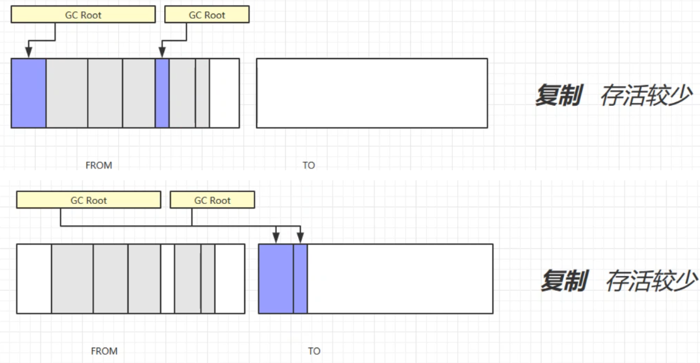
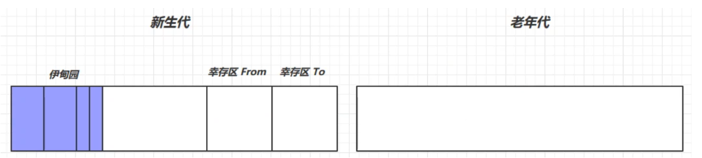
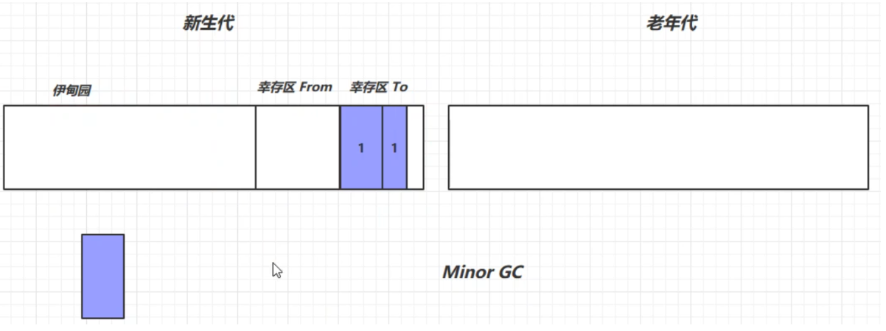
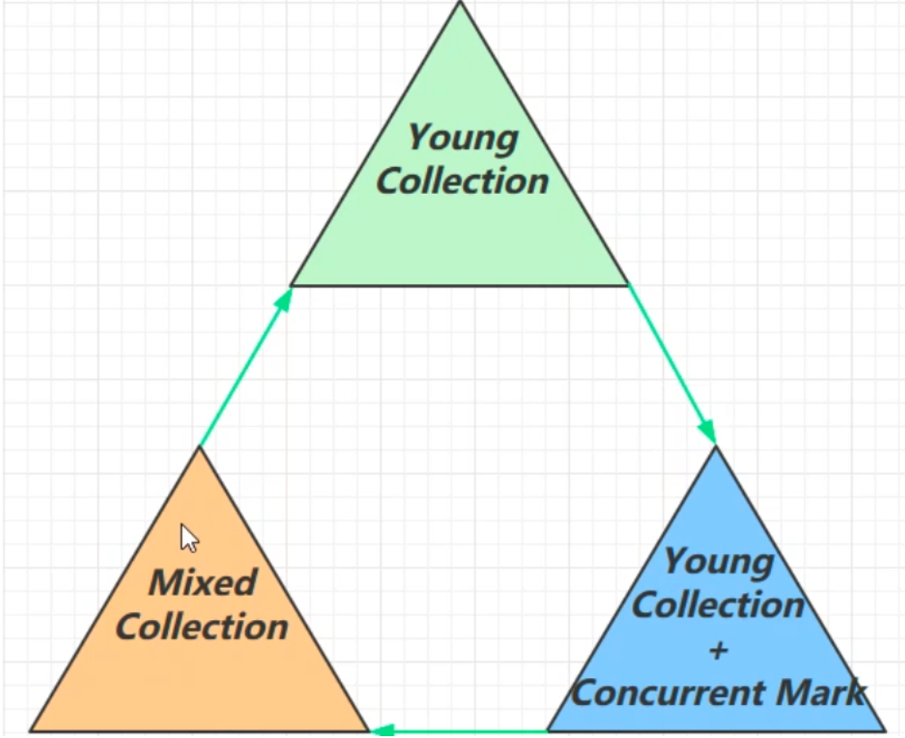
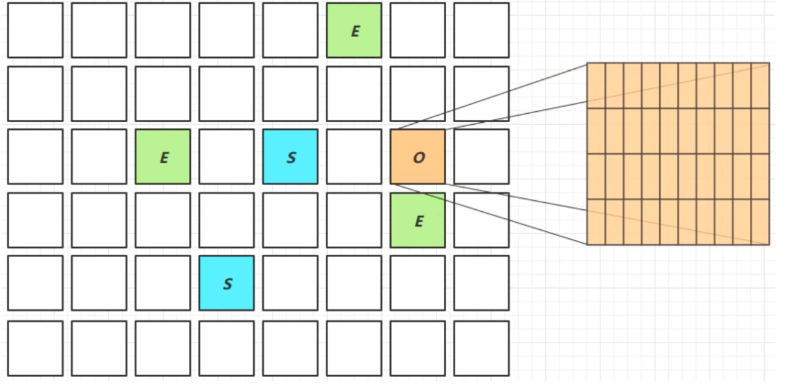
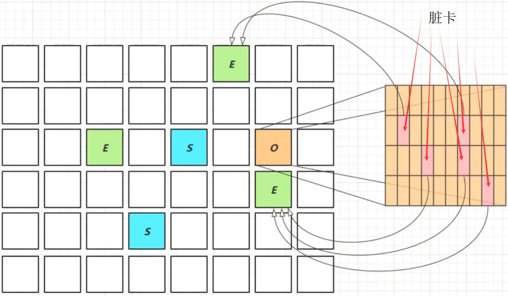

# 1. 如何判断对象可以回收

## 1.1 引用计数法

给对象中添加一个引用计数器，每当有 一个地方引用它时，计数器值就加1；当引用失效时，计数器值就减1；任何时刻计数器为0的对象就是不可能再被使用的。

**弊端**：很难解决对象之间相互循环引用的问题。（两个对象的计数都为1，导致两个对象都无法被释放）

所以虚拟机并不是通过引用计数法来判断对象是否存活。

## 1.2 可达性分析算法

Java虚拟机中的垃圾回收**采用可达性分析**来探索所有存活的对象。

扫描堆中的对象，看是否能够沿着 **GC Root对象** 为起点的引用链找到该对象，找不到，表示可以回收。

- JAVA语言中，GC Roots对象包括：
  - 虚拟机栈(栈帧中的本地变量表)中引用的对象
  - 方法区中**类静态属性**引用的对象
  - 方法区中**常量**引用的对象
  - **本地方法栈**中JNI（即一般说的Native方法）引用的对象

## 1.3 四种引用


#### 1.3.1 强引用

只有GC Root**都不通过强引用引用**该对象时，才会回收**强引用**对象

- 如上图B、C对象都不引用A1对象时，A1对象才会被回收

#### 1.3.2 软引用

仅有软引用引用该对象时，在垃圾回收后，内存仍不足时，才会回收软引用所引用的对象

- B不再强引用A2对象，在垃圾回收后，仍内存不足时，会回收软引用所引用的A2对象。

##### 软引用应用案例

> list强引用byte数组，不会垃圾回收，堆内存溢出。

```Java
//-Xmx20m
private static final int _4MB = 4 * 1024 * 1024;
public static void main(String[] args) throws IOException {
  List<byte[]> list = new ArrayList<>();
  for (int i = 0; i < 5; i++) {
    list.add(new byte[_4MB]);
  }
  System.in.read();
}
```

出现异常：java.lang.OutOfMemoryError: Java heap space

**采用软引用**：

```Java
/**
 * 演示软引用
 * -Xmx20m -XX:+PrintGCDetails -verbose:gc
 */
public class Demo2_3 {

  private static final int _4MB = 4 * 1024 * 1024;
  
  public static void main(String[] args) throws IOException {
    soft();
  }

  public static void soft() {
    // list --> SoftReference --> byte[]
    List<SoftReference<byte[]>> list = new ArrayList<>();
    for (int i = 0; i < 5; i++) {
      //使用软引用对象 list和SoftReference是强引用，而SoftReference和byte数组则是软引用
      SoftReference<byte[]> ref = new SoftReference<>(new byte[_4MB]);
      System.out.println(ref.get());
      list.add(ref);
      System.out.println(list.size());
    }
    System.out.println("循环结束：" + list.size());
    
    for (SoftReference<byte[]> ref : list) {
      System.out.println(ref.get());
    }
  }
}
```


> - 最后循环打印list对象，只打印出了最后一个软引用对象引用的对象，其他的都被垃圾回收了
>
> - 如果在垃圾回收时发现内存不足，在回收软引用所指向的对象时，**软引用本身不会被清理**

##### 使用引用队列回收软引用对象

```Java
/**
 * 演示软引用, 配合引用队列
 */
public class Demo2_4 {
  private static final int _4MB = 4 * 1024 * 1024;

  public static void main(String[] args) {
    List<SoftReference<byte[]>> list = new ArrayList<>();

    // 引用队列：利用引用队列回收软引用对象
    ReferenceQueue<byte[]> queue = new ReferenceQueue<>();

    for (int i = 0; i < 5; i++) {
      // 关联了引用队列， 当软引用所关联的 byte[]被回收时，软引用自己会加入到 queue 中去
      SoftReference<byte[]> ref = new SoftReference<>(new byte[_4MB], queue);
      System.out.println(ref.get());
      list.add(ref);
      System.out.println(list.size());
    }

    // 从队列中获取无用的 软引用对象，并移除
    Reference<? extends byte[]> poll = queue.poll();
    while( poll != null) {
      list.remove(poll);
      poll = queue.poll();
    }

    System.out.println("===========================");
    for (SoftReference<byte[]> reference : list) {
      System.out.println(reference.get());
    }

  }
}
```

> 查看引用队列中有无软引用，如果有，则将该软引用从存放它的集合中移除（这里为一个list集合）

#### 1.3.3 弱引用

仅被弱引用关联的对象只能生存到下一次垃圾收集发生之前。当垃圾收集器工作时，**无论当前内存是否足够， 都会回收掉**只被弱引用关联的对象。

- A3不再被B强引用，A3在垃圾回收时不论内存是否足够都会被回收。

**弱引用的使用和软引用类似**，只是将**SoftReference 换为了 WeakReference**

#### 1.3.4 虚引用

**必须配合引用队列**使用，主要配合 ByteBuffffer 使用，被引用对象回收时，会将虚引用入队，由 Reference Handler 线程调用虚引用相关方法释放直接内存。

- 虚引用的一个体现是**释放直接内存所分配的内存**，当引用的对象ByteBuffer被垃圾回收以后，虚引用对象Cleaner就会被放入引用队列中，然后调用Cleaner的clean方法来释放直接内存
- 如上图，B对象不再引用ByteBuffer对象，ByteBuffer就会被回收。但是直接内存中的内存还未被回收。这时需要将虚引用对象Cleaner放入引用队列中，然后调用它的clean方法来释放直接内存

#### 1.3.5 终结器引用

无需手动编码，但其内部**配合引用队列**使用，在垃圾回收时，终结器引用入队（被引用对象暂时没有被回收），再由 Finalizer 线程通过终结器引用找到被引用对象并调用它的 fifinalize方法，第二次 GC 时才能回收被引用对象。

所有的类都继承自Object类，Object类有一个finalize方法。

- 如上图，B对象不再引用A4对象。这是终结器对象就会被放入引用队列中，引用队列会根据它，找到它所引用的对象。然后调用被引用对象的finalize方法。调用以后，该对象就可以被垃圾回收了。

#### 1.3.6 引用队列

- 软引用和弱引用**可以配合**引用队列
  - 在**弱引用**和**虚引用**所引用的对象被回收以后，会将这些引用放入引用队列中，方便一起回收这些软/弱引用对象
- 虚引用和终结器引用**必须配合**引用队列
  - 虚引用和终结器引用在使用时会关联一个引用队列

# 2. 垃圾回收算法

## 2.1 标记清除


**定义**：清除算法，是指在虚拟机执行垃圾回收的过程中，先采用标记算法标记要回收的对象，然后垃圾收集器根据标记回收相应的内容。

- 这里的腾出内存空间并不是将内存空间的字节清0，而是记录下这段内存的起始结束地址，下次分配内存的时候，会直接**覆盖**这段内存

**缺点**：**会产生大量的内存碎片**。无法满足大对象的内存分配，一旦导致无法分配对象，那就会导致jvm启动gc，这就导致应用的响应速度变慢。

## 2.2 标记整理


**定义**：标记过程 仍然与“标记-清除”算法一样，但后续步骤不是直接对可回收对象进行清理，而是让所有存活的对象都向一端移动，然后直接清理掉端边界以外的内存。

**弊端**：需要整理存活对象，效率较低

## 2.3 复制算法




**定义**：将可用内存按容量划分为大小相等的两块，每次只使用其中的一块(from)。当这一块的内存用完了，就将还存活着的对象复制到另外一块(to)上面，然后再把已使用过的内存空间一次清理掉。再交换from与to两块区域。

优点：不会有内存碎片

缺点：需要占用双倍内存空间

# 3. 分代垃圾回收

**回收流程**：



1.  新创建的对象都被放在新生代伊甸园(Eden Space)中，当伊甸园的内存不足时，就会进行一次垃圾回收GC，这时的回收叫做Minor GC，Minor GC会将伊甸园存活的对象通过**复制算法**复制到幸存区的to空间，并让其寿命加1，交换两个幸存区from和to。





2.  再次创建对象，若新生代的伊甸园又满了，则会再次触发Minor GC，这时不光会回收伊甸园的垃圾，还会回收幸存区的垃圾对象，将存活对象放入幸存区TO中。回收以后交换两个幸存区，并将幸存区中的对象寿命加一。

   

3.  若幸存区的某个对象寿命超过一定阈值(最大15，4bit 1111)，会被放入老年代中。

   

4.  如果老年代的内存满了，会先尝试触发Minor GC，之后空间仍不足，会触发Full GC ，回收新生代和老年代所有垃圾对象。仍不足，抛出OOM异常。

## 3.1 触发Full GC的情况

- 老年代空间不足

  如果创建一个大对象，Eden区域当中放不下这个大对象，会直接保存在老年代当中，如果老年代空间也不足，就会触发Full GC。为了避免这种情况，最好就是不要创建太大的对象。

- 持久代空间不足

  如果有持久代空间的话，系统当中需要加载的类，调用的方法很多，同时持久代当中没有足够的空间，就出触发一次Full GC

- 显示调用System.gc()

## 3.2 GC相关VM参数


子线程内存溢出抛出的异常跟所有其他的异常其实是一样的，所以不会让主线程停止运行，而主线程的堆状态是跟子线程抛出异常时相同的，因为它们共用堆内存，看程序运行结束的堆状态信息也能体现这一点

## 3.3 GC分析

**大对象处理策略**

当遇到一个**较大的对象**时，就算新生代的**伊甸园**为空，也**无法容纳该对象**时，会将该对象**直接晋升为老年代**

**线程内存溢出**

某个线程的内存溢出了而抛异常（out of memory），不会让其他的线程结束运行

这是因为当一个线程**抛出OOM异常后**，**它所占据的内存资源会全部被释放掉**，从而不会影响其他线程的运行，**进程依然正常**

# 4. 垃圾回收器

**相关概念**：

**并行收集**：指多条垃圾收集线程并行工作，但此时**用户线程仍处于等待状态。**

**并发收集**：指用户线程与垃圾收集线程**同时工作**(不一定是并行的，可能会交替执行)。**用户程序在继续运行**，而垃圾收集程序运行在另一个CPU上。

**吞吐量**：**吞吐量**：即CPU用于**运行用户代码的时间**与CPU**总消耗时间**的比值（吞吐量 = 运行用户代码时间 / ( 运行用户代码时间 + 垃圾收集时间 )），也就是。例如：虚拟机共运行100分钟，垃圾收集器花掉1分钟，那么吞吐量就是99%。

1.  串行
   - 单线程
   - 堆内存较小，适合个人电脑
2. 吞吐量优先
   - 对线程
   - 堆内存较大，适合多核CPU
   - 让单位时间内，STW(stop the world)的时间最短  0.2+0.2 = 0.4，垃圾回收时间占比最低，这样就称吞吐量高（多食少餐）
3.  响应时间优先
   - 对线程
   - 堆内存较大，适合多核CPU
   - 尽可能让单次STW的时间最短  0.1+0.1+0.1+0.1+0.1 = 0.5（少食多餐）

## 4.1 串行（Serial）收集器


**安全点**：让其他线程都在这个点停下来，以免垃圾回收时移动对象地址，使得其他线程找不到被移动的对象。

因为是串行的，所以只有一个垃圾回收线程。且在该线程执行回收工作时，其他线程进入**阻塞**状态。

#### 1. Serial 收集器（新生代收集器）

 Serial收集器是一个**单线程的收集器**，但它的“单线程”的意义并**不仅仅是**说明**它只会使用一个CPU或一条收集线程去完成垃圾收集工作**，更重要的是**在它进行垃圾收集时，必须暂停其他所有的工作线程（Stop The World），直到它收集结束**。

Serial收集器是最基本的、发展历史最悠久的收集器

**特点：**单线程、简单高效（与其他收集器的单线程相比），采用**复制算法**。对于限定单个CPU的环境来说，Serial收集器由于没有线程交互的开销，专心做垃圾收集自然可以获得最高的单线程手机效率。收集器进行垃圾回收时，必须暂停其他所有的工作线程，直到它结束（Stop The World）

#### 2. Serial Old 收集器（老年代收集器）

Serial Old是Serial收集器的**老年代版本**

**特点**：同样是单线程收集器，采用**标记-整理算法**

## 4.2 吞吐量优先（Parallel Scavenge收集器 ）

#### 1. ParNew 收集器（新生代收集器）

ParNew收集器其实就是**Serial收集器的多线程版本**，可与CMS收集器配合工作。

**特点**：多线程、ParNew收集器**默认开启的收集线程数与CPU的数量相同**，在CPU非常多的环境中，可以使用-XX:ParallelGCThreads参数来限制垃圾收集的线程数。和Serial收集器一样**存在Stop The World问题**


#### 2. Parallel Scavenge收集器（新生代收集器）

无法与CMS收集器配合工作

JDK 1.8默认使用的垃圾回收器，与ParNew 收集器收集器相比，Parallel Scavenge收集器的目标则是达到 一个可控制的吞吐量（Throughput）。

Parallel Scavenge收集器**使用两个参数控制吞吐量**（两个参数矛盾）：

- XX:MaxGCPauseMillis 控制最大的垃圾收集停顿时间（堆内存变大，每次垃圾回收时间变长）
- XX:GCTimeRatio（=1/(1+radio)） 垃圾收集时间占总时间的比率(达不到要求，PS收集器会调整堆内存的大小，一般调大，增大后，垃圾回收次数变得不频繁，垃圾回收总时间↓，吞吐量提高↑，达到要求)

**GC自适应调节策略**（-XX:+UseAdptiveSizePolicy)：**虚拟机会根据系统的运行状况收集性能监控信息，动态设置 新生代的大小（-Xmn）、Eden与Survivor区的比例（-XX:SurvivorRation）、晋升老年代的对象年龄（-XX:PretenureSizeThreshold）等参数以提供最优的停顿时间和最高的吞吐量**，这种调节方式称为GC的自适应调节策略。

#### 3. Parallel Old收集器

Parallel Scavenge收集器的老年代版本。使用**多线程和“标记-整理”算法**。

直到Parallel Old收集器出现后，“吞吐量优先”收集器终于有了比较名副其实的应用组合，在注重吞吐量以及CPU资源敏感的场合，都可以优先考虑**Parallel Scavenge加Parallel Old收集器**。

## 4.3 响应时间优先 CMS(Concurrent Mark Sweep)收集器

CMS（Concurrent Mark Sweep）收集器是一种以**获取最短回收停顿时间为目标**的**老年代收集器**。

**特点**：**并发标记-清除**收集器。并发收集、低停顿，但是会产生内存碎片。

**应用场景**：重视程序响应速度的应用。如B/S系统


CMS的垃圾回收过程分为以下四个步骤：

- 初始标记：标记GC Roots能直接关联到的对象，速度很快（但存在Stop The World）
- 并发标记：进行GC Roots Tracing的过程，找出存活对象，用户线程可并发执行
- 重新标记：为了修正并发标记期间因用户程序继续运作而导致标记产生变动的那一部分对象的标记记录。（STW问题）
- 并发清除：对标记的对象进行清除回收

CMS收集器的内存回收过程是与用户线程一起**并发执行**的。

## 4.4 G1收集器(Garbage First)

JDK 9 以后默认使用，替代了CMS收集器。

G1把连续的Java堆划分为多个大小相等的独立区域（region），每一个Region都可以根据需要，扮演新生代的Eden Survivor 或者老年代空间。

**参数**：

- -XX:+UseG1GC：开启G1收集器，JDK9+默认，其他需设置
- -XX:G1HeapRegionSize：设置Region区域大小，取值范围1MB-32MB，且应为2的N次幂
- -XX:MaxGCPauseMillis：设定允许的手机停顿时间，默认200毫秒

**适用场景**：

- 同时注重吞吐量和低延迟（响应时间）
- 超大堆内存，会将内存划分为多个大小相等的region区域
- 整体上使用**标记-整理算法**，两个区域之间是**复制算法**。


### 4.4.1 G1垃圾回收阶段



新生代伊甸园垃圾回收 —–> 内存不足，新生代回收+并发标记 —–> 回收新生代伊甸园、幸存区、老年代内存  ——> 新生代伊甸园垃圾回收(重新开始)

**G1收集器的运作过程**：

- **初始标记**：标记GC Roots能直接关联到的对象，需停顿线程，耗时很短（STW）
- **并发标记**：老年代占用堆空间比例达到阈值时，进行并发标记。从GC Root开始对堆对象进行可达性分析，找出要回收的对象。与线程并发执行
- **最终标记**：处理并发阶段结束后仍遗留的对象（并发阶段，用户线程执行产生的垃圾对象）（STW）
- **筛选回收**：将决定回收的Region的存活对象复制到空的Region中，再清理掉整个旧的Region的全部空间。（STW）

### 4.4.2 Full GC

SerialGC

新生代内存不足发生的垃圾收集 - minor gc

老年代内存不足发生的垃圾收集 - full gc

ParallelGC

新生代内存不足发生的垃圾收集 - minor gc

老年代内存不足发生的垃圾收集 - full gc

CMS

新生代内存不足发生的垃圾收集 - minor gc

老年代内存不足

G1

新生代内存不足发生的垃圾收集 - minor gc

老年代内存不足（老年代所占内存超过阈值）

- 如果垃圾产生速度慢于垃圾回收速度，不会触发Full GC，还是并发地进行清理
- 如果垃圾产生速度快于垃圾回收速度，便会触发Full GC。

### 4.4.3 Young Collection跨代引用

为了解决跨代引用带来的问题，垃圾收集器在Region建立了名为记忆集（Remembered Set）的数据结构，用以避免把整个老年代加进GC Roots 扫描范围。

- 卡表（Card Table）与 记忆集（Remembered Set）
  - 记忆集：是一种用于记录从非收集区域指向收集区域的指针集合的抽象数据结构。
  - 卡表：记忆集的一种具体实现。
    - 卡页：卡表最简单的形式是一个字节数组，数组的每一个元素都对应着其标识的内存区域中一块特定大小的内存块（512KB），这个内存块被称为卡页。
    - 只要卡页内有一个对象或更多引用了新生代对象，该数组元素的值标为1，该区域被称为脏卡。





### 4.4.4 Remark

重新标记阶段：

在垃圾回收时，收集器处理对象的过程中，从GC Roots进行可达性分析

- 黑色：对象已被垃圾收集器访问过，且这个对象的所有引用都已经扫描过。
- 灰色：对象已被垃圾收集器访问过，但这个对象上至少还存在一个引用没被扫描过。
- 白色：未被垃圾收集器访问过。


在并发标记过程中，垃圾回收线程与用户线程并发执行，可能会出现：

- ABC都被处理后，用户线程断开了BC的引用（原本消亡的对象标记为存活）
- ABC都被处理后，用户线程将A -> C （A引用C）（原本存活的对象标记为消亡，会发生错误）

解决方案：

- 在对象的引用发生改变时，写屏障的指令就会执行，会把A放入一个队列（satb_mark_queue）中（A变灰）。并发标记结束后，在重新标记阶段处理队列中的对象。

- 黑色对象一旦新插入了指向白色对象的引用之后，他就变为灰色对象了。

### 4.4.5 JDK 8u20 字符串去重

过程

- 将所有新分配的字符串（底层是char[]）放入一个队列
- 当新生代回收时，G1并发检查是否有重复的字符串
- 如果字符串的值一样，就让他们**引用同一个字符串对象**
- 注意，其与String.intern的区别
  - intern关注的是字符串对象
  - 字符串去重关注的是char[]
  - 在JVM内部，使用了不同的字符串标

优点与缺点

- 节省了大量内存
- 新生代回收时间略微增加，导致略微多占用CPU

### 4.4.6 JDK 8u40 并发标记类卸载

在并发标记阶段结束以后，就能知道哪些类不再被使用。如果一个类加载器的所有类都不在使用，则卸载它所加载的所有类

### 4.4.7 JDK 8u60 回收巨型对象

- 一个对象大于region的一半时，就称为巨型对象

- G1不会对巨型对象进行拷贝

- 回收时被优先考虑

- G1会跟踪老年代所有incoming引用，如果老年代incoming引用为0的巨型对象就可以在新生代垃圾回收时处理掉

  

# 5. GC调优

查看虚拟机参数命令：

```
-XX:+PrintFlagsFinal -version | findstr "GC"
```

### 5.1 调优领域

- 内存
- 锁竞争
- CPU占用
- IO
- GC

### 5.2 确定目标

低延迟/高吞吐量？ 选择合适的GC

- CMS G1 ZGC
- ParallelGC
- Zing

### 5.3 最快的GC是不发生GC

首先排除减少因为自身编写的代码而引发的内存问题

- 查看Full GC前后的内存占用，考虑以下几个问题
  - 数据是不是太多？
  - 数据表示是否太臃肿
    - 对象图
    - 对象大小
  - 是否存在内存泄漏

### 5.4 新生代调优

- 新生代的特点
  - 所有的new操作分配内存都是非常廉价的
    - TLAB
  - 死亡对象回收零代价
  - 大部分对象用过即死（朝生夕死）
  - MInor GC 所用时间远小于Full GC
- 新生代内存越大越好么？
  - 不是
    - 新生代内存太小：频繁触发Minor GC，会STW，会使得吞吐量下降
    - 新生代内存太大：老年代内存占比有所降低，会更频繁地触发Full GC。而且触发Minor GC时，清理新生代所花费的时间会更长
  - 新生代内存设置为内容纳[并发量*(请求-响应)]的数据为宜

### 5.5 幸存区调优

- 幸存区需要能够保存 **当前活跃对象**+**需要晋升的对象**
- 晋升阈值配置得当，让长时间存活的对象尽快晋升。