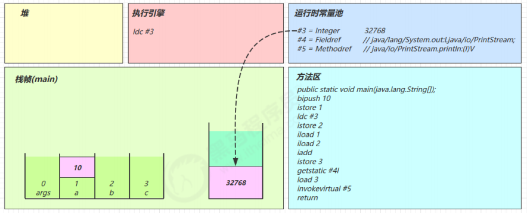
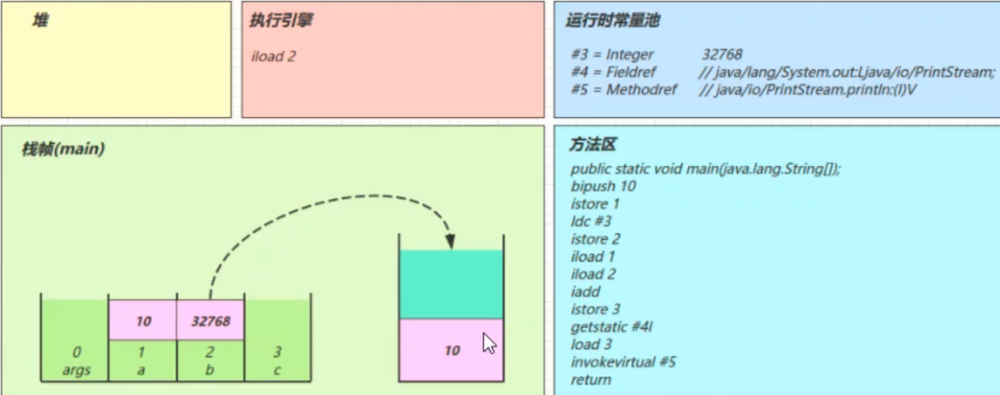
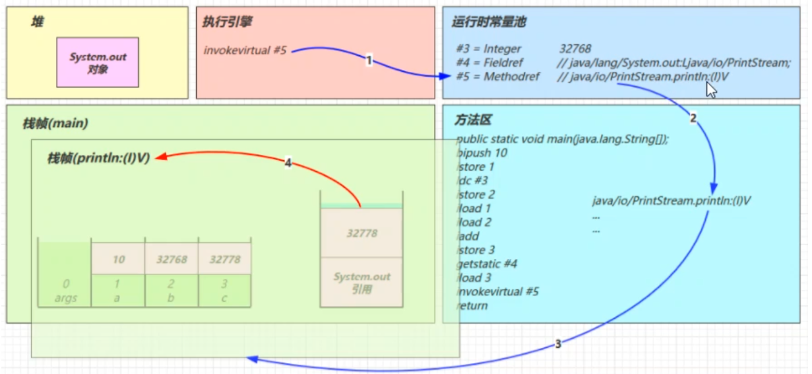

R

# 1. 类文件结构

```JAVA 
public class HelloWorld {
    public static void main(String[] args) {
        System.out.println("Hello World");
    }
}
```

javac编译后的class文件：

```
0000000 ca fe ba be 00 00 00 34 00 23 0a 00 06 00 15 09 
0000020 00 16 00 17 08 00 18 0a 00 19 00 1a 07 00 1b 07 
0000040 00 1c 01 00 06 3c 69 6e 69 74 3e 01 00 03 28 29 
0000060 56 01 00 04 43 6f 64 65 01 00 0f 4c 69 6e 65 4e 
0000100 75 6d 62 65 72 54 61 62 6c 65 01 00 12 4c 6f 63 
0000120 61 6c 56 61 72 69 61 62 6c 65 54 61 62 6c 65 01 
0000140 00 04 74 68 69 73 01 00 1d 4c 63 6e 2f 69 74 63 
0000160 61 73 74 2f 6a 76 6d 2f 74 35 2f 48 65 6c 6c 6f 
0000200 57 6f 72 6c 64 3b 01 00 04 6d 61 69 6e 01 00 16 
0000220 28 5b 4c 6a 61 76 61 2f 6c 61 6e 67 2f 53 74 72 
0000240 69 6e 67 3b 29 56 01 00 04 61 72 67 73 01 00 13 
0000260 5b 4c 6a 61 76 61 2f 6c 61 6e 67 2f 53 74 72 69 
0000300 6e 67 3b 01 00 10 4d 65 74 68 6f 64 50 61 72 61 
0000320 6d 65 74 65 72 73 01 00 0a 53 6f 75 72 63 65 46 
0000340 69 6c 65 01 00 0f 48 65 6c 6c 6f 57 6f 72 6c 64 
0000360 2e 6a 61 76 61 0c 00 07 00 08 07 00 1d 0c 00 1e 
0000400 00 1f 01 00 0b 68 65 6c 6c 6f 20 77 6f 72 6c 64 
0000420 07 00 20 0c 00 21 00 22 01 00 1b 63 6e 2f 69 74 
0000440 63 61 73 74 2f 6a 76 6d 2f 74 35 2f 48 65 6c 6c 
0000460 6f 57 6f 72 6c 64 01 00 10 6a 61 76 61 2f 6c 61 
0000500 6e 67 2f 4f 62 6a 65 63 74 01 00 10 6a 61 76 61 
0000520 2f 6c 61 6e 67 2f 53 79 73 74 65 6d 01 00 03 6f 
0000540 75 74 01 00 15 4c 6a 61 76 61 2f 69 6f 2f 50 72 
0000560 69 6e 74 53 74 72 65 61 6d 3b 01 00 13 6a 61 76 
0000600 61 2f 69 6f 2f 50 72 69 6e 74 53 74 72 65 61 6d 
0000620 01 00 07 70 72 69 6e 74 6c 6e 01 00 15 28 4c 6a 
0000640 61 76 61 2f 6c 61 6e 67 2f 53 74 72 69 6e 67 3b 
0000660 29 56 00 21 00 05 00 06 00 00 00 00 00 02 00 01 
0000700 00 07 00 08 00 01 00 09 00 00 00 2f 00 01 00 01 
0000720 00 00 00 05 2a b7 00 01 b1 00 00 00 02 00 0a 00 
0000740 00 00 06 00 01 00 00 00 04 00 0b 00 00 00 0c 00 
0000760 01 00 00 00 05 00 0c 00 0d 00 00 00 09 00 0e 00 
0001000 0f 00 02 00 09 00 00 00 37 00 02 00 01 00 00 00
0001020 09 b2 00 02 12 03 b6 00 04 b1 00 00 00 02 00 0a 
0001040 00 00 00 0a 00 02 00 00 00 06 00 08 00 07 00 0b 
0001060 00 00 00 0c 00 01 00 00 00 09 00 10 00 11 00 00 
0001100 00 12 00 00 00 05 01 00 10 00 00 00 01 00 13 00 
0001120 00 00 02 00 14
```

根据JVM规范，类文件结构如下：

```
ClassFile{
  u4 			 			 magic
  u2             minor_version;    
  u2             major_version;    
  u2             constant_pool_count;    
  cp_info        constant_pool[constant_pool_count-1];    
  u2             access_flags;    
  u2             this_class;    
  u2             super_class;   
  u2             interfaces_count;    
  u2             interfaces[interfaces_count];   
  u2             fields_count;    
  field_info     fields[fields_count];   
  u2             methods_count;    
  method_info    methods[methods_count];    
  u2             attributes_count;    
  attribute_info attributes[attributes_count];
}
```

#### 1.1 魔数

**u4 magic**：确定这个文件是否为一个能被虚拟机接受的class文件。

字节码文件的头四个字节：

0000000 **ca fe ba be** 00 00 00 34 00 23 0a 00 06 00 15 09

#### 1.2 版本号

0000000 ca fe ba be **00 00 00 34** 00 23 0a 00 06 00 15 09

00 00 ：次版本号  **u2 minor_version**;

00 34：主版本号   **u2 major_version**;    34H=52，代表JDK8

#### 1.3 常量池

常量池为class文件里的资源仓库，占空间大。

00 23：代表常量池有34个常量（23H=35，0项不计入，也没有值）

常量池中每一项常量都是一个表

0000000 ca fe ba be 00 00 00 34 00 23 **0a 00 06 00 15** 09

0a：查常量池表，代表CONSTANT_Methodref_info方法表。

0a 00 06 00 15：后四个字节代表它引用了常量池#6和#21项来获得这个方法的所属类和方法名。

#### 1.4 访问标识 access_flags

用于识别一些类或者接口层次的访问信息，包括：class是类还是接口；是否定义为public类型，等等。。

0000660 29 56 **00 21** 00 05 00 06 00 00 00 00 00 02 00 01 

21 = 20 + 1：代表公共类

#### 1.5 类索引、父类索引、接口索引

0000660 29 56 00 21 **00 05 00 06 00 00** 00 00 00 02 00 01 

this_class（类索引）：确定这个类的全限类名

super_class（父类索引）：确定这个类的父类的全限类名

interfaces_count		interfaces[interfaces_count]（接口索引）：描述这个类实现了哪些接口

#### 1.6 fields成员变量信息

#### 1.7 Method方法信息

一个方法由 访问修饰符，名称，参数描述，方法属性数量，方法属性组成

0000760 01 00 00 00 05 00 0c 00 0d 00 00 **00** **09 00 0e 00** 
0001000 **0f 00 02** 00 09 00 00 00 37 00 02 00 01 00 00 00

init 构造方法

main  主方法

#### 1.8 附加属性

# 2. 字节码指令

### 2.1 javap工具

使用javap工具反编译class文件。`javap -v HelloWorld.class`

```java

Classfile /F:/Thread_study/src/com/nyima/JVM/day5/Demo1.class
  Last modified 2020-6-6; size 434 bytes
  MD5 checksum df1dce65bf6fb0b4c1de318051f4a67e
  Compiled from "Demo1.java"
public class com.nyima.JVM.day5.Demo1
  minor version: 0
  major version: 52
  flags: ACC_PUBLIC, ACC_SUPER
Constant pool:
   #1 = Methodref          #6.#15         // java/lang/Object."<init>":()V
   #2 = Fieldref           #16.#17        // java/lang/System.out:Ljava/io/PrintStream;
   #3 = String             #18            // hello world
   #4 = Methodref          #19.#20        // java/io/PrintStream.println:(Ljava/lang/String;)V
   #5 = Class              #21            // com/nyima/JVM/day5/Demo1
   #6 = Class              #22            // java/lang/Object
   #7 = Utf8               <init>
   #8 = Utf8               ()V
   #9 = Utf8               Code
  #10 = Utf8               LineNumberTable
  #11 = Utf8               main
  #12 = Utf8               ([Ljava/lang/String;)V
  #13 = Utf8               SourceFile
  #14 = Utf8               Demo1.java
  #15 = NameAndType        #7:#8          // "<init>":()V
  #16 = Class              #23            // java/lang/System
  #17 = NameAndType        #24:#25        // out:Ljava/io/PrintStream;
  #18 = Utf8               hello world
  #19 = Class              #26            // java/io/PrintStream
  #20 = NameAndType        #27:#28        // println:(Ljava/lang/String;)V
  #21 = Utf8               com/nyima/JVM/day5/Demo1
  #22 = Utf8               java/lang/Object
  #23 = Utf8               java/lang/System
  #24 = Utf8               out
  #25 = Utf8               Ljava/io/PrintStream;
  #26 = Utf8               java/io/PrintStream
  #27 = Utf8               println
  #28 = Utf8               (Ljava/lang/String;)V
{
  public com.nyima.JVM.day5.Demo1();
    descriptor: ()V
    flags: ACC_PUBLIC
    Code:
      stack=1, locals=1, args_size=1
         0: aload_0
         1: invokespecial #1                  // Method java/lang/Object."<init>":()V
         4: return
      LineNumberTable:
        line 7: 0

  public static void main(java.lang.String[]);
    descriptor: ([Ljava/lang/String;)V
    flags: ACC_PUBLIC, ACC_STATIC
    Code:
      stack=2, locals=1, args_size=1
         0: getstatic     #2                  // Field java/lang/System.out:Ljava/io/PrintStream;
         3: ldc           #3                  // String hello world
         5: invokevirtual #4                  // Method java/io/PrintStream.println:(Ljava/lang/String;)V

         8: return
      LineNumberTable:
        line 9: 0
        line 10: 8
}
```

### 2.2 图解方法执行流程

```java
public class Demo3_1 {    
	public static void main(String[] args) {        
		int a = 10;        
		int b = Short.MAX_VALUE + 1;        
		int c = a + b;        
		System.out.println(c);   
    } 
}
```

#### 1. 常量池载入运行时常量池

常量池也属于方法区，只不过这里单独提出来了


#### 2. 方法字节码载入方法区


#### 3. main线程开始执行，分配栈帧内存

（stack=2，locals=4） 对应操作数栈有2个空间（每个空间4个字节），局部变量表中有4个槽位


#### 4. 执行引擎开始执行字节码

##### 4.1 bipush 10

- **将一个 byte 压入操作数栈**（其长度会补齐 4 个字节），类似的指令还有
  - sipush 将一个 short 压入操作数栈（其长度会补齐 4 个字节）
  - ldc 将一个 int 压入操作数栈
  - ldc2_w 将一个 long 压入操作数栈（**分两次压入**，因为 long 是 8 个字节）
  - 这里小的数字都是和字节码指令存在一起，**超过 short 范围的数字存入了常量池**

  

##### 4.2 istore_1

将操作数栈顶数据弹出，存入局部变量表的 slot 1

对应代码： a = 10;


##### 4.3 ldc #3

读取运行时常量池中#3，即32768(超过short最大值范围的数会被放到运行时常量池中)，将其加载到操作数栈中

注意 Short.MAX_VALUE 是 32767，所以 32768 = Short.MAX_VALUE + 1 实际是在编译期间计算好的



##### 4.4 istore_2

将操作数栈中的元素弹出，放到局部变量表的2号位置


##### 4.5 iload 1	iload 2

将局部变量表中1号位置和2号位置的元素放入操作数栈中

- 因为只能在操作数栈中执行运算操作




##### 4.6 iadd

将操作数栈中的两个元素**弹出栈**并相加，结果在压入操作数栈中


##### 4.7 istore_3


##### 4.8 getstatic #4

在运行时常量池中找到#4，发现是一个对象

在堆内存中找到该对象，并将其**引用**放入操作数栈中


##### 4.9 iload 3

将局部变量表中3号位置的元素压入操作数栈中


##### 4.10 invokevirtual #5

找到常量池 #5 项，定位到方法区 java/io/PrintStream.println:(I)V 方法

生成新的栈帧（分配 locals、stack等）

传递参数，执行新栈帧中的字节码



执行完毕，弹出栈帧

清除 main 操作数栈内容


##### 4.11 return 

完成 main 方法调用，弹出 main 栈帧，程序结束

### 2.3 练习

#### 2.3.1 分析自增自减运算符

```java
public class Demo3_2 { 
  public static void main(String[] args) { 
    int a = 10;    //10放入操作数栈，出栈放入局部变量表a槽中
    int b = a++ + ++a + a--; 
    System.out.println(a); 
    System.out.println(b); 
  } 
}
```

- 10放入操作数栈，出栈放入局部变量表a槽中

- a++：先执行iload将a槽中值放入操作数栈，再在局部变量表执行iinc自加1。
- ++a：在局部变量表先执行iinc自加1，再执行iload将a槽中自增的数放入操作数栈。

```java
public class Demo2 {
	public static void main(String[] args) {
		int i=0;
		int x=0;
		while(i<10) {
			x = x++;
			i++;
		}
		System.out.println(x); //结果为0
	}
}
```

为什么x最终结果为0？

- x = 0先放入操作数栈，再在局部变量表加1，x = x++；将操作数栈中的值istore赋值到x的槽位，所以结果为0。

### 2.4 构造方法

#### 2.4.1 \<cinit>()V

```java 
public class Demo3 {
	static int i = 10;

	static {
		i = 20;
	}

	static {
		i = 30;
	}

	public static void main(String[] args) {
		System.out.println(i); //结果为30
	}
}
```

编译器会按**从上至下**的顺序，收集所有 static 静态代码块和静态成员赋值的代码，**合并**为一个特殊的方法 cinit()V :

```java 
stack=1, locals=0, args_size=0
         0: bipush        10
         2: putstatic     #3                  // Field i:I
         5: bipush        20
         7: putstatic     #3                  // Field i:I
        10: bipush        30
        12: putstatic     #3                  // Field i:I
        15: return
```

#### 2.4.2 \<init>()V

```java
public class Demo4 {
	private String a = "s1";

	{
		b = 20;
	}

	private int b = 10;

	{
		a = "s2";
	}

	public Demo4(String a, int b) {
		this.a = a;
		this.b = b;
	}

	public static void main(String[] args) {
		Demo4 d = new Demo4("s3", 30);
		System.out.println(d.a);
		System.out.println(d.b);
	}
}
```

编译器会按**从上至下**的顺序，收集所有 {} 代码块和成员变量赋值的代码，**形成新的构造方法**，但**原始构造方法**内的代码**总是在后**

```java 
Code:
     stack=2, locals=3, args_size=3
        0: aload_0
        1: invokespecial #1                  // Method java/lang/Object."<init>":()V
        4: aload_0
        5: ldc           #2                  // String s1
        7: putfield      #3                  // Field a:Ljava/lang/String;
       10: aload_0
       11: bipush        20
       13: putfield      #4                  // Field b:I
       16: aload_0
       17: bipush        10
       19: putfield      #4                  // Field b:I
       22: aload_0
       23: ldc           #5                  // String s2
       25: putfield      #3                  // Field a:Ljava/lang/String;
       //原始构造方法在最后执行
       28: aload_0
       29: aload_1
       30: putfield      #3                  // Field a:Ljava/lang/String;
       33: aload_0
       34: iload_2
       35: putfield      #4                  // Field b:I
       38: return
```

执行顺序：静态代码块 -> 非静态代码块 -> 构造方法

### 2.5 方法调用

```java
public class Demo5 {
	public Demo5() {

	}

	private void test1() {

	}

	private final void test2() {

	}

	public void test3() {

	}

	public static void test4() {

	}

	public static void main(String[] args) {
		Demo5 demo5 = new Demo5();
		demo5.test1();
		demo5.test2();
		demo5.test3();
		Demo5.test4();
	}
}
```

不同方法在调用时，对应的虚拟机指令有所区别

- 私有、构造、被final修饰的方法，在调用时都使用**invokespecial**指令
- 普通成员方法在调用时，使用invokespecial指令。因为编译期间无法确定该方法的内容，只有在运行期间才能确定
- 静态方法在调用时使用invokestatic指令

```java
Code:
      stack=2, locals=2, args_size=1
         0: new           #2                  // class com/nyima/JVM/day5/Demo5 
         3: dup
         4: invokespecial #3                  // Method "<init>":()V
         7: astore_1
         8: aload_1
         9: invokespecial #4                  // Method test1:()V
        12: aload_1
        13: invokespecial #5                  // Method test2:()V
        16: aload_1
        17: invokevirtual #6                  // Method test3:()V
        20: invokestatic  #7                  // Method test4:()V
        23: return
```

- new 是创建【对象】，给对象分配堆内存，执行成功会将【**对象引用**】压入操作数栈

- dup 是赋值操作数栈栈顶的内容，本例即为【**对象引用**】，为什么需要两份引用呢，一个是要配合 invokespecial 调用该对象的构造方法 “init”:()V （会消耗掉栈顶一个引用），另一个要 配合 astore_1 赋值给局部变量

- 终方法（final），私有方法（private），构造方法都是由 invokespecial 指令来调用，属于静态绑定

- 普通成员方法是由 invokevirtual 调用，属于**动态绑定**，即支持多态。

   成员方法与静态方法调用的另一个区别是，执行方法前是否需要【对象引用】

### 2.6 多态的原理

因为普通成员方法需要在运行时才能确定具体的内容，所以虚拟机需要调用**invokevirtual**指令

在执行invokevirtual指令时，经历了以下几个步骤

- 先通过栈帧中对象的引用找到对象
- 分析对象头，找到对象实际的Class
- Class结构中有**vtable**
- 查询vtable找到方法的具体地址
- 执行方法的字节码

### 2.7 异常处理

#### 2.7.1 try-catch

```java
public class Demo1 {
	public static void main(String[] args) {
		int i = 0;
		try {
			i = 10;
		}catch (Exception e) {
			i = 20;
		}
	}
}
```

对应字节码指令（部分）

```java
Code:
     stack=1, locals=3, args_size=1
        0: iconst_0
        1: istore_1
        2: bipush        10
        4: istore_1
        5: goto          12
        8: astore_2
        9: bipush        20
       11: istore_1
       12: return
     //多出来一个异常表
     Exception table:
        from    to  target type
            2     5     8   Class java/lang/Exception
```

- 多出来一个异常表（Exception table），[from to)是**前闭后开**，也就是检测2-4行的字节码，一旦这部分字节码执行出现异常，则通过type匹配异常类型，匹配一致，进入target所指示行号。
- 8行的字节码指令astore_2试讲异常对象存入局部变量表的2号位置

#### 2.7.2 多个single-catch

```java
public class Demo1 {
	public static void main(String[] args) {
		int i = 0;
		try {
			i = 10;
		}catch (ArithmeticException e) {
			i = 20;
		}catch (Exception e) {
			i = 30;
		}
	}
}
```

对应的字节码：

```java
Code:
     stack=1, locals=3, args_size=1
        0: iconst_0
        1: istore_1
        2: bipush        10
        4: istore_1
        5: goto          19
        8: astore_2
        9: bipush        20
       11: istore_1
       12: goto          19
       15: astore_2
       16: bipush        30
       18: istore_1
       19: return
     Exception table:
        from    to  target type
            2     5     8   Class java/lang/ArithmeticException
            2     5    15   Class java/lang/Exception
```

- 异常出现时，只能进入Exception table中一个分支，所以局部变量表slot 2 位置被共用

#### 2.7.3 finally

```java
public class Demo2 {
	public static void main(String[] args) {
		int i = 0;
		try {
			i = 10;
		} catch (Exception e) {
			i = 20;
		} finally {
			i = 30;
		}
	}
}
```

对应的字节码：

```java
Code:
     stack=1, locals=4, args_size=1
        0: iconst_0
        1: istore_1
        //try块
        2: bipush        10
        4: istore_1
        //try块执行完后，会执行finally    
        5: bipush        30
        7: istore_1
        8: goto          27
       //catch块     
       11: astore_2 //异常信息放入局部变量表的2号槽位
       12: bipush        20
       14: istore_1
       //catch块执行完后，会执行finally        
       15: bipush        30
       17: istore_1
       18: goto          27
       //出现异常，但未被Exception捕获，会抛出其他异常，这时也需要执行finally块中的代码   
       21: astore_3
       22: bipush        30
       24: istore_1
       25: aload_3
       26: athrow  //抛出异常
       27: return
     Exception table:
        from    to  target type
            2     5    11   Class java/lang/Exception
            2     5    21   any   //剩余的异常类型，比如 Error
           11    15    21   any   //剩余的异常类型，比如 Error
```

可以看到 finally 中的代码被**复制了 3 份**，分别放入 try 流程，catch 流程以及 catch剩余的异常类型流程

**注意**：虽然从字节码指令看来，每个块中都有finally块，但是finally块中的代码**只会被执行一次**

### 2.8 练习题-finally

#### finally中的return

```java
public class Demo3_12_2 { 
  public static void main(String[] args) { 
    int result = test(); 
    System.out.println(result); 
  }
  public static int test() { 
    try {
      return 10; 
    } finally { 
      return 20; 
    } 
  } 
}
```

字节码：


- 由于 finally 中的 **ireturn** 被插入了所有可能的流程，因此返回结果肯定以finally的为准
- 至于字节码中第 2 行，似乎没啥用，且留个伏笔，看下个例子
- 跟上例中的 finally 相比，发现**没有 athrow 了**，这告诉我们：如果在 finally 中出现了 return，会**吞掉异常**
- 所以**不要在finally中进行返回操作**

#### 被吞掉的异常

```java
public class Demo3 {
   public static void main(String[] args) {
      int i = Demo3.test();
      //最终结果为20
      System.out.println(i);
   }

   public static int test() {
      int i;
      try {
         i = 10;
         //这里应该会抛出异常
         i = i/0;
         return i;
      } finally {
         i = 20;
         return i;
      }
   }
}
```

#### finally对返回值影响

```java
public class Demo4 {
	public static void main(String[] args) {
		int i = Demo4.test();
		System.out.println(i);
	}

	public static int test() {
		int i = 10;
		try {
			return i;
		} finally {
			i = 20;
		}
	}
}
```

对应字节码：

```java
Code:
     stack=1, locals=3, args_size=0
        0: bipush        10
        2: istore_0 //赋值给i 10
        3: iload_0	//加载到操作数栈顶
        4: istore_1 //加载到局部变量表的1号位置
        5: bipush        20
        7: istore_0 //赋值给i 20
        8: iload_1 //加载局部变量表1号位置的数10到操作数栈
        9: ireturn //返回操作数栈顶元素 10
       10: astore_2
       11: bipush        20
       13: istore_0
       14: aload_2 //加载异常
       15: athrow //抛出异常
     Exception table:
        from    to  target type
            3     5    10   any
```

### 2.9 Synchronized

```java 
public class Demo5 {
	public static void main(String[] args) {
		int i = 10;
		Lock lock = new Lock();
		synchronized (lock) {
			System.out.println(i);
		}
	}
}

class Lock{}
```

对应的字节码

```java
Code:
     stack=2, locals=5, args_size=1
        0: bipush        10
        2: istore_1
        3: new           #2                  // class com/nyima/JVM/day06/Lock
        6: dup     //Lock复制一份，放到操作数栈顶，用于构造函数消耗
        7: invokespecial #3                  // Method com/nyima/JVM/day06/Lock."<init>":()V
       10: astore_2 //剩下的一份放到局部变量表的2号位置
       11: aload_2 //加载到操作数栈
       12: dup //lock复制一份，放到操作数栈，用于加锁时消耗
       13: astore_3 //将操作数栈顶元素弹出，暂存到局部变量表的三号槽位。这时操作数栈中有一份对象的引用
       14: monitorenter //加锁
       //锁住后代码块中的操作    
       15: getstatic     #4                  // Field java/lang/System.out:Ljava/io/PrintStream;
       18: iload_1
       19: invokevirtual #5                  // Method java/io/PrintStream.println:(I)V
       //加载局部变量表中三号槽位对象的引用，用于解锁    
       22: aload_3    
       23: monitorexit //解锁
       24: goto          34
       //异常操作    
       27: astore        4
       29: aload_3
       30: monitorexit //解锁
       31: aload         4
       33: athrow
       34: return
     //可以看出，无论何时出现异常，都会跳转到27行，将异常放入局部变量中，并进行解锁操作，然后加载异常并抛出异常。      
     Exception table:
        from    to  target type
           15    24    27   any
           27    31    27   any
```

# 3. 编译器处理

