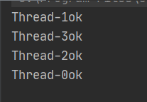

# 1. 概述

单例模式涉及到一个单一的类，该类负责创建自己的对象，同时确保只有单个对象被创建。这个类提供了一种访问其唯一的对象的方式，可以直接访问，不需要实例化该类的对象。

**注意**：

- 单例类**只能有一个实例**。
- 单例类**必须自己创建自己的唯一实例**。
- 单例类必须**给所有其他对象提供这一实例**。
- 单例类的**构造函数是私有的**。

**优点**：

- 减少了内存的开销，尤其是频繁的创建和销毁实例。
- 避免对资源的多重占用。（比如写文件操作）

**缺点**：

- 没有接口，不能继承。
- 与单一职责原则冲突。（一个类应该只关心内部的逻辑，不关心外面怎么实例化）

# 2. 实现方式

## 2.1 饿汉式

**线程安全**。

```Java
/**
 * 饿汉式单例
 */
public class Hungry {
  private Hungry() {
  }

  private final static Hungry HUNGRY = new Hungry();

  public static Hungry getInstance() {
    return HUNGRY;
  }
}
```

**缺点**：在类加载时就初始化，浪费内存，容易产生垃圾对象。

## 2.2 懒汉式

### 2.2.1 懒汉式，线程不安全

```Java
/**
 * 懒汉式单例
 */
public class Lazy {
    private Lazy() {
        System.out.println(Thread.currentThread().getName() + "ok");
    }

    private static Lazy lazy;

    public static Lazy getInstance() {
        if (lazy == null) {
            lazy = new Lazy();
        }
        return lazy;
    }

    //多线程并发
    public static void main(String[] args) {
        for (int i = 0; i < 10; i++) {
            new Thread(new Runnable() {
                public void run() {
                    Lazy.getInstance();
                }
            }).start();
        }
    }
}

```



> 每次结果都不一样。

### 2.2.2 DCL懒汉式，线程安全

```Java
//双重检测锁模式懒汉式，也称 DCL懒汉式
public static Lazy getInstance() {
  if (lazy == null) {
    synchronized (Lazy.class) {
      if (lazy == null) {
        lazy = new Lazy();
      }
    }
  }
  return lazy;
}
```

