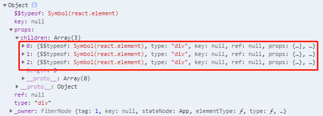

# 1. JSX转换本质

实际上，jsx 仅仅只是 `React.createElement(component, props, ...children)` 函数的语法糖。

- 所有的jsx最终都会被转换成`React.createElement`的函数调用。

```JavaScript
<script>
    // const message1 = <h2>Hello React</h2>
    const message2 = React.createElement("h2",{className: "message"},"Hello React")
    ReactDOM.render(message2,document.getElementById("app"))
</script>
```

> 在这种情况下，不需要babel相关的内容

`React.createElement`在源码的位置：（可从`index.js`开始找）

​	packages -> react -> ReactElement.js -> function createElement

## 1.1 源码

`createElement`需要传递三个参数：

- 参数一：type

- - 当前`ReactElement`的**类型**；
  - 如果是标签元素，那么就使用字符串表示 “div”；
  - 如果是组件元素，那么就直接使用组件的名称；

- 参数二：config

- - **所有 jsx 中的属性**都在 config 中以对象的属性和值的形式存储

- 参数三：children

- - **存放在标签中的内容**，以children数组的方式进行存储；
  - 当然，如果是多个元素呢？React内部有对它们进行处理，处理的源码如下：

- ```javascript
  export function createElement(type, config, children) {
  	...
  	const props = {};
  	...
  	const childrenLength = arguments.length - 2;
      if (childrenLength === 1) {
      	props.children = children;
    	} else if (childrenLength > 1) {
          const childArray = Array(childrenLength);
          for (let i = 0; i < childrenLength; i++) {
            childArray[i] = arguments[i + 2];
          }
          if (__DEV__) {
            if (Object.freeze) {
              Object.freeze(childArray);
            }
          }
          props.children = childArray;
    	}
      ...
  }
  ```

## 1.2 babel官网查看

**jsx是通过babel帮我们进行语法转换的**，所以我们之前写的jsx代码都需要依赖babel。

- 可以在babel的官网中快速查看转换的过程：https://babeljs.io/repl/#?presets=react

  ```HTML
  <div className="app">
    <div className="header">
      <h1 title="标题">我是网站标题</h1>
    </div>
    <div className="content">
      <h2>我是h2元素</h2>
      <button onClick={e => console.log("+1")}>+1</button>
      <button onClick={e => console.log("+1")}>-1</button>
    </div>
    <div className="footer">
      <p>我是网站的尾部</p>
    </div>
  </div>
  ```

  ```JavaScript
  /*#__PURE__*/
  React.createElement("div", {
    className: "app"
  }, /*#__PURE__*/React.createElement("div", {
    className: "header"
  }, /*#__PURE__*/React.createElement("h1", {
    title: "\u6807\u9898"
  }, "\u6211\u662F\u7F51\u7AD9\u6807\u9898")), /*#__PURE__*/React.createElement("div", {
    className: "content"
  }, /*#__PURE__*/React.createElement("h2", null, "\u6211\u662Fh2\u5143\u7D20"), /*#__PURE__*/React.createElement("button", {
    onClick: e => console.log("+1")
  }, "+1"), /*#__PURE__*/React.createElement("button", {
    onClick: e => console.log("+1")
  }, "-1")), /*#__PURE__*/React.createElement("div", {
    className: "footer"
  }, /*#__PURE__*/React.createElement("p", null, "\u6211\u662F\u7F51\u7AD9\u7684\u5C3E\u90E8")));
  ```

  

# 2. 虚拟DOM

## 2.1 虚拟DOM的创建过程

查看源码发现，通过`React.createElement`最终创建出来一个`ReactElement`对象。

```JavaScript
return ReactElement(
  type,
  key,
  ref,
  self,
  source,
  ReactCurrentOwner.current,
  props,
);
```

1. 这个`ReactElement`对象是什么作用呢？React为什么要创建它呢？

- 原因是React利用`ReactElement`对象组成了一个JavaScript的对象树；
- JavaScript的对象树就是大名鼎鼎的**虚拟DOM（Virtual DOM）**；

> JSX -> React.createElement函数 -> ReactElement(对象树)（虚拟DOM）-> ReactDOM.render -> 真实DOM

2. 查看ReactElement的树结构

   将下述代码JSX打印出来

   ```JavaScript
   render() {
       const jsx = (
           <div>
               <div className="header">
               	<h1 title="标题">我是网站标题</h1>
           	</div>
               <div className="content">
                   <h2>我是h2元素</h2>
                   <button onClick={e => console.log("+1")}>+1</button>
                   <button onClick={e => console.log("+1")}>-1</button>
               </div>
               <div className="footer">
                   <p>我是网站的尾部</p>
               </div>
           </div>
       )
       console.log(jsx);
       return jsx
   }
   ```

   

## 2.2 为什么采用虚拟DOM

**为什么要采用虚拟DOM，而不是直接修改真实的DOM呢？**

- 很难追踪状态发生的改变：原有的开发模式，我们很难追踪到状态发生的改变，不方便调试
- 操作真实DOM性能较低：传统的开发模式会进行频繁的DOM操作，这一做法性能非常低

**DOM操作性能非常低：**

- 首先，`document.createElement`本身创建出来的就是一个非常复杂的对象；
  - https://developer.mozilla.org/zh-CN/docs/Web/API/Document/createElement

- 其次，DOM操作会引起浏览器的回流和重绘，所以在开发中应该避免频繁的DOM操作；

**我们举一个例子：**

有一组数组[0, 1, 2, 3, 4]渲染后我们又增加了5条数据：[0, 1, 2, 3, 4, 5, 6, 7, 8, 9]，如何渲染？

```JavaScript
for (var i=5; i<10; i++) {
	var li = document.createElement("li");
    li.innerHTML = arr[i];
    ul.appendChild(li);
}
```

> 上述代码：
>
> - 我们通过 `document.createElement` 创建元素，再通过 `ul.appendChild(li)` 渲染到DOM上，进行了多次DOM操作；
> - 对于批量操作的，最好的办法不是一次次修改DOM，而是对批量的操作进行合并；（比如可以通过DocumentFragment进行合并）；

**虚拟DOM帮助我们从命令式编程转到了声明式编程的模式**

1. react官方的说法：Virtual DOM 是一种编程理念。
   - 在这个理念中，UI以一种理想化或者说虚拟化的方式保存在内存中，并且它是一个相对简单的JavaScript对象。
   - 我们可以**通过ReactDOM.render让 `虚拟DOM` 和 `真实DOM`同步起来**，这个过程中叫做**协调（Reconciliation）**；

2. 这种编程的方式赋予了React声明式的API。
   - 你只需要告诉React希望让UI是什么状态，React来确保DOM和这些状态是匹配的。
   - 你不需要直接进行DOM操作，只可以从手动更改DOM、属性操作、事件处理中解放出来；