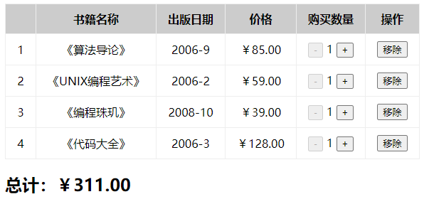

达成效果：



# 1. 项目的内容展示

```JavaScript
<style>
    table,
    th,
    td {
        border: 1px solid #eee;
        border-collapse: collapse;
    }

	th,
    td {
        padding: 10px 16px;
        text-align: center;
    }

    th {
        background-color: #ccc;
    }
</style>

class App extends React.Component {
    constructor() {
        super()
        this.state = {
            books: [
                {
                    id: 1,
                    name: '《算法导论》',
                    date: '2006-9',
                    price: 85.00,
                    count: 1
                },
                {
                    id: 2,
                    name: '《UNIX编程艺术》',
                    date: '2006-2',
                    price: 59.00,
                    count: 1
                },
                {
                    id: 3,
                    name: '《编程珠玑》',
                    date: '2008-10',
                    price: 39.00,
                    count: 1
                },
                {
                    id: 4,
                    name: '《代码大全》',
                    date: '2006-3',
                    price: 128.00,
                    count: 1
                },
            ]
        }
    }

    render() {
        return (
            <div>
                <table>
                    <thead>
                        <tr>
                            <th></th>
                            <th>书籍名称</th>
                            <th>出版日期</th>
                            <th>价格</th>
                            <th>购买数量</th>
                            <th>操作</th>
                        </tr>
                    </thead>
                    <tbody>
                        {
                            this.state.books.map((item, index) => {
                                return (
                                    <tr>
                                        <td>{item.id}</td>
                                        <td>{item.name}</td>
                                        <td>{item.date}</td>
                                        <td>{formatPrice(item.price)}</td>
                                        <td>
                                            <button>-</button>
                                            <span style={{ padding: "0 5px" }}>{item.count}</span>
                                            <button}>+</button>
                                        </td>
                                        <td>
                                            <button}>移除</button>
                                        </td>
                                    </tr>
                                )
                            })
                        }
                    </tbody>
                </table>
                <h2>总计：</h2>
			</div>
		)
	}
}
ReactDOM.render(<App />, document.getElementById("app"))
```

价格的展示：

- 封装了一个函数来格式化价格

```JavaScript
function formatPrice(price) {
    //判断价格是否是数字类型，不是显示0
  if (typeof price != "number") {
    price = Number(price) || 0
  }
    //四舍五入为指定小数位的数字
  return "￥" + price.toFixed(2);
}
```

# 2. 数据总价格的显示

```JavaScript
<h2>总计：{this.getTotalPrice()}</h2>

getTotalPrice() {
    // let totalPrice = 0
    // for (let item of this.state.books) {
    //     totalPrice += item.count * item.price
    // }
    // return formatPrice(totalPrice)

    //array.reduce(function(total, currentValue, currentIndex, arr), initialValue)
    const totalPrice = this.state.books.reduce((prevalue, item) => {
        return prevalue + item.count * item.price
    }, 0)
    return formatPrice(totalPrice)
}
```

> `array.reduce(function(total, currentValue, currentIndex, arr), initialValue)`
>
> 回调函数的参数：
>
> 参数一：上一次回调函数的结果(第一次没有上一次函数的回调结果，使用初始化值`initialValue`)

# 3. 移除某个书籍

```JavaScript
<button onClick={e => this.removeBook(index)}>移除</button>

removeBook(index) {
    // react中设计原则：state中数据的不可变性
    // 使用splice直接修改了state中的books数据,filter进行了替换
    this.setState({
        books: this.state.books.filter((item, indey) => index != indey)
    })
}
```

> 注意：
>
> react中设计原则：**state中数据的不可变性**
>
> 使用splice直接修改了state中的books数据，filter进行了替换

当所有书籍全部移除后，不显示表头，显示 ”购物车为空~“

所以封装两个函数，一个显示表格，一个显示 ”购物车为空~“

```js
renderBooks() {
    return (
            <div>
                <table>
                    <thead>
                        <tr>
                            <th></th>
                            <th>书籍名称</th>
                            <th>出版日期</th>
                            <th>价格</th>
                            <th>购买数量</th>
                            <th>操作</th>
                        </tr>
                    </thead>
                    <tbody>
                        {
                            this.state.books.map((item, index) => {
                                return (
                                    <tr>
                                        <td>{item.id}</td>
                                        <td>{item.name}</td>
                                        <td>{item.date}</td>
                                        <td>{formatPrice(item.price)}</td>
                                        <td>
                                            <button>-</button>
                                            <span style={{ padding: "0 5px" }}>{item.count}</span>
                                            <button}>+</button>
                                        </td>
                                        <td>
                                            <button}>移除</button>
                                        </td>
                                    </tr>
                                )
                            })
                        }
                    </tbody>
                </table>
                <h2>总计：</h2>
			</div>
		)
}
```

```js
renderEmptyTip() {
	return <h2>购物车为空~</h2>
}
```

进行判断，books长度为0，显示购物车为空，否则显示表格

```js
render() {
	return this.state.books.length ? this.renderBooks() : this.renderEmptyTip()
}
```

# 4. 书籍的数量改变

```js
<button disabled={item.count == 1} onClick={e => this.changeBooksCount(index, -1)}>-</button>
<span style={{ padding: "0 5px" }}>{item.count}</span>
<button onClick={e => this.changeBooksCount(index, 1)}>+</button>

changeBooksCount(index, count) {
    const newBooks = [...this.state.books]
    newBooks[index].count += count
    this.setState({
        books: newBooks
    })
}
```

# 5.完整代码

```JavaScript
<!DOCTYPE html>
<html lang="en">

<head>
    <meta charset="UTF-8">
    <meta name="viewport" content="width=device-width, initial-scale=1.0">
    <title>Document</title>
    <style>
        table,
        th,
        td {
            border: 1px solid #eee;
            border-collapse: collapse;
        }

        th,
        td {
            padding: 10px 16px;
            text-align: center;
        }

        th {
            background-color: #ccc;
        }
    </style>
</head>

<body>
    <div id="app"></div>

    <script src="../react/react.development.js"></script>
    <script src="../react/react-dom.development.js"></script>
    <script src="../react/babel.min.js"></script>
    <script src="./format_util.js"></script>

    <script type="text/babel">
        class App extends React.Component {
            constructor() {
                super()
                this.state = {
                    books: [
                        {
                            id: 1,
                            name: '《算法导论》',
                            date: '2006-9',
                            price: 85.009,
                            count: 1
                        },
                        {
                            id: 2,
                            name: '《UNIX编程艺术》',
                            date: '2006-2',
                            price: 59.00,
                            count: 1
                        },
                        {
                            id: 3,
                            name: '《编程珠玑》',
                            date: '2008-10',
                            price: 39.00,
                            count: 1
                        },
                        {
                            id: 4,
                            name: '《代码大全》',
                            date: '2006-3',
                            price: 128.00,
                            count: 1
                        },
                    ]
                }
            }

            renderBooks() {
                return (
                    <div>
                        <table>
                            <thead>
                                <tr>
                                    <th></th>
                                    <th>书籍名称</th>
                                    <th>出版日期</th>
                                    <th>价格</th>
                                    <th>购买数量</th>
                                    <th>操作</th>
                                </tr>
                            </thead>
                            <tbody>
                                {
                                    this.state.books.map((item, index) => {
                                        return (
                                            <tr>
                                                <td>{item.id}</td>
                                                <td>{item.name}</td>
                                                <td>{item.date}</td>
                                                <td>{formatPrice(item.price)}</td>
                                                <td>
                                                    <button disabled={item.count == 1} onClick={e => this.changeBooksCount(index, -1)}>-</button>
                                                    <span style={{ padding: "0 5px" }}>{item.count}</span>
                                                    <button onClick={e => this.changeBooksCount(index, 1)}>+</button>
                                                </td>
                                                <td>
                                                    <button onClick={e => this.removeBook(index)}>移除</button>
                                                </td>
                                            </tr>
                                        )
                                    })
                                }
                            </tbody>
                        </table>
                        <h2>总计：{this.getTotalPrice()}</h2>
                    </div>
                )
            }

            renderEmptyTip() {
                return <h2>购物车为空~</h2>
            }

            render() {
                return this.state.books.length ? this.renderBooks() : this.renderEmptyTip()
            }

            changeBooksCount(index, count) {
                const newBooks = [...this.state.books]
                newBooks[index].count += count
                this.setState({
                    books: newBooks
                })
            }

            removeBook(index) {
                // react中设计原则：state中数据的不可变性
                // 使用splice直接修改了state中的books数据,filter进行了替换
                this.setState({
                    books: this.state.books.filter((item, indey) => index != indey)
                })
            }

            getTotalPrice() {
                // let totalPrice = 0
                // for (let item of this.state.books) {
                //     totalPrice += item.count * item.price
                // }
                // return formatPrice(totalPrice)

                const totalPrice = this.state.books.reduce((prevalue, item) => {
                    return prevalue + item.count * item.price
                }, 0)
                return formatPrice(totalPrice)
            }

        }
        ReactDOM.render(<App />, document.getElementById("app"))
    </script>
</body>

</html>
```

