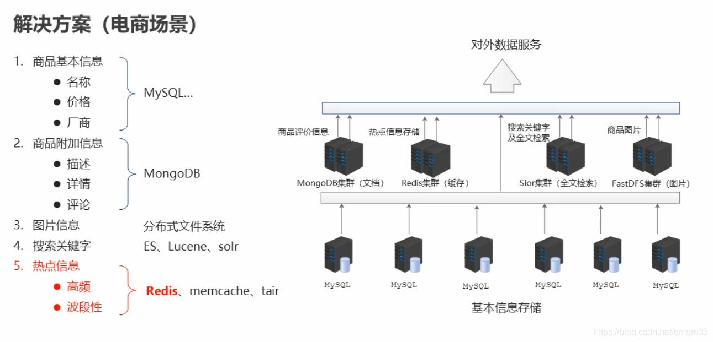
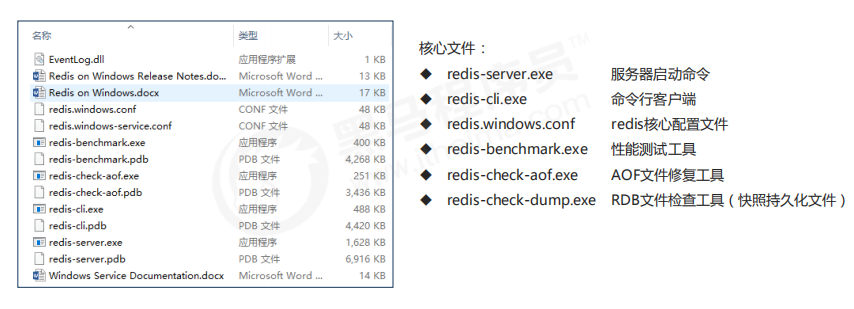

# 1. 问题的抛出

## 1.1 出现的问题

- 海量用户
- 高并发

## 1.2 罪魁祸首--关系型数据库

- 性能瓶颈：磁盘IO性能低下

  （CPU数据交换 —— cache高速缓存 —— 内存 ——硬盘）一层一层传，性能低

- 扩展瓶颈：数据关系复杂，扩展性差，不便于大规模集群

## 1.3 解决思路

- 降低磁盘IO次数，越低越好——使用内存存储
- 去除数据间的关系，越简单越好——不存储关系，仅存储数据

# 2. Nosql简介

**Nosql**：即Not-Only Sql ，（泛指非关系型数据库），作为**关系型数据库的补充**。

**作用**：应用对于海量用户和海量数据前提下的数据处理问题。

**特征**：

- 可扩容，可伸缩
- 大数据量下高性能
- 灵活的数据模型
- 高可用

**常见Nosql数据库**

Redis	memcache	HBase	Mongo DB



# 3. Redis

**概念**：Redis（Remote Dictionary Server）是C语言开发的一个开源的高性能**键值对（key-value）数据库**。

**特征**：

- 数据间没有必然的关联关系
- 内部采用单线程机制进行工作
- 高性能。
- 多数据类型支持
  - 字符串类型  String
  - 列表类型      list
  - 散列类型      hash
  - 集合类型      set
  - 有序集合类型 sorted_set
- 持久化支持。可以进行数据灾难恢复

**应用**：

- 为热点数据加速查询（主要场景）、如热点商品、热点新闻、热点资讯、推广类等提高访问量信息等。
- 任务队列、如秒杀、抢购、购票等
- 即时信息查询，如各位排行榜、各类网站访问统计、公交到站信息、在线人数信息（聊天室、网站）、设备信号等
- 时效性信息控制，如验证码控制，投票控制等
- 分布式数据共享，如分布式集群构架中的session分离
- 消息队列
- 分布式锁

## 3.1 Redis下载与安装

Linux 版（适用于企业级开发）

- Redis 高级开始使用
- 以4.0 版本作为主版本

Windows 版本（适合零基础入门学习）

- Redis 入门使用
- 以 3.2 版本作为主版本
- 下载地址：https://github.com/MSOpenTech/redis/tag

解压即安装



## 3.2 Redis基本操作

#### 信息添加

- 功能：设置key，value数据
- 命令：`set key value`
- 范例：`set name xxx`

#### 信息查询

- 功能：根据key查询对应的value,如果不存在，返回空（nil)
- 命令：`get key`
- 范例：`get name`

#### 清除屏幕信息

- 命令：`clear`

#### 退出客户端命令行模式

- 命令

  ```
  quit
  exit
  <ESC>
  ```

#### 帮助

- 功能：获取命令帮助文档，获取组中所有命令信息名称

- 命令：

  ```
  help 命令名称
  help @组名
  ```

  