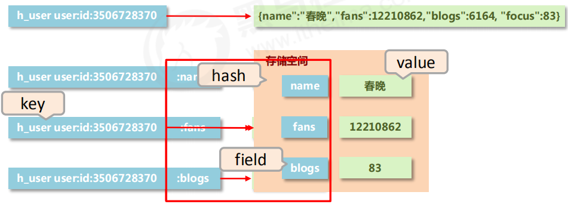

# 1. 常见数据类型

- string --> String
- hash --> Hashmap
- list --> LinkList
- set --> HashSet
- sorted_set --> TreeSet

# 2. 业务数据使用

### 2.1 作为缓存使用

1. 原始业务功能设计
   秒杀
   618活动
   双十一活动
   排队购票
2. 运营平台监控到的突发高频访问数据
   突发市政要闻，被强势关注围观
3. 高频、复杂的统计数据
   在线人数
   投票排行榜

### 2.2 附加功能

系统功能优化或升级

- 单服务器升级集群
- Session管理
- Token管理

# 3. Redis数据存储格式

- redis自身是一个Map,其中所有的数据都是采用key:value的形式存储

- **数据类型指的是存储的数据的类型，也就是value部分的类型，key部分永远都是字符串**

  

# 4. String类型

- 存储的数据：单个数据，最简单的数据存储类型，也是最常用的数据存储类型
- 存储数据的格式：一个存储空间保存一个数据
- 存储内容：通常使用字符串，如果字符串以整数的形式展示，可以作为数字操作使用


### 4.1 String类型数据的基本操作

- 添加/修改数据：`set key value`
- 获取数据：`get key`
- 删除数据：`del key`
- 添加/修改单个数据：`mset key1 value1 key2 value2 ...`
- 获取多个数据：`mget key1 key2...`
- 获取数据字符个数（字符串长度）：`strlen key`
- 追加信息到原始信息后部（原始存在就追加，否则新建）：`append key value`

#### 单数据操作与多数据操作的选择

`set key value` 与 `mset key1 value1 key2 value2 ...`


### 4.2 String数据类型的扩展操作

#### 业务场景

大型企业级应用中，分表操作是基本操作，使用多张表存储同类型数据，但是对应的主键id必须保证统一性，不能重复。Oracle数据库具有sequence设定，可以解决该问题，但是MySQL数据库并不具有类似的机制，那么如何解决？

#### 解决方案

- 设置数值数据增加指定范围的值

  ```rust
  incr key     //给key的value自增1
  incrby key increment       //给key的value增加increment
  incrbyfloat key incerment  //给key的value增加float类型的值
  ```

- 设置数值数据减少指定范围的值

  ```rust
  decr key   //key的value自减1
  decrby key increment  //给key的value减少increment
  ```

> increment 可以是一个负数。

#### 4.2.1 String作为数值操作

- String在Redis**内部存储默认是一个字符串**，当遇到增减类操作incr，decr时会**转成数值型进行计算**；
- Redis所有操作都是原子性的，采用**单线程**处理所有业务，命令是一个一个执行的，因此无需考虑并发带来的数据影响；
- **注意**：**按数值进行操作的数据，如果原始数据不能转成数值，或超过了Redis数值上线范围，将会报错。**9223372036854775807 (java中long型数据最大值，Long.MAX_VALUE)

### 4.3 String数据时效性

#### 业务场景

场景一：“最强女生”，启动海选投票，只能通过微信投票，每个微信号每4个小时只能投1票。

场景二：电商商家开启热门商品推荐，热门商品不能一直处于热门期，每种商品热门期维持3天，3天后自动取消热门。

场景三：新闻网站会出现热点新闻，热点新闻最大的特征是对时效性，如何自动控制热点新闻的时效性

#### 解决方案

- 指定数据的生命周期

  ```
  setex key second value
  psetex key millisecond value
  ```

- redis 控制数据的生命周期，通过数据是否失效控制业务行为，适用于所有具有时效性限定控制的操作

### 4.4 String 类型数据操作的注意事项

- 数据操作不成功的反馈与数据正常操作之间的差异

  ① 表示运行结果是否成功

  -  (integer) 0 → false 失败

  - (integer) 1 → true 成功

  ② 表示运行结果值

  - (integer) 3 → 3 3个 

  -  (integer) 1 → 1 1个 

- 数据未获取到

  nil（等同于null）

- 数据最大存储量

  512MB

- 数据计算最大范围（java中的long的最大值）

  9223372036854775807

### 4.5 String类型应用场景

#### 业务场景

主页高频访问信息显示控制，例如新浪微博大V主页显示粉丝数与微博数量

#### 解决方案

- 在Redis中为用户设置用户信息，以用户主键和属性值作为key，后台设定定时刷新策略即可。

  

- 在Redis中以json格式存储用户信息，定时刷新（也可以使用hash类型）

  

- redis应用于各种结构型和非结构型高热度数据访问加速

### 4.6 key的设置约定

- 数据库中的热点数据key命名惯例

  

# 5. Hash类型

存储的困惑：

对象类数据的存储如果具有较为频繁的更新需求操作会显得笨重。



**hash类型**：

- 新的存储需求：对一系列存储的数据进行编组，方便管理，典型应用存储对象信息
- 需要的内存结构：一个存储空间保存多少个键值对数据
- hash类型：底层使用哈希表结构实现数据存储


### 5.1 hash数据类型的基本操作

- 添加/修改数据：`hset key filed value`

- 获取数据：

  ```
  hget key filed
  hgetall key
  ```

- 删除数据：`hdel key filed1`
- 添加/修改多个数据：`hmset key filed1 value1 filed2 value2...`
- 获取多个数据：`hmget key filed1 filed2..`
- 获取哈希表中字段的数量：`hlen key`
- 获取哈希表中是否存在指定的字段：`hexists key filed`

### 5.2 hash类型数据的扩展操作

- 获取hash表中所有字段名和字段值

  ```
  hkeys key
  hvals key
  ```

- 设置指定字段的数值数据增加指定范围的值

  ```
  hincrby key filed increment
  hincrbyfloat key filed increment
  ```

### 5.3 hash类型数据操作的注意事项

- hash类型下的value只能存储字符串，不允许存储其他类型数据，不存在嵌套现象。如果数据未获取到，对应的值为(nil)
- 每个hash可以存储232-1个键值对
- hash类型十分贴近对象的数据存储形式，并且可以灵活添加删除对象属性。但hash设计初中不是为了存储大量对象而设计的，切记不可滥用，更不可以将hash作为对象列表使用
- hgetall操作可以获取全部属性，如果内部fiekd过多，遍历整体数据效率就会很低，有可能成为数据访问瓶颈

### 5.4 应用场景购物车

#### 业务场景


#### 解决方案

- 以客户id作为key，每位客户创建一个hash存储结构存储对应的购物车信息
- 将商品编号作为field，购买数量作为value进行存储
- 添加商品：追加全新的field与value
- 浏览：遍历hash
- 更改数量：自增/自减，设置value值
- 删除商品：删除field
- 清空：删除key

> 此处仅讨论购物车中的模型设计
>
> 购物车与数据库间持久化同步、购物车与订单间关系、未登录用户购物车信息存储不进行讨论


#### 当前设计是否加速了购物车的呈现

当前仅仅是将数据存储到redis中，并没有起到加速的所用，**商品信息**还需要二次查询数据库

**解决**：

- 每条购物车中的商品记录保存成两条field
- field1 专用于保存购买数量
  1、命名格式：商品id:nums
  2、保存数据：数值
- field2 专用于保存购物车中显示的信息，包含文字描述，图片地址，所属商家信息
  1、命名格式：商品id:info
  2、保存数据：json


从上面看出又具有了大量的信息重复，所以我们**把filed2的内容变成一个固定的hash**

- 修改数据，如果有，失败；如果没有，创建。

  ```
  hsetnx key filed value
  ```

  

### 5.5 应用场景抢购

#### 业务场景


#### 解决方案

- 以商家id作为key
- 将参与抢购的商品id作为field
- 将参与抢购的商品数量作为对应的value
- 抢购时使用降值的方式控制产品数量

> redis 应用于抢购，限购类、限量发放优惠卷、激活码等业务的数据存储设计

