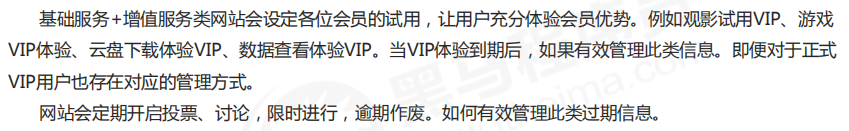

# 1. list类型

- 数据存储需求：存储多个数据，并对数据进入存储空间的**顺序**进行区分
- 需要的存储数据：一个存储空间保存多个数据，且通过数据可以体现进入顺序
- list类型：保存多个数据，**底层使用双向链表存储结构**实现


## 1.1 list数据类型基本操作

- 添加/修改数据

  ```
  lpush key value1 value2...
  rpush key value1 value2
  ```

- 获取数据

  ```
  lrange key start stop
  lindex key index
  llen key
  ```

- 获取并移除数据

  ```
  lpop key
  rpop key
  ```

## 1.2 list类型数据扩展操作

- 规定时间内获取并移除数据

  ```
  blpop key1 key2... timeout
  brpop key1 key2... timeout
  brpop source destination timeout
  ```

  

> 在规定的时间内移除数据，等到了就移除，等不到就算了。

### 1.2.1 应用场景

#### 业务场景

微信朋友圈点赞，要求按照点赞顺序显示点赞好友信息

 如果取消点赞，移除对应好友信息


#### 解决方案

- 移除指定数据

  ```
  lrem key count value  //删除count数量的value值
  ```

redis 应用于具有操作先后顺序的数据控制.


## 1.3 list 类型数据操作注意事项

- **list 中保存的数据都是string类型的**，数据总容量式有限的，最多232-1个元素（4294967295）
- list具有**索引**的概念，但是操作数据时候通常以队列的形式进行入队出队操作，或以栈的形式进入栈出栈的操作
- **获取全部数据操作结束索引设置为-1**
- list 可以对数据进行分页操作，通过第一页的信息来自list，第2页及更多的信息通过数据库的形式加载

## 1.4 list类型应用场景

#### 应用场景

- twitter、新浪微博、腾讯微博中个人用户的关注列表需要按照用户的关注顺序进行展示，粉丝列表需要将最近关注的粉丝列在前面。

- 新闻、资讯类网站如何将最新的新闻或资讯按照发生的时间顺序展示？

- 企业运营过程中，系统将产生出大量的运营数据，如何保障**多台服务器操作日志的统一顺序输出**？

#### 解决方案

- 依赖list的数据**具有顺序的特征**对信息进行管理
- 使用队列模型解决**多路信息汇总合并**的问题
- 使用栈模型解决最新消息的问题

# 2. set类型

- 新的存储需求：存储大量的数据，在查询方面提供更高的效率
- 需要的存储结构：能够保存大量的数据，高效的内部存储机制，便于查询
- set类型：**与hash存储结构完全相同，仅存储键，不存储值（nil)**，并且值是不允许重复的


## 2.1 set类型的基本操作

- 添加数据：`sadd key member1 member2...`
- 获取全部数据：`smembers key`
- 删除数据：`srem key member1 member2...`
- 获取集合数据总量：`scard key`
- 判断集合中是否包含指定数据：`sismember key member`

## 2.2 set类型数据的扩展操作

### 2.2.1 随机推荐类信息检索

redis应用于**随机推荐类信息检索**，例如热点歌单推荐，热点新闻推荐，热点旅游线路，应用APP推荐，大V推荐等。

#### 业务场景

每位用户首次使用进入头条时候会设置3项爱好的内容，但是后期为了增加用户的活跃度，兴趣点，必须让用户对其他信息类别逐渐产生兴趣，增加客户留存度，如何实现？

#### 业务分析

- 系统分析出**各个分类的最新或最热点信息条目并组织成set集合**
- **随机挑选其中部分信息**
- 配合用户关注信息分类中的热点信息组织展示的全信息集合

#### 解决方案

- 随机获取集合中指定数量的数据：`srandmember key count`
- 随机获取集合中的某个数据并移除：`spop key`


### 2.2.2 并交差操作

#### 业务场景

脉脉为了促进用户间的交流，保障业务成单率的提升，需要让每位用户拥有大量的好友，事实上职场新人不具有更多的职场好友，如何快速为用户积累更多的好友？

#### 解决方案

- 求两个集合的交并差集

  ```
  sinter key1 key2    //交集
  sunion key1 key2    //并集
  sdiff key1 key2     //差集  key1 - key2
  ```

- 求两个集合的交并差集并存储到指定集合中

  ```
  sinterstore destination key1 key2
  sunionstore destination key1 key2
  sdiffstore destination key1 key2
  ```

- 将指定数据从原始集合移动到目标集合中

  ```
  smove source destination member
  ```

- redis应用于同类信息的关联搜索，二度关联搜索，深度关联搜索
- 显示共同关注（一度）   //交集
- 显示共同好友（一度）   //交集
- 由用户A出发，获取到好友用户B的好友信息列表（一度）  
- 由用户A出发，获取到好友用户B的购物清单列表（二度）
- 由用户A出发，获取到好友用户B的游戏充值列表（二度）

## 2.3 set类型操作注意事项

- set类型不允许数据重复，如果添加的数据在set中已经存在，将只保留一份
- set虽然与hash的存储结构相同，但是无法启用hash中存储值的空间

### 2.3.1 同类型数据的快速去重


# 3. sorted_set类型

- 新的存储需求：根据排序有利于数据的有效显示，需要提供一种可以根据自身特征进行排序的方式
- 需要的存储结构：新的存储模型，**可以保存可排序的数据**
- sorted_set类型：在set的存储结构基础上**添加可排序字段**


## 3.1 基本操作

- 添加数据：`zadd key score1 member1 score2 member2...`

- 获取全部数据：

  ```
  zrange key start stop [withscores]  //升序   [withscores]  //值带着scores一起显示
  zrevrange key start stop [withscores]  //降序
  ```

- 删除数据：`zrem key member ...`

- 按条件获取数据：

  ```
  zrangebyscore key min max [withscore] [limit]
  zrevrangebyscore key max min [withscore]
  ```

- 按条件删除数据：

  ```
  zremrangebyrank key start stop
  zremrangebyscore key min max
  ```

**注意**：

- min与max用于限定搜索查询的条件
- start与stop用于限定查询范围，作用于索引，**表示开始和结束索引**
- offset与count用于限定查询范围，作用于查询结果，**表示开始位置和数据总量**


- 获取集合数据总量：

  ```
  zcard key
  zcount key min max
  ```

- 集合交、并操作：

  ```
  zinterstore destination numkeys key1 key2..   //交之后求和
  zunionstore destination numkeys key1 key2..   //病之后求和
  ```

  

## 3.2 扩展操作

### 3.3.1 排序对应的排名

#### 业务场景

票选广东十大杰出青年，各类综艺选秀海选投票

各类资源网站TOP10（电影，歌曲，文档，电商，游戏等）

#### 解决方案

- 获取数据对应的索引（排名）

  ```
  zrank key member
  zrevrank key member
  ```

- score值获取与修改

  ```
  zscore key member
  zincrby key increment member
  ```


### 3.3.2 sorted_set数据操作的注意事项

- score 保存的数据存储空间是64位，如果是整数范围是-9007199254740992~9007199254740992
- score保存的数据也可以是一个双精度的double值，基于双精度浮点数的特征，可能会丢失精度，使用时侯要慎重
- **sorted_set底层存储还是基于set结构的，因此数据不能重复**，如果重复添加相同的数据，score值将被反复覆盖，保留最后一次修改的结果

### 3.3.3 定时任务执行顺序管理/任务过期管理

#### 业务场景



#### 解决方案

- 对于基于时间线限定的任务处理，**将处理时间记录位score值**，利用排序功能区分处理的先后顺序

- 记录下一个要处理的事件，当到期后处理对应的任务，移除redis中的记录，并记录下一个要处理的时间

- 当新任务加入时，判定并更新当前下一个要处理的任务时间

- 为提升sorted_set的性能，通常将任务根据特征存储成若干个sorted_set。例如1小时内，1天内，年度等，操作时逐渐提升，将即将操作的若干个任务纳入到1小时内处理队列中

- 获取当前系统时间

  ```
  time
  ```

### 3.3.4 任务/消息权重设定应用

#### 业务场景

当任务或者消息待处理，形成了任务队列或消息队列时，对于高优先级的任务要保障对其优先处理，如何实现任务权重管理。

#### 解决方案

- 对于带有权重的任务，优先处理权重高的任务，采用score记录权重即可