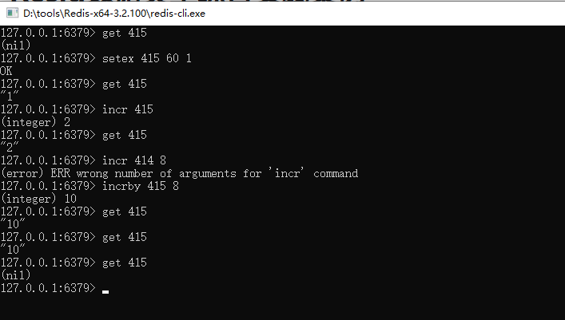
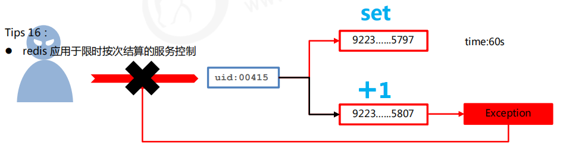
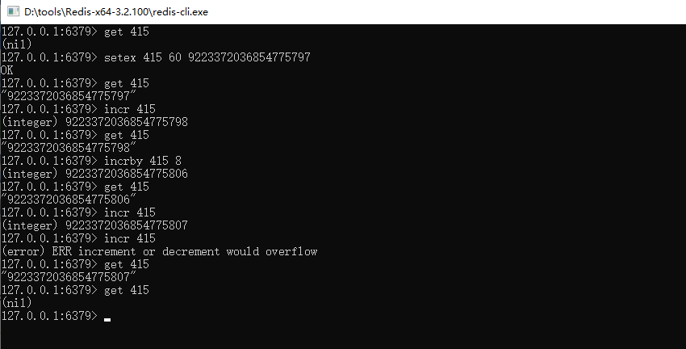
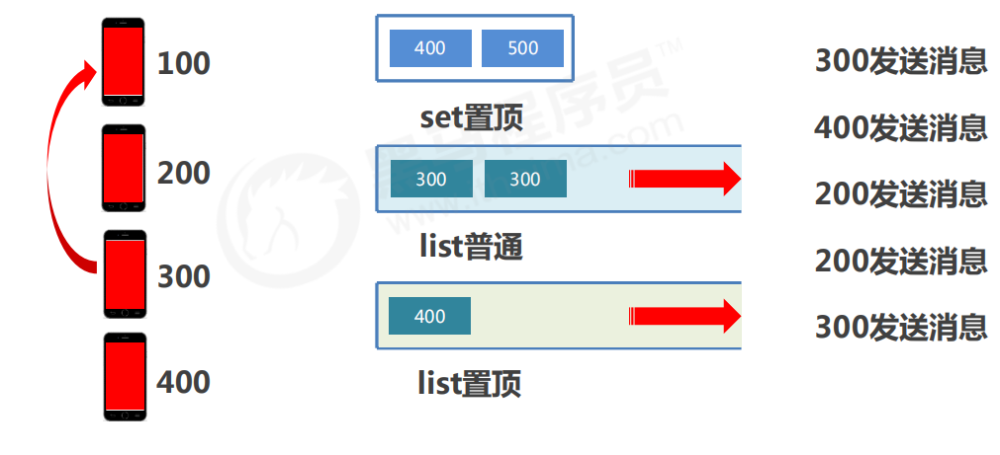
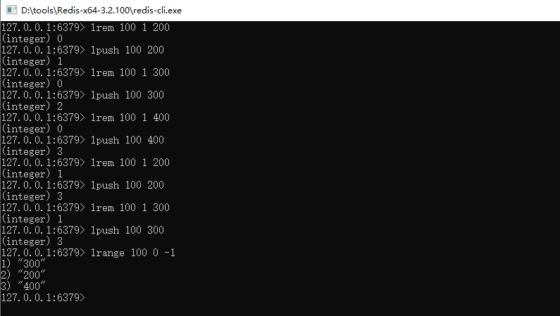

# 1. 计数器

限制每个用户每分钟最多发起10次调用。

#### 解决方案

- 设计计数器，记录调用次数，用于控制业务执行次数。以用户id作为key,使用此时作为value
- 在调用前获取次数，判断是否超过限定次数，不超过次数的情况下，每次调用计数+1，业务调用失败，计数-1
- 为了计数器设置生命周期为指定周期，例如1秒/分钟，自动清空周期内使用次数。

#### 解决方案改良

- 取消最大值的判定，利用**incr操作超过最大值抛出异常的形式**替代每次判断是否大于最大值

- 判断是否为nil，

  - 如果是，设置为Max-次数

  - 如果不是，计数+1

  - 业务调用失败，计数-1 

- 遇到异常即+操作超过上限，视为使用达到上限

# 2. 微信会话

#### 业务场景

使用微信的过程中，当微信接收消息后，会默认将最近接收的消息置顶，当多个好友及关注的订阅号同时发送消息时，该排序会不停的进行交替。同时还可以将重要的会话设置为置顶。一旦用户离线后，再次打开微信时，消息该按照什么样的顺序显示？

#### 业务分析

#### 解决方案

- 依赖list的数据具有顺序的特征对消息进行管理，将list结构作为栈使用
- 对置顶与普通会话分别创建独立的list分别管理
- 当某个list中接收到用户消息后，将**消息发送方的id从list的一侧加入list(此处设定左侧）**
- 多个相同id发出的消息反复入栈会出现问题，**在入栈之前无论是否具有当前id对应得消息，先删除对应id**
- 推送消息时**先推送顶置会话list,再推送普通会话list,**推送完成的list清除所有数据
- 消息的数量，也就是微信用户对话数量采用计数器的思想另行记录，伴随list操作同步更新

例如，发送顺序为 200 300 400 200 300

