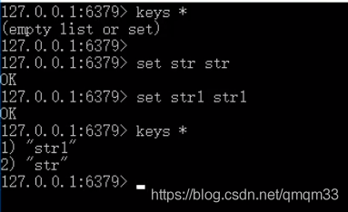
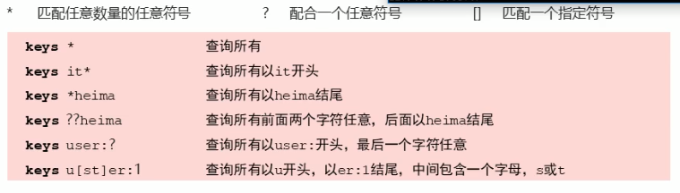
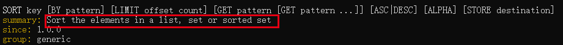
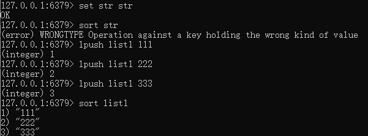
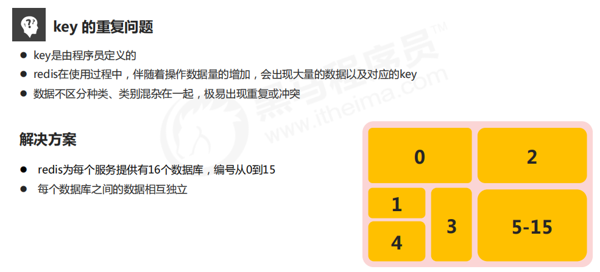
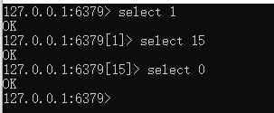
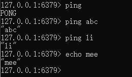
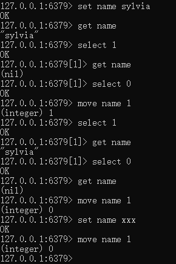

# 1. key通用指令

#### key特征

key是一个字符串，通过key获取Redis中保存的数据。

### 1.1 key基本操作

- 删除指定key

  ```
  del key
  ```

- 获取key是否存在

  ```
  exists key
  ```

- 获取key的类型

  ```
  type key
  ```

### 1.2 key 扩展操作

#### 1.2.1 时效性控制

- 为key设置有效期

  ```
  expire key seconds
  pexpire key milliseconds
  expireat key timestamp
  pexpireat key milliseconds-timestamp
  ```

- 获取key的有效时间

  ```
  //三种返回值：-2：访问的key已经不存在；-1：key存在但是没有设置有效时间；有效时间：key剩余的有效时间
  ttl key   
  pttl key
  ```

- 切换key从时效性转换为永久性

  ```
  persist key
  ```

#### 1.2.2 查询模式

- 查询key

  ```
  keys pattern
  ```

  

- 查询模式规则

  

#### 1.2.3 为key改名

```
rename key newkey   //如果newkey已存在，则直接覆盖
renamenx key newkey   //如果newkey已存在，则失败
```

#### 1.2.4 为所有key排序

```
sort key    //只能排集合
```





#### 1.2.3 其他key通用操作

```
help @generic
```

# 2. 数据库通用操作



### 2.1 DB基本操作

- 切换数据库

  ```
  select index
  ```

  

- 其他操作

  ```
  quit
  ping
  echo message
  ```

  

- 数据移动

  ```
  move key db
  ```

  

- 数据清除

  ```
  dbsize  //当前数据库里有多少个key
  flushdb   //清空当前数据库
  flushall  //清空所有数据库
  ```

  