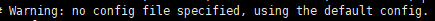

# 1. 安装步骤

### 下载和编译

1.  `wget  Redis下载链接`     //下载
2.  `tar xf  Redis压缩文件`    //解压
3.  `cd redis-xxx`
4.  `vi README.md`
5.  `make`   //编译
6.  `yum install gcc -y`  //上一步出错，找不到cc命令
7.  `make`  //还是出错 ，readme里有提到
8.  `make distclean`
9.  `make` //成功

### 安装

1.  `make PREFIX=/opt/datdabse/redis6 insatll`    //将可执行程序放到指定文件夹

2.  `vi /etc/profile`   //配置环境变量

   ```
   export REDIS_HOME=/opt/database/redis5
   export PATH=$PATH:$REDIS_HOME/bin
   ```

12.  `. /etc/profile`   //加载配置文件

### 后台服务/以配置文件启动

直接启动有警告：



13.  `cat redis.conf | grep -v "#" | grep -v "^$" > redis-6379.conf`   //复制redis.conf配置文件

14.  `vim redis-6379.conf`     //编辑

    ```
    port 6379
    daemonize yes
    logfile "6379.log"
    dir /root/redis-6.2.3/data
    ```

15.  启动：`redis-server redis-6379.conf`

16.  查看启动进程：`ps -ef | grep redis-`

17.  因为每启动一个Redis就要创建一个redis-xxxx.conf，所以创建一个文件保存conf

18.  `mkdir conf`

19.  `cp redis-6379.conf redis-6380.conf`

20.  修改redis-6380.conf文件

