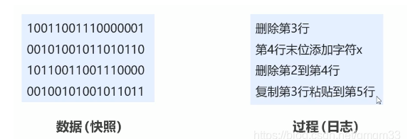
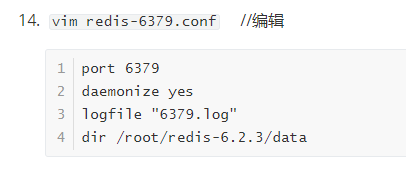
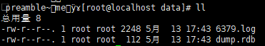
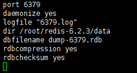
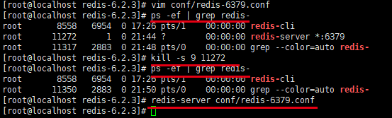
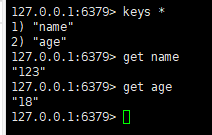
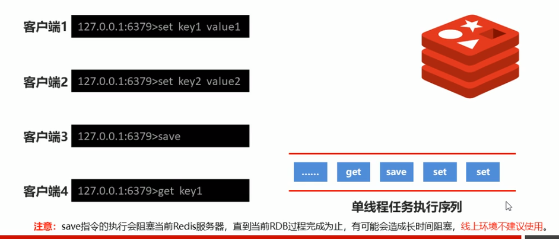
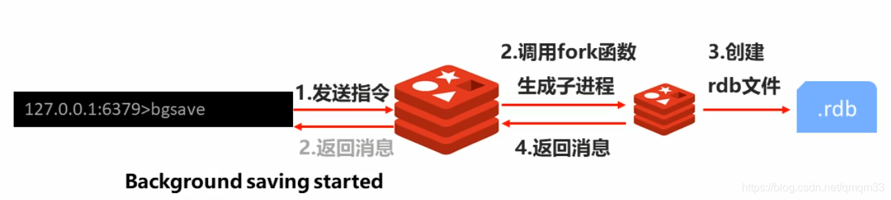
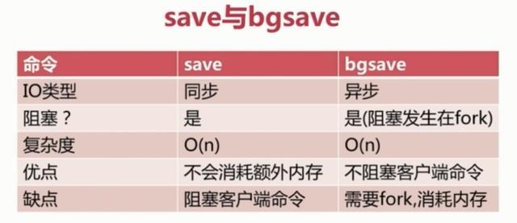
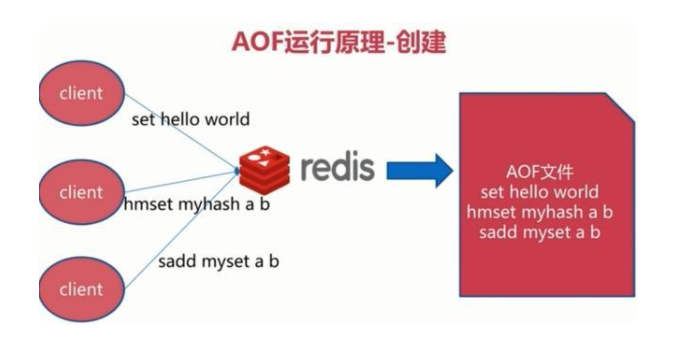

# 1. 持久化简介

### 1.1 什么是持久化

利用永久性存储介质（磁盘）将数据进行保存，在特定的事件将保存的数据进行恢复的工作机制成为持久化。

### 1.2 为什么要持久化

防止数据的意外丢失，确保数据安全性。

### 1.3 持久化保存什么

- 将当前数据状态进行保存，快照形式，存储格式简单     ==》  RDB
- 将数据的操作过程进行保存，日志形式，存储格式复杂  ==》AOF



# 2. Redis持久化机制

RDB（Redis database）  和 AOF（append only file）

## 2.1. RDB快照

RDB就是**把某个时刻的所有数据生成一个快照保存在磁盘上。**

### 2.1.1 save命令

使用save命令：手动执行一次保存操作



执行save命令，之前设置会在data里面生成记录。



#### save指令相关配置

- dbfilename dump.rdb
  说明：设置本地数据库文件名，默认值为dump.rdb
  经验：通常设置魏dump-端口号.rdb
- dir
  说明：设置存储.rdb文件的路径
  经验：通常设置成存储空间较大的目录中，目录名称data
- rdbcompression yes
  说明：设置存储至本地数据库时是否压缩数据，默认为yes，采用LZF压缩
  经验：通常默认为开启状态，如果设置成no，可以节省CPU运行时间，但会使存储的文件变大（巨大）
- rdbchecksumy yes
  说明：设置是否进行RDB文件格式的校验，该校验过程在写文件和读文件过程均进行
  经验：通常默认为开启状态，如果设置为no，可以节约读写性过程约10%时间消耗，但是存储一定的数据损坏风险


修改conf/redis-6379.conf文件：



save之后，再次启动Redis-server，可以恢复数据。



#### save指令工作原理



**Redis是单线程的**，所有命令都会在类似队列中排好队，不建议使用save指令，因为save指令的执行会阻塞当前Redis服务器，直到当前RDB过程完成，有可能会造成长时间阻塞，**不建议使用**

### 2.1.2 bgsave命令

- 作用：手动启动后台保存操作，但**不是立即执行**
- 具体操作：Redis进程执行fork创建子进程，持久化操作交给子进程去执行，完成后自动结束。



#### bgsave指令相关配置

- stop-writes-on-bgsave-error yes
  说明：后台存储过程中如果出现错误线程，是否停止保存操作
  经验：通常默认为开启状态

### 2.1.3 自动保存

在配置文件conf/redis-6379.conf修改：

```
save second changes   //在second秒内changes个key发生了改变
```

作用：在限定时间范围内指定数量个key发生变化就持久化。

> 自动保存底层仍然用的是bgsave指令

#### 配置原理


### 2.1.4 save与bgsave 区别



### 2.1.5 RDB优缺点

**优势**：

- RDB是一个紧凑压缩的二进制文件，存储效率较高
- RDB内部存储的是redis在某个时间点的数据快照，**非常适合用于数据备份，全量复制**等场景
- RDB**恢复数据**的速度要比AOF快很多

**劣势**：

- 存储海量数据时，每次save都是全部数据，效率很低
- bgsave指令每次运行要执行fork操作创建子进程，**要牺牲掉一些性能**
- RDB方式无论是执行指令还是利用配置，**无法做到实时持久化**，具体较大的可**能性丢失数据**

## 2.2 AOF

### 2.2.1 存储原理

AOF机制就是将每一次收到的命令都记录在.aof文件中，重启时执行aof文件中的命令来恢复数据。



### 2.2.2 三种触发机制

- always：每次写入操作都同步，不会造成数据丢失，但性能较差。
- everysec：每秒同步一次。系统故障只会丢失1秒的数据，性能较高。
- no：由操作系统决定同步的周期，不可控。

在 `redis-6379.conf`文件配置

```
appendonly yes  //开启aof
appenddfsync everysec    //设置aof触发机制
```

