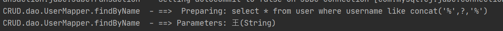

#### 1. 准备实体类和SqlMapConfig.xml

```xml
<?xml version="1.0" encoding="UTF-8"?>
<!DOCTYPE configuration
        PUBLIC "-//mybatis.org//DTD Config 3.0//EN"
        "http://mybatis.org/dtd/mybatis-3-config.dtd">
<!-- mybatis的主配置文件 -->
<configuration>
  <!-- 配置环境 -->
  <environments default="mysql">
    <!-- 配置mysql的环境-->
    <environment id="mysql">
      <!-- 配置事务的类型-->
      <transactionManager type="JDBC"></transactionManager>
      <!-- 配置数据源（连接池） -->
      <dataSource type="POOLED">
        <!-- 配置连接数据库的4个基本信息 -->
        <property name="driver" value="com.mysql.jdbc.Driver"/>
        <property name="url" value="jdbc:mysql://localhost:3306/eesy?serverTimezone=UTC"/>
        <property name="username" value="root"/>
        <property name="password" value="xxx1234567"/>
      </dataSource>
    </environment>
  </environments>

  <!-- 指定映射配置文件的位置，映射配置文件指的是每个dao独立的配置文件 -->
  <mappers>
    <mapper resource="mappers/UserMapper.xml"/>
  </mappers>
</configuration>
```

#### 2. dao文件

`UserMapper.java` 

```java 
public interface UserMapper {
  //查询所有用户
  List<User> findAll();

  //保存用户
  void saveUser(User user);

  //更新用户
  void updateUser(User user);

  //根据id删除用户
  void deleteUser(Integer userId);

  //根据id查询用户
  User findById(Integer id);

  //根据用户名模糊查询用户信息
  List<User> findByName(String username);

  //查询用户总记录数
  int findTotal();
}
```

#### 3. UserMapper.xml

```xml
<?xml version="1.0" encoding="UTF-8"?>
<!DOCTYPE mapper
        PUBLIC "-//mybatis.org//DTD Mapper 3.0//EN"
        "http://mybatis.org/dtd/mybatis-3-mapper.dtd">
<mapper namespace="com.xxx.mybatisCRUD.dao.UserMapper">
  <!-- 查询所有用户 -->
  <select id="findAll" resultType="com.xxx.mybatisCRUD.pojo.User">
    select * from user;
  </select>

  <!-- 保存用户 -->
  <insert id="saveUser" parameterType="com.xxx.mybatisCRUD.pojo.User">
    insert into user(username,address,sex,birthday) values(#{username},#{address},#{sex},#{birthday})
  </insert>

  <!-- 更新用户 -->
  <update id="updateUser" parameterType="com.xxx.mybatisCRUD.pojo.User">
    update user set username=#{username},address=#{address},sex=#{sex},birthday=#{birthday} where id=#{id}
  </update>

  <!-- 根据id删除用户 -->
  <delete id="deleteUser" parameterType="int">
    delete from user where id=#{id}
  </delete>

  <!-- 根据id查询用户 -->
  <select id="findById" parameterType="int" resultType="com.xxx.mybatisCRUD.pojo.User">
    select * from user where id=#{id}
  </select>

  <!-- 根据用户名模糊查询用户信息 -->
  <select id="findByName" parameterType="string" resultType="com.xxx.mybatisCRUD.pojo.User">
    select * from user where username like concat('%',#{username},'%')
  </select>

  <!-- 查询用户总记录数 -->
  <select id="findTotal" resultType="int">
    select count(id) from user
  </select>
</mapper>
```

**注意**：



使用`PreparedStatement`对象，安全，防止SQL注入问题

##### 保存数据的细节-获取保存数据的id

数据库插入时可以执行一条语句 `select last_insert_id()`，返回当前插入语句的id

````xml
<!-- 保存用户 -->
<insert id="saveUser" parameterType="com.xxx.mybatisCRUD.pojo.User">
  <!-- 获取保存数据的id -->
  <selectKey keyProperty="id" keyColumn="id" resultType="int" order="AFTER">
    select last_insert_id()
  </selectKey>
  insert into user(username,address,sex,birthday) values(#{username},#{address},#{sex},#{birthday})
</insert>
````

````java 
@Test
public void testSave() {
  User user = new User();
  user.setUsername("mabatis last insertid");
  user.setAddress("北京市顺义区");
  user.setSex("男");
  user.setBirthday(new Date());
  //执行保存操作前：User{id=null, ...}
  System.out.println("执行保存操作前："+user); 
  userMapper.saveUser(user);
  //执行保存操作后：User{id=57, ...}
  System.out.println("执行保存操作后："+user); 
}
````

##### mybatis的参数深入

1.  使用实体类的包装对象作为查询条件

   - 编写QueryVo：实体类的包装对象

     ```Java
     public class QueryVo {
       private User user;
     
       public User getUser() {
         return user;
       }
     
       public void setUser(User user) {
         this.user = user;
       }
     }
     ```

   - 编写持久层dao接口

     ````java
     //根据QueryVo查询用户
     List<User> findByQueryVo(QueryVo vo);
     ````

   - 编写持久层接口的映射文件

     ````xml
     <!-- 根据QueryVo查询用户 -->
     <select id="findByQueryVo" parameterType="com.xxx.mybatisCRUD.pojo.QueryVo" resultType="com.xxx.mybatisCRUD.pojo.User">
       select * from user where username like concat('%',#{user.username},'%')
     </select>
     ````

   - 测试

     ````java
     //测试根据QueryVo模糊查询用户
     @Test
     public void testFindByQueryVo() {
       QueryVo vo = new QueryVo();
       User user = new User();
       user.setUsername("王");
       vo.setUser(user);
       List<User> users = userMapper.findByQueryVo(vo);
       System.out.println(users);
     }
     ````

##### mybatis的返回值深入

实体类属性与数据库列名不对应的方法

````xml
<!-- 建立 User 实体和数据库表的对应关系 
		 type 属性：指定实体类的全限定类名
		 id 属性：给定一个唯一标识，是给查询 select 标签引用用的。
-->
<resultMap type="com.itheima.domain.User" id="userMap"> 
  <id column="id" property="userId"/>
  <result column="username" property="userName"/>
  <result column="sex" property="userSex"/>
  <result column="address" property="userAddress"/>
  <result column="birthday" property="userBirthday"/>
</resultMap>
id 标签：用于指定主键字段
result 标签：用于指定非主键字段
column 属性：用于指定数据库列名
property 属性：用于指定实体类属性名称
````

