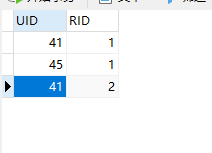
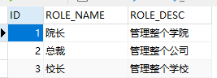

# 1. 连接池


我们在实际开发中都会使用连接池，因为他可以减少我们获取连接所消耗的时间

### mybatis中的连接池

在 Mybatis 中有连接池技术，但是它采用的是自己的连接池技术。在 Mybatis 的 SqlMapConfig.xml 配置文件中，通过`<dataSource type="pooled”\>`来实现 Mybatis 中连接池的配置。

UNPOOLED 不使用连接池的数据源

POOLED 使用连接池的数据源

JNDI  使用 JNDI 实现的数据源


# 2. mybatis的动态SQL语句

### 2.1 where与if标签

````xml
<!-- 根据条件查询 -->
<select id="findByCondition" parameterType="com.xxx.mybatisCRUD.pojo.User" resultType="com.xxx.mybatisCRUD.pojo.User">
  select * from user
  <where>
    <if test="username!=null">
      and username = #{username}
    </if>
  </where>
</select>
````

### 2.2 foreach标签

1.  QueryVo

   `private List<Integer> ids;`

2.  dao接口

   ```Java
   //根据ids查询
   List<User> findByIds(QueryVo vo);
   ```

3.  dao映射文件mapper

   ````xml
   <select id="findByIds" parameterType="com.xxx.mybatisCRUD.pojo.QueryVo" resultType="com.xxx.mybatisCRUD.pojo.User">
     select * from user
     <where>
       <if test="ids!=null and ids.size()>0">
         <foreach collection="ids" open="and id in(" close=")" item="id" separator=",">
           #{id}
         </foreach>
       </if>
     </where>
   </select>
   ````

4.  测试

   ````java
   //测试根据ids查询
   @Test
   public void testFindByIds() {
     QueryVo vo = new QueryVo();
     List<Integer> list = new ArrayList<Integer>();
     list.add(41);
     list.add(43);
     list.add(46);
     vo.setIds(list);
     List<User> users = userMapper.findByIds(vo);
     System.out.println(users);
   }
   ````

### 2.3 SQL片段

抽取重复的SQL语句代码片段，封装在SQL标签，可通过include标签来调用

````xml
<!-- 抽取重复的语句代码片段 --> 
<sql id="defaultSql">
  select * from user
</sql>
````

````xml
<select id="findAll" resultType="user"> 
  <include refid="defaultSql"></include>
</select>
````

# 3. mybatis多表查询

### 3.1 一对一查询

**需求**：查询所有账户信息，关联用户信息。

**注意**：因为一个账户信息只能供某个用户使用，所以从查询账户信息出发关联查询用户信息为一对一查询。

1.  定义账户信息account的实体类

2.  编写持久层dao接口

   ```Java
   //查询所有账户，并带有用户名称和地址信息
   List<AccountUser> findAccountUser();
   ```

   > 查询所有账户并带有用户名称和地址信息，将要返回的结果封装为一个dto或vo：AccountUser

 3.  封装AccountUser类

    ````java
    public class AccountUser extends Account {
      private String username;
      private String address;
    
      public String getUsername() {
        return username;
      }
    
      public void setUsername(String username) {
        this.username = username;
      }
    
      public String getAddress() {
        return address;
      }
    
      public void setAddress(String address) {
        this.address = address;
      }
    
      @Override
      public String toString() {
        return super.toString()+"AccountUser{" +
          "username='" + username + '\'' +
          ", address='" + address + '\'' +
          '}';
      }
    }
    ````

 4.  配置dao接口的映射文件

    ```xml
    <!-- 查询所有账户，并带有用户名称和地址信息 -->
    <select id="findAccountUser" resultType="AccountUser">
      select a.*,u.username,u.address from account a,user u where a.uid = u.id
    </select>
    ```

 5.  测试

    ```java 
    //查询所有账户，并带有用户名称和地址信息
    @Test
    public void testFindAccountUser() {
      List<AccountUser> list = accountMapper.findAccountUser();
      for (AccountUser accountUser : list) {
        System.out.println(accountUser);
      }
    }
    //输出：
    //Account{id=1, uid=41, money=1000.0}AccountUser{username='老王', address='北京'}
    //Account{id=2, uid=45, money=1000.0}AccountUser{username='传智播客', address='北京金燕龙'}
    //Account{id=3, uid=41, money=2000.0}AccountUser{username='老王', address='北京'}
    ```

> 注意：还有第二种方法，将返回结果在映射文件里封装为resultMap(需要在 Account 类中加入 User 类的对象作为 Account 类的一个属性)，但一般使用第一种。

```xml
<!-- 建立对应关系 --> 
<resultMap type="account" id="accountMap"> <id column="aid" property="id"/>
  <result column="uid" property="uid"/>
  <result column="money" property="money"/>
  <!-- 它是用于指定从表方的引用实体属性的 --> 
  <association property="user" javaType="user"> <id column="id" property="id"/>
    <result column="username" property="username"/>
    <result column="sex" property="sex"/>
    <result column="birthday" property="birthday"/>
    <result column="address" property="address"/>
  </association>
</resultMap>
```

### 3.2 一对多查询

**需求**：查询所有用户信息及用户关联的账户信息。

**注意**：用户信息和他的账户信息为一对多关系，并且查询过程中如果用户没有账户信息，也要将用户信息查询出来，使用左外连接查询比较合适。

1.  User类中加入`List<Account>`

   ```Java
   //一对多关系映射，主表实体应该加上从表实体的集合引用
   private List<Account> accounts;
   
   public List<Account> getAccounts() {
     return accounts;
   }
   
   public void setAccounts(List<Account> accounts) {
     this.accounts = accounts;
   }
   ```

2.  编写dao接口

   ```Java
   //查询所有用户，同时获取用户下的所有账户信息
   List<User> findUserAccount();
   ```

3.  配置映射文件

   ```xml
   <!--定义user的resultMap-->
   <resultMap id="userAccountMap" type="user">
     <id property="id" column="id"></id>
     <result property="username" column="username"></result>
     <result property="address" column="address"></result>
     <result property="sex" column="sex"></result>
     <result property="birthday" column="birthday"></result>
     <!-- 配置user对象中accounts集合的映射 -->
     <collection property="accounts" ofType="account">
       <id column="id" property="id"></id>
       <result column="uid" property="uid"></result>
       <result column="money" property="money"></result>
     </collection>
   </resultMap>
   
   <!-- 查询所有用户，同时获取用户下的所有账户信息 -->
   <select id="findUserAccount" resultMap="userAccountMap">
     select * from user u left join account a on a.uid = u.id
   </select>
   ```

4.  测试

   ````java
   //查询所有用户，同时获取用户下的所有账户信息
   @Test
   public void testFindUserAccount() {
     List<User> users = userMapper.findUserAccount();
     for (User user : users) {
       System.out.println("---每个用户的信息：---");
       System.out.println(user);
       System.out.println(user.getAccounts());
     }
   }
   
   //输出
   ---每个用户的信息：---
   User{id=41, username='老王', birthday=Wed Feb 28 01:47:08 CST 2018, sex='男', address='北京'}
   [Account{id=1, uid=41, money=1000.0}, Account{id=3, uid=41, money=2000.0}]
   ---每个用户的信息：---
   User{id=45, username='传智播客', birthday=Sun Mar 04 20:04:06 CST 2018, sex='男', address='北京金燕龙'}
   [Account{id=2, uid=45, money=1000.0}]
   ---每个用户的信息：---
   User{id=42, username='小二王', birthday=Fri Mar 02 23:09:37 CST 2018, sex='女', address='北京金燕龙'}
   []
   ---每个用户的信息：---
   User{id=43, username='小二王', birthday=Sun Mar 04 19:34:34 CST 2018, sex='女', address='北京金燕龙'}
   []
   ---每个用户的信息：---
   User{id=46, username='老王', birthday=Thu Mar 08 01:37:26 CST 2018, sex='男', address='北京'}
   []
   ---每个用户的信息：---
   User{id=48, username='小马宝莉', birthday=Thu Mar 08 19:44:00 CST 2018, sex='女', address='北京修正'}
   []
   ---每个用户的信息：---
   User{id=56, username='mabatis last insertid', birthday=Mon Dec 14 15:38:14 CST 2020, sex='男', address='北京市顺义区'}
   []
   ---每个用户的信息：---
   User{id=57, username='mabatis last insertid', birthday=Mon Dec 14 15:39:16 CST 2020, sex='男', address='北京市顺义区'}
   []
   ````

### 3.3 多对多查询

**多对多关系我们看成是双向的一对多关系。**

#### 3.3.1 实现role到user的多对多

1.  在 MySQL 数据库中添加角色表，用户角色的中间表。

                           

2.  实现SQL

   ````mysql
   select u.*,r.id as rid,r.ROLE_NAME,r.ROLE_DESC from role r
   left join user_role ur on r.id = ur.RID
   left join user u on u.id = ur.UID
   ````

3.  role实体类

   ````java
   public class Role implements Serializable {
     private Integer id;
     private String roleName;
     private String roleDesc;
   
     //多对多的关系映射：一个角色可以赋予多个用户
     private List<User> users;
     ...
   }
   ````

4.  role持久层接口

   ````java
   //查询所有角色
   List<Role> findAll();
   ````

5.  映射文件

   ```xml
   <!-- 定义role表的resultMap -->
   <resultMap id="roleMap" type="Role">
     <id property="id" column="rid"></id>
     <result property="roleName" column="role_name"></result>
     <result property="roleDesc" column="role_desc"></result>
     <collection property="users" ofType="user">
       <id column="id" property="id"></id>
       <result column="username" property="username"></result>
       <result column="address" property="address"></result>
       <result column="sex" property="sex"></result>
       <result column="birthday" property="birthday"></result>
     </collection>
   </resultMap>
   
   <!-- 查询所有角色 -->
   <select id="findAll" resultMap="roleMap">
     select u.*,r.id as rid,r.ROLE_NAME,r.ROLE_DESC from role r
     left join user_role ur on r.id = ur.RID
     left join user u on u.id = ur.UID
   </select>
   ```

6.  测试

   ```java 
   @Test
   public void testFindAll() {
     List<Role> list = roleMapper.findAll();
     for (Role role : list) {
       System.out.println("----每个角色的信息：----");
       System.out.println(role);
       System.out.println(role.getUsers());
     }
   }
   
   //输出
   ----每个角色的信息：----
   Role{id=1, roleName='院长', roleDesc='管理整个学院'}
   [User{id=41, username='老王', birthday=Wed Feb 28 01:47:08 CST 2018, sex='男', address='北京'}, User{id=45, username='传智播客', birthday=Sun Mar 04 20:04:06 CST 2018, sex='男', address='北京金燕龙'}]
   ----每个角色的信息：----
   Role{id=2, roleName='总裁', roleDesc='管理整个公司'}
   [User{id=41, username='老王', birthday=Wed Feb 28 01:47:08 CST 2018, sex='男', address='北京'}]
   ----每个角色的信息：----
   Role{id=3, roleName='校长', roleDesc='管理整个学校'}
   []
   ```

#### 3.3.2 实现user到role的多对多

SQL：

```mysql
select u.*,r.id as rid,r.ROLE_NAME,r.ROLE_DESC from user u
left join user_role ur on u.id = ur.UID
left join role r on r.id = ur.RID
```

