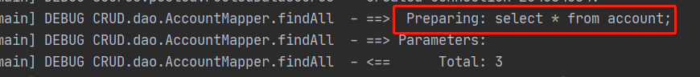
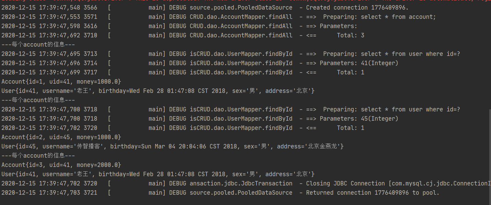
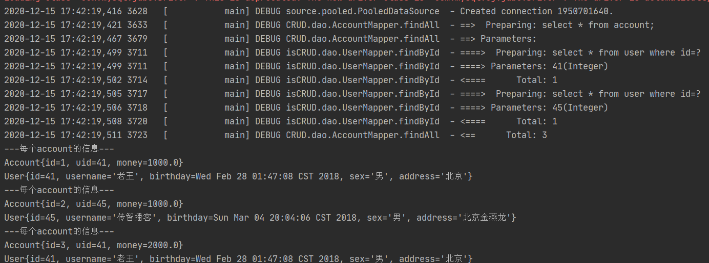
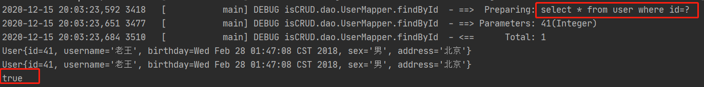
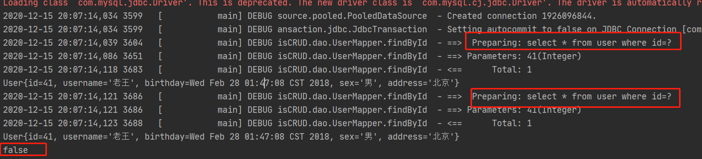
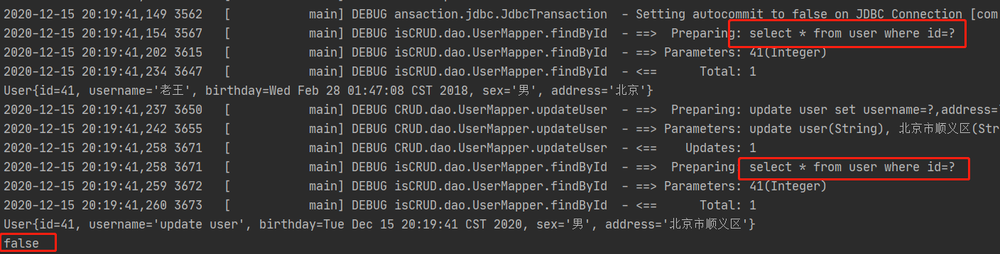
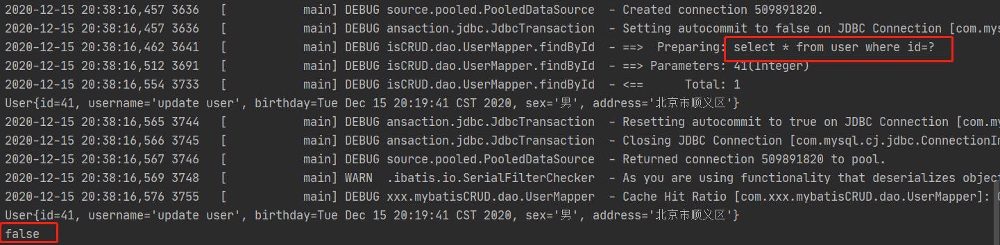

# 1. 延迟加载

首先我们先思考一个问题，假设：在一对多中，我们有一个用户，他有100个账户。

问题1：在查询用户的时候，要不要把关联的账户查出来？

问题2：在查询账户的时候，要不要把关联的用户查出来？

解答：在查询用户的时候，用户下的账户信息应该是我们什么时候使用，什么时候去查询。

​	   在查询账户的时候，账户的所属用户信息应该是随着账户查询时一起查询出来。

搞清楚这两个简单的问题后，我们就可以引出延迟加载和立即加载的特性。

**延迟加载**：在真正使用数据的时候才发起查询，不用的时候不查询关联的数据，延迟加载又叫按需查询（懒加载）

**立即加载**：不管用不用，只要一调用方法，马上发起查询。

**使用场景**：在对应的四种表关系中，**一对多、多对多**通常情况下采用**延迟加载**

​									**多对一、一对一**通常情况下采用**立即加载**

### 1.1 一对一实现延迟加载(使用association)

查询账户关联的用户使用延迟加载

1.  Account实体类

   ```Java
   public class Account implements Serializable {
     private Integer id;
     private Integer uid;
     private Double money;
     private User user;
   }
   ```

2.  账户的持久层dao接口

   ```java 
   //查询所有账户
   List<Account> findAll();
   ```

3.  映射文件

   ```xml
   <!-- 定义和封装 account 和 user的 resultMap -->
   <resultMap id="accountUserMap" type="Account">
     <id property="id" column="id"></id>
     <result property="uid" column="uid"></result>
     <result property="money" column="money"></result>
     <!--一对一的关系映射，配置封装user的内容
         select属性指定的内容：查询用户的唯一标识
         column属性指定的内容：用户根据id查询时，所需要的参数的值
     -->
     <association property="user" column="uid" javaType="User" select="com.xxx.mybatisCRUD.dao.UserMapper.findById">
     </association>
   </resultMap>
   
   <!-- 查询所有账户 -->
   <select id="findAll" resultMap="accountUserMap">
     select * from account;
   </select>
   ```

4.  开启mybatis延迟加载

   `SqlMapConfig.xml`文件

   ```xml
   <settings>
     <!-- 开启mybatis支持延迟加载 -->
     <setting name="lazyLoadingEnabled" value="true"/>
     <setting name="aggressiveLazyLoading" value="false"/>
   </settings>
   ```

5.  测试

   ```Java
   //查询所有账户
   @Test
   public void testFindAll() {
     List<Account> accounts = accountMapper.findAll();
     //        for (Account account : accounts) {
     //            System.out.println("---每个account的信息---");
     //            System.out.println(account);
     //            System.out.println(account.getUser());
     //        }
   }
   ```

   

> 只执行了`select * from account`，没有立即查询用户，实现了延迟加载

- 在for循环输出每个account信息的打印日志，可以看到在输出一个account信息的时候才会查询他关联的用户

  

- 没有配置延迟加载时的日志

  

### 1.2 一对多实现延迟加载(使用collection)

````xml
<!--定义user的resultMap-->
<resultMap id="userAccountMap" type="User">
  <id property="id" column="id"></id>
  <result property="username" column="username"></result>
  <result property="address" column="address"></result>
  <result property="sex" column="sex"></result>
  <result property="birthday" column="birthday"></result>
  <!-- 配置user对象中accounts集合的映射 -->
  <!--        <collection property="accounts" ofType="account">-->
  <!--            <id column="aid" property="id"></id>-->
  <!--            <result column="uid" property="uid"></result>-->
  <!--            <result column="money" property="money"></result>-->
  <!--        </collection>-->
  <collection property="accounts" ofType="Account" select="com.xxx.mybatisCRUD.dao.AccountMapper.findByUid" column="id"></collection>
</resultMap>
````

# 2. 缓存

### 2.1 概念介绍

1.  **什么是缓存**：存在于内存中的临时数据
2.  **为什么使用缓存**：减少和数据库的交互次数，提高执行效率
3.  什么样的数据能适用缓存、什么样的数据不能适用缓存
   - 适用于缓存：
     1. 经常查询并且不经常改变的数据
     2. 数据的正确与否对最终结果影响不大的
   - 不适用于缓存
     1. 经常改变的数据
     2. 数据的正确对最终结果影响很大的     例如：商品的库存、银行的汇率等

### 2.2 mybatis中的一级缓存和二级缓存

#### 2.2.1 一级缓存

1.  一级缓存指的是`Mybatis`中`SqlSession`对象的缓存
2.  当我们执行查询语句之后，查询的结果会同时存入到`SqlSession`为我们提供的一块区域中，该区域的结构是一个Map，当我们再次查询相同的结果时，`Mybatis`会先去`SqlSession`中查询是否含有数据，有的话就直接拿来使用

- * 

##### 测试一级缓存

```java 
//测试一级缓存
@Test
public void TestFirstLevelCache() {
  User user1 = userMapper.findById(41);
  System.out.println(user1);
  User user2 = userMapper.findById(41);
  System.out.println(user2);

  System.out.println(user1 == user2);  //true
}
```



##### 一级缓存消失的一些行为：

* `SqlSession`对象消失
* 调用`SqlSession`对象的`clearCache()、commit()、close()`方法
* 调用`SqlSession`的修改、添加、删除等方法

```java 
//测试一级缓存
@Test
public void TestFirstLevelCache() {
  User user1 = userMapper.findById(41);
  System.out.println(user1);

  //  //清空sqlSession缓存
  //  sqlSession.clearCache();
  //  userMapper = sqlSession.getMapper(UserMapper.class);

  //调用update
  user1.setUsername("update user");
  user1.setAddress("北京市顺义区");
  user1.setSex("男");
  user1.setBirthday(new Date());
  userMapper.updateUser(user1);

  User user2 = userMapper.findById(41);
  System.out.println(user2);

  System.out.println(user1 == user2);  //false
}
```





#### 2.2.2 二级缓存

1.  二级缓存指的是`Mybatis`中`SqlSessionFactory`对象的缓存，由同一个`SqlSessionFactory`对象创建的`SqlSession`对象共享其缓存

2.  二级缓存的使用步骤：

   - 让`Mybatis`框架支持二级缓存：

     在主配置文件中配置：在`<configuration>`标签中添加：`<settings><setting name="cacheEnabled" value="true"/><settings></configuration>` (不用配置，默认为true)

   - 让当前的映射文件支持二级缓存：

     在xxxDao.xml进行配置：在`<mapper>`标签中添加：`<cache/>`标签

   - 让当前的操作支持二级缓存

     在`<select>`标签中进行配置：在`<select>`标签中添加：`useCache="true"`

##### 测试二级缓存

````java
public class SecondLevelCacheTest {
  private InputStream in;
  private SqlSessionFactory factory;

  @Before
  public void init() throws Exception{
    //1.读取配置文件，生成字节输入流
    in = Resources.getResourceAsStream("SqlMapConfig.xml");
    //2.获取SqlSessionFactory
    factory = new SqlSessionFactoryBuilder().build(in);
  }

  @After
  public void destroy() throws Exception{
    in.close();
  }

  @Test
  public void TestSecondLevelCache() {
    SqlSession session1 = factory.openSession();
    UserMapper mapper1 = session1.getMapper(UserMapper.class);
    User user1 = mapper1.findById(41);
    System.out.println(user1);
    session1.close();  //一级缓存消失

    SqlSession session2 = factory.openSession();
    UserMapper mapper2 = session2.getMapper(UserMapper.class);
    User user2 = mapper2.findById(41);
    System.out.println(user2);
    session1.close();

    System.out.println(user1 == user2);
  }
}
````




