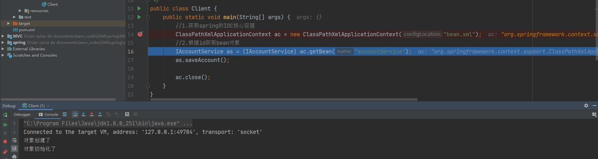

# 1. Spring概述

## 1.1 Spring是什么

Spring 是分层的 Java SE/EE 应用 full-stack 轻量级开源框架，以 **IoC（Inverse Of Control：反转控制）**和 **AOP（Aspect Oriented Programming：面向切面编程）**为内核，提供了展现层 Spring MVC 和持久层 Spring JDBC 以及业务层事务管理等众多的企业级应用技术，还能整合开源世界众多著名的第三方框架和类库，逐渐成为使用最多的 Java EE 企业应用开源框架。

## 1.2 Spring的体系结构


# 2. IOC的概念和作用

## 2.1 程序的耦合和解耦

### 2.1.1 什么是程序的耦合

**耦合：程序间的依赖关系**

​		包括：类之间的依赖、方法间的依赖

**解耦：降低程序间的依赖关系**

实际开发中，应该做到：**编译器不依赖，运行时才依赖**

我们在开发中，有些依赖关系是必须的，有些依赖关系可以通过优化代码来解除的。

例如：

```Java
/**
 * 账户的业务层实现类
 */
public class AccountServiceImpl implements IAccountService {
  //业务层调用持久层
  private IAccountDao accountDao = new AccountDaoImpl();

  public void saveAccount() {
    accountDao.saveAccount();
  }
}
```

> 业务层调用持久层，并且此时业务层在依赖持久层的接口和实现类。如果此时没有持久层实现类，编译将不能通过。这种编译期依赖关系，应该在我们开发中杜绝。

再比如：

早期我们的 JDBC 操作，注册驱动时，我们为什么不使用 DriverManager 的 register 方法，而是采用 Class.forName 的方式？

```Java
public static void main(String[] args) throws Exception {
  //1.注册驱动
  //Driver driver = new Driver() 会产生对某一种数据库的依赖（会import驱动包），耦合性较高。
  //DriverManager.registerDriver(new com.mysql.jdbc.Driver());
  Class.forName("com.mysql.jdbc.Driver");
  //解决了编译期依赖，变成了运行时才依赖
}
```

> 原因：
>
> com.mysql.jdbc.Driver的源码：
>
> ```Java
> public class Driver extends NonRegisteringDriver implements java.sql.Driver {
>   static {
>     try {
>       java.sql.DriverManager.registerDriver(new Driver());
>     } catch (SQLException E) {
>       throw new RuntimeException("Can't register driver!");
>     }
>   }
> }
> ```
>
> 根据类加载机制，当执行 `Class.forName(driverClass)` 获取其Class对象时， `com.mysql.jdbc.Driver` 就会被JVM加载，并进行初始化，初始化就会执行静态代码块，也就会执行这句代码：`java.sql.DriverManager.registerDriver(new Driver());`

### 2.1.2 解耦的思路：

1.  使用反射来创建对象，而避免使用new关键字
2.  通过读取配置文件来获取要创建对象的全限定类名

 `Class.forName("com.mysql.jdbc.Driver");`  只是一个字符串

> 此时的好处是，我们的类中不再依赖具体的驱动类，此时就算删除 mysql 的驱动 jar 包，依然可以编译（运行就不要想了，没有驱动不可能运行成功的）。
>
> 同时，也产生了一个新的问题，mysql 驱动的全限定类名字符串是在 java 类中写死的，一旦要改还是要修改源码。
>
> 解决这个问题也很简单，使用配置文件配置。

### 2.1.3 工厂模式解耦

模拟MVC三层架构

1.  业务层

   ```Java
   /**
    * 账户业务层的接口
    */
   public interface IAccountService {
     //保存账户(模拟操作)
     void saveAccount();
   }
   
   /**
    * 账户的业务层实现类
    */
   public class AccountServiceImpl implements IAccountService {
     //业务层调用持久层
     private IAccountDao accountDao = new AccountDaoImpl();
   
     public void saveAccount() {
       accountDao.saveAccount();
     }
   }
   ```

2.  持久层

   ````java
   /**
    * 账户的持久层接口
    */
   public interface IAccountDao {
     //模拟保存账户
     void saveAccount();
   }
   
   /**
    * 账户持久层的实现类，项目中使用mybatis映射文件
    */
   public class AccountDaoImpl implements IAccountDao {
     public void saveAccount() {
       System.out.println("保存账户");
     }
   }
   ````

3.  表现层

   ```java 
   /**
   * 模拟一个表现层，调用业务层
   */
   public class Client {
     public static void main(String[] args) {
       IAccountService as = new AccountServiceImpl();
       as.saveAccount();
     }
   
   }
   ```

**注意**：在表现层和业务层都new了对象，耦合度较高，使用工厂模式来解耦

Bean：在计算机英语中，有可重用组件的含义

Javabean：用JAVA语言编写的可重用组件     Javabean >> 实体类

​		  他就是创建我们的service和dao对象的

#### 1. 解决办法

第一：需要一个配置文件来配置我们的service和dao

​		配置的内容：唯一标识 = 全限定类名(key = value)

第二：通过读取配置文件中配置的内容，反射创建对象

1.  我的配置文件

   ```properties
   accountService=com.xxx.MVC.service.impl.AccountServiceImpl
   accountDao=com.xxx.MVC.dao.impl.AccountDaoImpl
   ```

2.  创建Bean对象的工厂

   ```java 
   /**
    * 一个创建bean对象的工厂
    */
   public class BeanFactory {
     private static Properties pro;
   
     //使用静态代码块为properties对象赋值
     static {
       try {
         pro = new Properties();
         InputStream in = BeanFactory.class.getClassLoader().getResourceAsStream("bean.properties");
         pro.load(in);
       } catch (IOException e) {
         e.printStackTrace();
       }
     }
   
     /**
        * 根据bean的名称获取bean对象
        * @param beanName
        * @return
        */
     public static Object getBean(String beanName) {
       Object bean = null;   //定义bean对象
       String beanPath = pro.getProperty(beanName);  //获取bean对象的全限定类名
       try {
         bean = Class.forName(beanPath).newInstance(); //每次都会调用默认构造函数创建对象
       } catch (InstantiationException e) {
         e.printStackTrace();
       } catch (IllegalAccessException e) {
         e.printStackTrace();
       } catch (ClassNotFoundException e) {
         e.printStackTrace();
       }
       return bean;
     }
   }
   ```

3.  解耦

   ```Java
   //业务层调用持久层
   private IAccountDao accountDao = (IAccountDao) BeanFactory.getBean("accountDao");
   
   //表现层
   public class Client {
     public static void main(String[] args) {
       IAccountService as = (IAccountService) BeanFactory.getBean("accountService");
       as.saveAccount();
     }
   }
   ```

#### 2. 初级改造

1.  业务层

   ````java
   /**
    * 账户的业务层实现类
    */
   public class AccountServiceImpl implements IAccountService {
     //业务层调用持久层
     private IAccountDao accountDao = (IAccountDao) BeanFactory.getBean("accountDao");
   
     private int i = 1;
   
     public void saveAccount() {
       accountDao.saveAccount();
       System.out.println(i);
       i++;
     }
   }
   ````

2.  表现层

   ```Java
   public class Client {
     public static void main(String[] args) {
       for (int i = 0; i < 5; i++) {
         IAccountService as = (IAccountService) BeanFactory.getBean("accountService");
         System.out.println(as);
         as.saveAccount();
       }
     }
   }
   ```

3.  运行结果(多例)

   ```Java
   com.xxx.MVC.service.impl.AccountServiceImpl@4554617c
   保存账户
   1
   com.xxx.MVC.service.impl.AccountServiceImpl@74a14482
   保存账户
   1
   com.xxx.MVC.service.impl.AccountServiceImpl@1540e19d
   保存账户
   1
   com.xxx.MVC.service.impl.AccountServiceImpl@677327b6
   保存账户
   1
   com.xxx.MVC.service.impl.AccountServiceImpl@14ae5a5
   保存账户
   1
   ```

   

#### 3. 最终改造(单例对象)

没有类成员，不存在线程安全问题，使用单例对象(第三点，第二点有线程安全问题)

1.  BeanFactory

   ```Java
   /**
    * 一个创建bean对象的工厂
    */
   public class BeanFactory {
     private static Properties pro;
   
     //定义一个map，用于存放我们要创建的对象，我们称之为容器
     private static Map<String,Object> beans;
   
     //使用静态代码块为properties对象赋值
     static {
       try {
         pro = new Properties();
         InputStream in = BeanFactory.class.getClassLoader().getResourceAsStream("bean.properties");
         pro.load(in);
         //实例化容器
         beans = new HashMap<String, Object>();
         //取出配置文件中所有的key
         Enumeration<Object> keys = pro.keys();
         //遍历枚举
         while (keys.hasMoreElements()) {
           //取出每个key
           String key = keys.nextElement().toString();
           //根据key获取value
           String beanPath = pro.getProperty(key);
           //根据反射创建对象
           Object value = Class.forName(beanPath).newInstance();
           beans.put(key,value);
         }
       } catch (Exception e) {
         throw new ExceptionInInitializerError("初始化properties失败");
       }
     }
   
     /**
        * 根据bean的名称获取bean对象
        * @param beanName
        * @return
        */
     public static Object getBean(String beanName) {
       return beans.get(beanName);
     }
   }
   ```

2.  当业务层实现类定义成员变量时

   ```Java
   public class AccountServiceImpl implements IAccountService {
     //业务层调用持久层
     private IAccountDao accountDao = (IAccountDao) BeanFactory.getBean("accountDao");
   
     private static int i = 1;
     public void saveAccount() {
       //        int i = 1;
       accountDao.saveAccount();
       System.out.println(i);
       i++;
     }
   }
   ```

   运行结果：

   ```Java
   com.xxx.MVC.service.impl.AccountServiceImpl@4554617c
   保存账户
   1
   com.xxx.MVC.service.impl.AccountServiceImpl@4554617c
   保存账户
   2
   com.xxx.MVC.service.impl.AccountServiceImpl@4554617c
   保存账户
   3
   com.xxx.MVC.service.impl.AccountServiceImpl@4554617c
   保存账户
   4
   com.xxx.MVC.service.impl.AccountServiceImpl@4554617c
   保存账户
   5
   ```

   > 使用的是同一个对象，多线程时访问的是改过的数据，一般变量定义在方法中

3.  变量定义在方法中

   ```Java
   com.xxx.MVC.service.impl.AccountServiceImpl@4554617c
   保存账户
   1
   com.xxx.MVC.service.impl.AccountServiceImpl@4554617c
   保存账户
   1
   com.xxx.MVC.service.impl.AccountServiceImpl@4554617c
   保存账户
   1
   com.xxx.MVC.service.impl.AccountServiceImpl@4554617c
   保存账户
   1
   com.xxx.MVC.service.impl.AccountServiceImpl@4554617c
   保存账户
   1
   ```

### 2.1.4 控制反转IOC(Inversion Of Control)

在应用加载时，创建一个 Map，用于存放三层对象。我们把这个 map 称之为**容器**。 

**什么是工厂？**

工厂就是负责给我们从容器中获取指定对象的类。这时候我们获取对象的方式发生了改变。

原来：我们在获取对象时，都是采用 new 的方式。**是主动的。**

现在：我们获取对象时，同时跟工厂要，有工厂为我们查找或者创建对象。**是被动的。**

**这种被动接收的方式获取对象的思想就是控制反转，它是 spring 框架的核心之一。**

**明确ioc的作用**：削减计算机程序的耦合(解除我们代码中的依赖关系


# 3. 使用spring的IOC解决程序耦合

## 3.1 基于XML的配置(入门案例)

还是拿模拟MVC三层架构来演示

1.  导入pom依赖

   ```xml
   <dependency>
     <groupId>org.springframework</groupId>
     <artifactId>spring-context</artifactId>
     <version>5.3.1</version>
   </dependency>
   ```

2.  创建配置文件bean.xml

   ````xml
   <?xml version="1.0" encoding="UTF-8"?>
   <beans xmlns="http://www.springframework.org/schema/beans"
          xmlns:xsi="http://www.w3.org/2001/XMLSchema-instance"
          xsi:schemaLocation="http://www.springframework.org/schema/beans
                              http://www.springframework.org/schema/beans/spring-beans-3.2.xsd">
   
     <!-- 把对象的创建交给spring来管理 -->
     <bean id="accountService" class="spring.service.impl.AccountServiceImpl"></bean>
     <bean id="accountDao" class="spring.dao.impl.AccountDaoImpl"></bean>
   </beans>
   ````

3.  使用spring的IOC

   ```java 
   /**
    * 模拟一个表现层，调用业务层
    */
   public class Client {
     public static void main(String[] args) {
       //1.获取spring的IOC核心容器
       ClassPathXmlApplicationContext ac = new ClassPathXmlApplicationContext("bean.xml");
       //2.根据id获取bean对象(两种强转方式)
       IAccountService as = (IAccountService) ac.getBean("accountService");
       IAccountDao adao = ac.getBean("accountDao", IAccountDao.class);
       
       System.out.println(as);  //spring.service.impl.AccountServiceImpl@1ce92674
       System.out.println(adao);  //spring.dao.impl.AccountDaoImpl@5700d6b1
     }
   }
   ```

   `ApplicationContext`的三个常用实现类：

   - `ClassPathXmlApplicationContext`：它可以加载类路径下的配置文件，要求配置文件必须在类路径下，不在的话加载不了。(更常用)
   - `FileSystemXmlApplicationContext`：它可以加载磁盘任意路径下的配置文件(必须有访问权限)
   - `AnnotationConfigApplicationContext`：他是用于读取注解创建容器的


**核心容器两个接口BeanFactory和ApplicationContext的区别**

- ApplicationContext(单例对象适用)：它在构建核心容器时，创建对象采取的策略是**立即加载**的方式。即，只要一读取完配置文件马上就创建配置文件中配置的对象

- BeanFactory(多例对象适用)：它在构建核心容器时，创建对象采取的策略是**延迟加载**的方式。即，什么时候根据id获取对象了，什么时候才是真正的创建对象

## 3.2 IOC中bean标签和管理对象细节

### 3.2.1 bean标签

**作用：**用于配置对象让 spring 来创建的。

默认情况下它调用的是类中的无参构造函数。如果没有无参构造函数则不能创建成功。

**属性**：

- id：给对象在容器中提供一个唯一标识。用于获取对象。

- class：指定类的全限定类名。用于反射创建对象。默认情况下调用无参构造函数。

### 3.2.2 创建bean的三种方式

#### 1. 使用默认构造函数创建

在spring的配置文件中使用bean标签，配以id和class属性之后，且没有其他属性和标签时采用的就是默认构造函数创建bean对象，此时如果类中没有默认构造函数，则对象无法创建.

```xml
<bean id="accountService" class="bean.service.impl.AccountServiceImpl"></bean>
```


#### 2. 使用工厂的方法创建对象

使用普通工厂中的方法创建对象(使用某个类中的方法创建对象，并存入spring容器)

```Java
/**
 * 模拟一个工厂类(该类可能存在于jar包，我们无法通过修改源码方式提供默认构造函数)
 */
public class InstanceFactory {
  public IAccountService getAccountService() {
    return new AccountServiceImpl();
  }
}
```

```xml
<!-- 第二种方式：使用普通工厂中的方法创建对象(使用某个类中的方法创建对象，并存入spring容器) -->
<bean id="instanceFactory" class="bean.factory.InstanceFactory"></bean>
<bean id="accountService" factory-bean="instanceFactory" factory-method="getAccountService"></bean>
```

先把工厂的创建交给 spring 来管理，然后在使用工厂的 bean 来调用里面的方法。

factory-bean 属性：用于指定实例工厂 bean 的 id。

factory-method 属性：用于指定实例工厂中创建对象的方法。

#### 3. 使用工厂中的静态方法创建对象


```xml
<!-- 第三种方式：使用工厂的静态方法创建对象 -->
<bean id="accountService" class="bean.factory.StaticFactory" factory-method="getAccountService"></bean>
```

使用 StaticFactory 类中的静态方法 getAccountService 创建对象，并存入 spring 容器

id 属性：指定 bean 的 id，用于从容器中获取

class 属性：指定工厂的全限定类名

factory-method 属性：指定生产对象的静态方法

### 3.2.3 bean的作用范围和生命周期

#### 1. 作用范围

bean标签的scope属性：用于指定bean的作用范围

取值：

- singleton：单例的(默认值)

- prototype：多例的

- request：作用于web应用的请求范围

- session：作用于web应用的会话范围

- global-session：作用于集群环境的会话范围(全局会话范围)，当不是集群环境时，它就是session。

  

#### 2. 生命周期

```xml
<bean id="accountService" class="bean.service.impl.AccountServiceImpl" scope="prototype"
      init-method="init" destroy-method="destroy"></bean>
```

init-method：指定类中的初始化方法名称。

destroy-method：指定类中销毁方法名称。

1.  单例对象：`scope="singleton"`

   - 出生：当容器创建时对象出生

     

   - 活着：只要容器在，对象一直活着。

   - 死亡：销毁容器时，对象就被销毁了。

   - 总结：单例对象的生命周期和容器相同

2.  多例对象：`scope="prototype"`

   - 出生：当我们使用对象时，spring框架为我们创建

     

   - 活着：对象只要是在使用过程中就一直活着

   - 死亡：当对象长时间不用，且没有别的对象引用时，由Java的垃圾回收器回收

## 3.3 spring的依赖注入

### 3.3.1 概念

**Dependency Injection**：它是 spring 框架核心 ioc 的具体实现。

我们的程序在编写时，通过控制反转，把对象的创建交给了 spring，但是代码中不可能出现没有依赖的情况。IOC 解耦只是降低他们的依赖关系，但不会消除。例如：我们的业务层仍会调用持久层的方法。

那这种业务层和持久层的依赖关系，在使用 spring 之后，就**让 spring 来维护**了。简单的说，就是坐等框架把持久层对象传入业务层，而不用我们自己去获取。

依赖注入，**能注入的数据**：

- 基本类型和string
- 其他bean类型(在配置文件中或者注解配置过的bean)
- 复杂类型/集合类型

**注入的方式**：

- 使用构造函数
- 使用set方法
- 使用注解

### 3.3.2 使用构造函数

顾名思义，就是使用类中的构造函数，给成员变量赋值。注意，赋值的操作不是我们自己做的，而是通过配置的方式，让 spring 框架来为我们注入。

```Java
public class AccountServiceImpl implements IAccountService {
  //业务层调用持久层
  private String name;
  private Integer age;
  private Date birthday;

  public AccountServiceImpl(String name, Integer age, Date birthday) {
    this.name = name;
    this.age = age;
    this.birthday = birthday;
  }

  public void saveAccount() {
    System.out.println("service中的saveAccount方法执行了..." + name + "," + age + "," + birthday);
  }
}
```

使用构造函数的方式，给 service 中的属性传值。

要求：类中需要提供一个对应参数列表的构造函数。

**index**:指定参数在构造函数参数列表的索引位置

**type**:指定参数在构造函数中的数据类型

**name**:指定参数在构造函数中的名称 用这个找给谁赋值

=======上面三个都是找给谁赋值，下面两个指的是赋什么值的==============

**value**:它能赋的值是基本数据类型和 String 类型

**ref**:它能赋的值是其他 bean 类型，也就是说，必须得是在配置文件中配置过的 bean

```xml
<!-- 依赖注入：使用构造函数注入 -->
<bean id="accountService" class="DI.service.impl.AccountServiceImpl">
  <constructor-arg name="name" value="张三"></constructor-arg>
  <constructor-arg name="age" value="18"></constructor-arg>
  <constructor-arg name="birthday" ref="now"></constructor-arg>
</bean>
<!--配置一个日期对象-->
<bean id="now" class="java.util.Date"></bean>
```

> 优势：在获取bean对象时，注入数据是必须的操作，否则对象无法创建成功
>
> 弊端：改变了bean对象的实例化方式，使我们在创建对象时，如果用不到这些数据，也必须提供

### 3.3.3 使用set方法注入

顾名思义，就是在类中提供需要注入成员的 set 方法

```Java
public class AccountServiceImpl2 implements IAccountService {
  //业务层调用持久层
  private String name;
  private Integer age;
  private Date birthday;

  public void setName(String name) {
    this.name = name;
  }

  public void setAge(Integer age) {
    this.age = age;
  }

  public void setBirthday(Date birthday) {
    this.birthday = birthday;
  }

  public void saveAccount() {
    System.out.println("service中的saveAccount方法执行了..." + name + "," + age + "," + birthday);
  }
}
```

**name**：找的是类中 set 方法后面的部分

**ref**：给属性赋值是其他 bean 类型的

**value**：给属性赋值是基本数据类型和 string 类型的

实际开发中，此种方式用的较多。

```xml
<!-- 依赖注入：使用set方法注入 -->
<bean id="accountService2" class="DI.service.impl.AccountServiceImpl2">
  <property name="name" value="test"></property>
  <property name="age" value="18"></property>
  <!--        <property name="birthday" ref="now"></property>-->
</bean>

输出：
service中的saveAccount方法执行了...test,18,null
```

> 优势：创建对象时没有明确的限制，可以直接使用默认构造函数
>
> 弊端：如果有某个成员必须有值，则获取对象是有可能set方法没有执行

### 3.3.4 复杂类型/集合类型的注入

使用set方法注入

```Java
public class AccountServiceImpl3 implements IAccountService {
  //业务层调用持久层
  private String[] myStrs;
  private List<String> myList;
  private Set<String> mySet;
  private Map<String,String> myMap;
  private Properties myPros;

  public void setMyStrs(String[] myStrs) {
    this.myStrs = myStrs;
  }

  public void setMyList(List<String> myList) {
    this.myList = myList;
  }

  public void setMySet(Set<String> mySet) {
    this.mySet = mySet;
  }

  public void setMyMap(Map<String, String> myMap) {
    this.myMap = myMap;
  }

  public void setMyPros(Properties myPros) {
    this.myPros = myPros;
  }

  public void saveAccount() {
    System.out.println(Arrays.toString(myStrs));
    System.out.println(myList);
    System.out.println(mySet);
    System.out.println(myMap);
    System.out.println(myPros);
  }
}
```

```xml
<!-- 依赖注入：复杂类型/集合类型的注入 -->
<bean id="accountService3" class="DI.service.impl.AccountServiceImpl3">
  <property name="myStrs">
    <array>
      <value>AAA</value>
      <value>BBB</value>
      <value>CCC</value>
    </array>
  </property>
  <property name="myList">
    <list>
      <value>DDD</value>
      <value>EEE</value>
      <value>FFF</value>
    </list>
  </property>
  <property name="mySet">
    <set>
      <value>LLL</value>
      <value>MMM</value>
      <value>NNN</value>
    </set>
  </property>
  <property name="myMap">
    <map>
      <entry key="keyA" value="AAA"></entry>
      <entry key="keyB">
        <value>BBB</value>
      </entry>
    </map>
  </property>
  <property name="myPros">
    <props>
      <prop key="keyC">CCC</prop>
      <prop key="keyD">DDD</prop>
    </props>
  </property>
</bean>
```

> 注意：
>
> 用于给list结构集合注入的标签：list array set
>
> 用于给map结构集合注入的标签：map props
>
> 结构相同，标签可以互换

