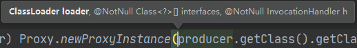
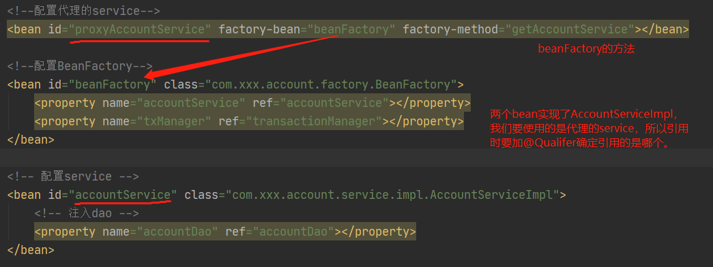

### 1. 之前案例中的事务问题

事务被自动控制了。换言之，我们使用了 connection 对象的 setAutoCommit(true)

此方式控制事务，如果我们每次都执行一条 sql 语句，没有问题，但是如果业务方法一次要执行多条 sql语句，这种方式就无法实现功能了。

例如：我们在业务层添加一条转账操作；

```Java
public void transfer(String sourceName, String targetName, Float money) {
  //1.根据名称查询转出账户
  Account sourceAccount = accountDao.findByName(sourceName);
  //2.根据名称查询转入账户
  Account targetAccount = accountDao.findByName(targetName);
  //3.转出账户减钱
  sourceAccount.setMoney(sourceAccount.getMoney() - money);
  //4.转入账户加钱
  targetAccount.setMoney(targetAccount.getMoney() + money);
  //5.更新转出转入账户
  updateAccount(sourceAccount);

  int i = 1/0; //模拟转账异常

  updateAccount(targetAccount);

}
```

> money为100，此时进行操作，sourceAccount少了100块钱，但是targetAccount并没有多100块钱，100不翼而飞了！！！

### 2. 问题的解决

解决办法：让业务层控制事务的提交和回滚，实现事务控制

```Java
//保证一个事务用的是同一个Connection
public class ConnectionUtils {
  private ThreadLocal<Connection> tl = new ThreadLocal<Connection>();
  private DataSource dataSource;

  public void setDataSource(DataSource dataSource) {
    this.dataSource = dataSource;
  }

  /**
     * 获取当前线程上的连接
     * @return
     */
  public Connection getTreadConnection() {
    try {
      //1.先从ThreadLocal获取connection
      Connection conn = tl.get();
      //2.判断当前线程上是否有连接connection
      if (conn == null) {
        //3.从数据源上获取一个连接，并且存入ThreadLocal中
        conn = dataSource.getConnection();
        tl.set(conn);
      }
      //4.返回当前线程上的连接
      return conn;
    } catch (SQLException e) {
      throw new RuntimeException(e);
    }
  }

  /**
     * 把连接和线程解绑
     * 线程用完还回线程池，connection关闭连接也只是还回连接池，线程上还是有这个连接，要从线程上移除这个connection
     */
  public void removeConnection() {
    tl.remove();
  }
}
```

```Java
/**
 * 和事务管理相关的工具类，包含开启事务 提交事务 回滚事务 和 释放连接
 */
public class TransactionManager {
  private ConnectionUtils connectionUtils;

  //给set方法是为了注入依赖
  public void setConnectionUtils(ConnectionUtils connectionUtils) {
    this.connectionUtils = connectionUtils;
  }


  //开启事务，并设置自动提交为false
  public void beginTransaction() {
    try {
      connectionUtils.getTreadConnection().setAutoCommit(false);
    } catch (SQLException e) {
      e.printStackTrace();
    }
  }

  //提交事务
  public void commit() {
    try {
      connectionUtils.getTreadConnection().commit();
    } catch (SQLException e) {
      e.printStackTrace();
    }
  }

  //回滚事务
  public void rollback() {
    try {
      connectionUtils.getTreadConnection().rollback();
    } catch (SQLException e) {
      e.printStackTrace();
    }
  }

  //释放连接
  public void release() {
    try {
      connectionUtils.getTreadConnection().close();  //还回连接池中
      connectionUtils.removeConnection();
    } catch (SQLException e) {
      e.printStackTrace();
    }
  }
}
```

在bean.xml中注入依赖

```Java
public void transfer(String sourceName, String targetName, Float money) {
  try {
    //开启事务
    txManager.beginTransaction();
    //执行操作
    //1.根据名称查询转出账户
    Account sourceAccount = accountDao.findByName(sourceName);
    //2.根据名称查询转入账户
    Account targetAccount = accountDao.findByName(targetName);
    //3.转出账户减钱
    sourceAccount.setMoney(sourceAccount.getMoney() - money);
    //4.转入账户加钱
    targetAccount.setMoney(targetAccount.getMoney() + money);
    //5.更新转出转入账户
    updateAccount(sourceAccount);

    int i = 1/0;

    updateAccount(targetAccount);
    //提交事务
    txManager.commit();
  } catch (Exception e) {
    //回滚事务
    txManager.rollback();
    e.printStackTrace();
  } finally {
    //关闭连接
    txManager.release();
  }
}
```

### 3. 新的问题

通过对业务层改造，已经可以实现事务控制了，但是由于我们添加了事务控制，也产生了一个新的问题：

业务层方法变得臃肿了，里面充斥着很多重复代码。并且业务层方法和事务控制方法耦合了。

### 4. 动态代理

**特点**：字节码随用随创建，随用随加载

**作用**：不修改源码的基础上对方法增强

**分类**：

- 基于接口的动态代理

  提供者：JDK 官方的 Proxy 类。

  要求：被代理类最少实现一个接口。

- 基于子类的动态代理

  提供者：第三方的 CGLib，如果报 asmxxxx 异常，需要导入 asm.jar。

  要求：被代理类不能用 final 修饰的类（最终类）

#### 4.1 基于接口的动态代理


一个电脑生产厂家要做到向经销商出售电脑和售后服务

```Java
/**
 * 对生产厂家的要求的规范/接口
 */
public interface IProducer {
  /**
     * 销售
     * @param money
     */
  void saleProduct(float money);

  /**
     * 售后
     * @param money
     */
  void afterSale(float money);
}
```

接口的实现类，一个满足生产厂家要求的生产者

```Java
/**
 * 一个生产者
 */
public class Producer implements IProducer {
  /**
     * 销售
     * @param money
     */
  public void saleProduct(float money) {
    System.out.println("销售产品，并拿到钱：" + money);
  }

  /**
     * 售后
     * @param money
     */
  public void afterSale(float money) {
    System.out.println("提供售后服务，并拿到钱：" + money);
  }
}
```

newProxyInstance的参数：



ClassLoader：用于加载代理对象的字节码，和被代理对象(producer)使用相同的类加载器。
Class[] Interfaces：让代理对象和被代理对象具有相同的行为。实现相同的接口。
InvocationHandler：如何代理。

```Java
public class Client {

  public static void main(String[] args) {
    //因为匿名内部类要访问producer，所以要加final
    final Producer producer = new Producer();
    /**
         * proxy代理(找到一个经销商)
         * 如何创建代理对象：Proxy.newProxyInstance
         * 创建代理的要求：被代理类至少实现一个接口，没有不能使用
         * newProxyInstance的参数：
         *      ClassLoader：用于加载代理对象的字节码，和被代理对象(producer)使用相同的类加载器。
         *      Class[] Interfaces：让代理对象和被代理对象具有相同的行为。实现相同的接口。
         *      InvocationHandler：如何代理。
         */
    IProducer proxyProducer = (IProducer) Proxy.newProxyInstance(producer.getClass().getClassLoader(),
                                                                 producer.getClass().getInterfaces(),
                                                                 new InvocationHandler() {
                                                                   /**
                                                                     * 执行被代理对象的任何接口方法都会经过该方法
                                                                     * @param proxy  代理对象的引用
                                                                     * @param method 当前执行的方法(本例中为saleProduct)
                                                                     * @param args   当前执行的方法所需要的参数(saleProduct(float money))
                                                                     * @return       和被代理对象有相同的返回值
                                                                     * @throws Throwable
                                                                     */
                                                                   public Object invoke(Object proxy, Method method, Object[] args) throws Throwable {
                                                                     //增强处理
                                                                     Object value = null;
                                                                     float money = (Float) args[0];
                                                                     if ("saleProduct".equals(method.getName())) {
                                                                       //消费者拿10000买电脑，实际上厂家只拿到8000，其他2000归经销商(赚差价)
                                                                       value = method.invoke(producer, money * 0.8f);
                                                                     }
                                                                     return value;
                                                                   }
                                                                 });
    proxyProducer.saleProduct(10000f);  
  }
}
```

#### 4.2 基于子类的动态代理

```Java
/**
 * 一个消费者
 */
public class Client {

    public static void main(String[] args) {
        final Producer producer = new Producer();
        /**
         * proxy代理(找到一个经销商)
         * 如何创建代理对象：Enhancer.create
         * 创建代理的要求：被代理类不能是最终类
         * create的参数：
         *      Class：用于指定被代理对象的字节码
         *      Callback：用于提供增强的代码，一般写该接口的子接口实现类:MethodInterceptor
         */
        Producer cglibProducer = (Producer) Enhancer.create(producer.getClass(), new MethodInterceptor() {
            /**
             * 执行被代理对象的任何方法都会经过该方法
             * @param proxy
             * @param method
             * @param args
             * @param methodProxy   当前执行方法的代理对象
             * @return
             * @throws Throwable
             */
            public Object intercept(Object proxy, Method method, Object[] args, MethodProxy methodProxy) throws Throwable {
                //增强处理
                Object value = null;
                float money = (Float) args[0];
                if ("saleProduct".equals(method.getName())) {
                    //消费者拿10000买电脑，实际上厂家只拿到8000，其他2000归经销商(赚差价)
                    value = method.invoke(producer, money * 0.8f);
                }
                return value;
            }
        });
        cglibProducer.saleProduct(12000f);
    }
}
```

# 5. 动态代理实现事务控制

### 5.1 创建service的代理对象的工厂

```Java
/**
 * 用于创建service的代理对象的工厂
 */
public class BeanFactory {
  private AccountService accountService;
  private TransactionManager txManager;

  public void setTxManager(TransactionManager txManager) {
    this.txManager = txManager;
  }

  public void setAccountService(AccountService accountService) {
    this.accountService = accountService;
  }

  /**
     * 获取service的代理对象
     * @return
     */
  public AccountService getAccountService() {
    return (AccountService) Proxy.newProxyInstance(accountService.getClass().getClassLoader(),
                                                   accountService.getClass().getInterfaces(),
                                                   new InvocationHandler() {
                                                     /**
                     * 添加事务的支持
                     * @param proxy
                     * @param method
                     * @param args
                     * @return
                     * @throws Throwable
                     */
                                                     public Object invoke(Object proxy, Method method, Object[] args) throws Throwable {
                                                       Object value = null;
                                                       try {
                                                         //开启事务
                                                         txManager.beginTransaction();
                                                         //执行操作
                                                         value = method.invoke(accountService, args);
                                                         //提交事务
                                                         txManager.commit();
                                                         return value;
                                                       } catch (Exception e) {
                                                         //回滚事务
                                                         txManager.rollback();
                                                         throw new RuntimeException(e);
                                                       } finally {
                                                         //关闭连接
                                                         txManager.release();
                                                       }
                                                     }
                                                   });

  }
}
```

### 5.2 配置bean.xml



> 使用普通工厂中的方法创建对象(使用某个类中的方法创建对象，并存入spring容器)
>
> 先把工厂的创建交给 spring 来管理，然后在使用工厂的 bean 来调用里面的方法。

### 5.3 测试(执行成功)

```Java
public class AccountServiceTest {
  @Autowired
  @Qualifier("proxyAccountService")
  private AccountService as;

  @Test
  public void testTransfer() {
    as.transfer("aaa","bbb",100f);
  }
}
```

