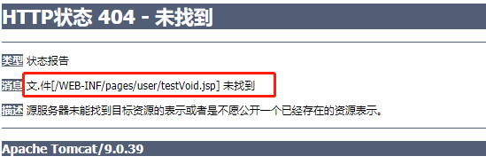

# 1. 响应数据和结果视图

## 1.1 返回值分类

### 1.1.1 字符串

```Java
@Controller
@RequestMapping("user")
public class UserController {

  @RequestMapping("/testString")
  public String testString(Model model) {
    System.out.println("testString方法执行了...");
    User user = new User();
    user.setUsername("张三");
    user.setPassword("123");
    user.setAge(20);
    model.addAttribute("user",user);
    return "success";
  }
}
```

```jsp
<h2>执行成功!</h2>

${user.username}
${user.password}
```

### 1.1.2 void

```java 
@RequestMapping("/testVoid")
public void testVoid() {
  System.out.println("testVoid方法执行了...");
}
```

控制台输出：testVoid方法执行了...

返回值为空，页面自动跳转到WEB-INF/pages/user/testVoid.jsp页面。



```Java
@RequestMapping("/testVoid")
public void testVoid(HttpServletRequest request, HttpServletResponse response) throws Exception {
  System.out.println("testVoid方法执行了...");
  //转发
  //request.getRequestDispatcher("/WEB-INF/pages/success.jsp").forward(request,response);
  //重定向
  System.out.println(request.getContextPath());   ///day2_01Response_war
  //response.sendRedirect(request.getContextPath()+"/index.jsp");

  //设置中文乱码
  response.setCharacterEncoding("utf-8");
  response.setContentType("text/html,charset=utf-8");

  //直接响应
  response.getWriter().write("你好");   //在day2_01Response_war/user/testVoid页面显示你好
}
```

### 1.1.3 ModelAndView

```Java
@RequestMapping("/testModelAndView")
public ModelAndView testModelAndView() {
  System.out.println("testModelAndView方法执行了...");
  ModelAndView mav = new ModelAndView();
  User user = new User();
  user.setUsername("张三");
  user.setPassword("123");
  user.setAge(20);
  //把user对象存到mav对象中，也会把user对象存到request域中
  mav.addObject("user",user);
  //设置逻辑视图名称，视图解析器会根据名称前往指定的视图
  mav.setViewName("success");
  return mav;
}
```

## 1.2 转发和重定向

### 1.2.1 forward准发

controller 方法在提供了 String 类型的返回值之后，默认就是请求转发。

````java
@RequestMapping("/testForwardOrRedirect")
public String testForwardOrRedirect() {
  System.out.println("testForwardOrRedirect方法执行了...");
  //请求的转发
  return "forward:/WEB-INF/pages/success.jsp";
}
````

需要注意的是，如果用了 **forward**：则路径必须写成实际视图 url，不能写逻辑视图。

它相当于`request.getRequestDispatcher("**url**").forward(request,response)`。使用请求转发，既可以转发到 jsp，也可以转发到其他的控制器方法。

### 1.2.2 redirect重定向

```java 
@RequestMapping("/testForwardOrRedirect")
public String testForwardOrRedirect() {
  System.out.println("testForwardOrRedirect方法执行了...");
  //重定向
  return "redirect:/index.jsp";
}
```

它相当于`response.sendRedirect(url)`。需要注意的是，如果是重定向到 jsp 页面，则 jsp 页面不能写在 WEB-INF 目录中，否则无法找到。

## 1.3 @ResponseBody响应json数据

作用：该注解用于将 Controller 的方法返回的对象，通过 HttpMessageConverter 接口转换为指定格式的数据如：json,xml 等，通过 Response 响应给客户端。

需求：使用@ResponseBody 注解实现将 controller 方法返回对象转换为 json 响应给客户端

Springmvc 默认用 MappingJacksonHttpMessageConverter 对 json 数据进行转换，需要加入jackson 的包。

```xml
<dependency>
  <groupId>com.fasterxml.jackson.core</groupId>
  <artifactId>jackson-databind</artifactId>
  <version>2.9.0</version>
</dependency>
<dependency>
  <groupId>com.fasterxml.jackson.core</groupId>
  <artifactId>jackson-core</artifactId>
  <version>2.9.0</version>
</dependency>
<dependency>
  <groupId>com.fasterxml.jackson.core</groupId>
  <artifactId>jackson-annotations</artifactId>
  <version>2.9.0</version>
</dependency>
```

```javascript
<div>
  <button id="btn">发送ajax请求</button>
</div>

<script src="js/jquery.min.js"></script>
<script type="application/javascript">
  $(function () {
  $("#btn").click(function () {
    // alert("hello");
    $.ajax({
      type: "post",
      contentType: "application/json;charset=UTF-8",
      url: "user/testAjax",
      data: '{"username": "张三","password": "123","age": 30}',
      dataType: "json",
      success: function (data) {
        //data服务器响应的json数据，进行解析
        alert(data);
        alert(data.username);
        alert(data.age);
      }
    })
  })
})
</script>
```

```java 
@RequestMapping("/testAjax")
public @ResponseBody User testAjax(@RequestBody User user) {
  System.out.println("testAjax方法执行了...");
  System.out.println(user);
  user.setUsername("李四");
  user.setAge(50);
  return user;
}
```

