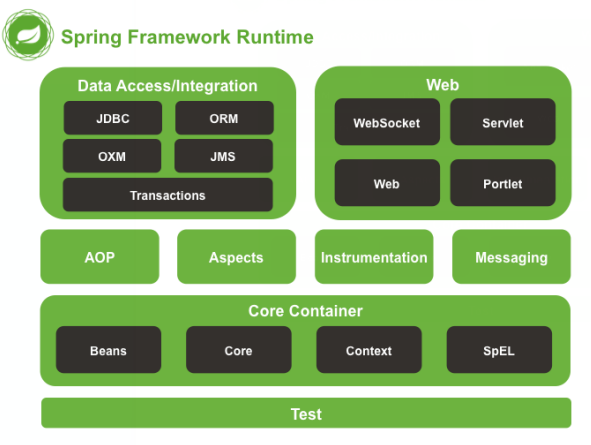

# 1. Spring概述

## 1.1 Spring是什么

Spring 是分层的 Java SE/EE 应用 full-stack 轻量级开源框架，以 **IoC（Inverse Of Control：反转控制）**和 **AOP（Aspect Oriented Programming：面向切面编程）**为内核，提供了展现层 Spring MVC 和持久层 Spring JDBC 以及业务层事务管理等众多的企业级应用技术，还能整合开源世界众多著名的第三方框架和类库，逐渐成为使用最多的 Java EE 企业应用开源框架。

## 1.2 Spring的体系结构

# 2. IOC的概念和作用

## 2.1 程序的耦合

耦合：程序间的依赖关系

​		包括：类之间的依赖、方法间的依赖

解耦：降低程序间的依赖关系

实际开发中，应该做到：编译器不依赖，运行时才依赖

解耦的思路：

	1. 使用反射来创建对象，而避免使用new关键字
 	2. 通过读取配置文件来获取要创建对象的全限定类名

