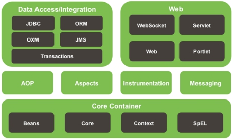

# 1. Spring概述

1. Spring是一个开源框架
2. Spring为简化企业级开发而生，使用Spring，JavaBean就可以实现很多以前要靠EJB才能实现的功能。同样的功能，在EJB中要通过繁琐的配置和复杂的代码才能够实现，而在Spring中却非常的优雅和简洁。
3. Spring是一个**IOC**(DI)和**AOP**容器框架。
4. Spring的优良特性
   - **非侵入式**：基于Spring开发的应用中的对象可以不依赖于Spring的API
   - **依赖注入**：DI--Dependency Injection，反转控制(IOC)最经典的实现。
   - **面向切面编程**：Aspect Oriented Programming——AOP
   - **容器**：Spring是一个容器，因为它包含并且管理应用对象的生命周期
   - **组件化**：Spring实现了使用简单的组件配置组合成一个复杂的应用。在 Spring 中可以使用XML和Java注解组合这些对象。
   - **一站式**：在IOC和AOP的基础上可以整合各种企业应用的开源框架和优秀的第三方类库（实际上Spring 自身也提供了表述层的SpringMVC和持久层的Spring JDBC）。

# 2. Spring模块划分

