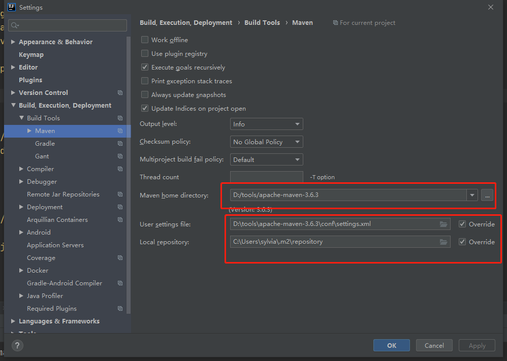

# 1. 简介

简化Spring应用开发的一个框架；

整个Spring技术栈的一个大整合；

J2EE开发的一站式解决方案。

# 2. 环境准备

环境约束

–jdk1.8：Spring Boot 推荐jdk1.7及以上；java version "1.8.0_112"

–maven3.x：maven 3.3以上版本；

–IntelliJIDEA

–SpringBoot 1.5.9.RELEASE：1.5.9；

### 2.1 maven设置

给maven 的settings.xml配置文件的profiles标签添加

```xml
<profile>
  <id>jdk-1.8</id>
  <activation>
    <activeByDefault>true</activeByDefault>
    <jdk>1.8</jdk>
  </activation>
  <properties>
    <maven.compiler.source>1.8</maven.compiler.source>
    <maven.compiler.target>1.8</maven.compiler.target>
    <maven.compiler.compilerVersion>1.8</maven.compiler.compilerVersion>
  </properties>
</profile>
```

### 2.2 IDEA设置



# 3. Spring Boot HelloWorld

浏览器发送hello请求，服务器接受请求并处理，响应Hello World字符串；

### 3.1 创建一个maven工程；（jar）

### 3.2 导入spring boot相关的依赖

```xml
<parent>
  <groupId>org.springframework.boot</groupId>
  <artifactId>spring-boot-starter-parent</artifactId>
  <version>2.2.1.RELEASE</version>
  <relativePath/> <!-- lookup parent from repository -->
</parent>
<dependencies>
  <dependency>
    <groupId>org.springframework.boot</groupId>
    <artifactId>spring-boot-starter-web</artifactId>
  </dependency>
</dependencies>
```

### 3.3 编写一个主程序；启动Spring Boot应用

```Java
/**
 * @SpringBootApplication 来标注一个主程序类，说明这是一个Spring Boot应用
 */
@SpringBootApplication
public class HelloWorldMainApplication {
  public static void main(String[] args) {
    //启动
    SpringApplication.run(HelloWorldMainApplication.class,args);
  }
}
```

### 3.4 编写相关的Controller、Service

```Java
@Controller
public class HelloController {

  @ResponseBody
  @RequestMapping("/hello")
  public String hello() {
    return "hello world";
  }
}
```

### 3.5 运行主程序测试


### 3.6 简化部署

```xml
<!-- 这个插件，可以将应用打包成一个可执行的jar包；-->
<build>
  <plugins>
    <plugin>
      <groupId>org.springframework.boot</groupId>
      <artifactId>spring-boot-maven-plugin</artifactId>
    </plugin>
  </plugins>
</build>
```

将这个应用打成jar包，直接使用java -jar的命令进行执行；

# 4. Hello World探究

### 4.1 POM文件

#### 1. 父项目

```xml
<parent>
  <groupId>org.springframework.boot</groupId>
  <artifactId>spring-boot-starter-parent</artifactId>
  <version>2.2.1.RELEASE</version>
  <relativePath/> <!-- lookup parent from repository -->
</parent>

他的父项目是：
<parent>
  <groupId>org.springframework.boot</groupId>
  <artifactId>spring-boot-dependencies</artifactId>   <!--(Spring Boot的版本仲裁中心；) -->
  <version>2.2.1.RELEASE</version>
  <relativePath>../../spring-boot-dependencies</relativePath>
</parent>
```

> 以后我们导入依赖默认是不需要写版本；（没有在dependencies里面管理的依赖需要声明版本号）

#### 2. 启动器

`spring-boot-starter`：spring-boot场景启动器；帮我们导入了web模块正常运行所依赖的组件；

> `Spring Boot`将所有的功能场景都抽取出来，做成一个个的`starters`（启动器），只需要在项目里面引入这些starter相关场景的所有依赖都会导入进来。要用什么功能就导入什么场景的启动器。

例：

```xml
<dependency>
  <groupId>org.springframework.boot</groupId>
  <artifactId>spring-boot-starter-web</artifactId>
</dependency>
```

### 4.2 主程序类，主入口类

 `@SpringBootApplication`：`Spring Boot`应用标注在某个类上说明这个类是`SpringBoot`的主配置类，`SpringBoot`就应该运行这个类的main方法来启动`SpringBoot`应用；

**它的源码**：

```Java
@Target({ElementType.TYPE})
@Retention(RetentionPolicy.RUNTIME)
@Documented
@Inherited
@SpringBootConfiguration
@EnableAutoConfiguration
@ComponentScan(
    excludeFilters = {@Filter(
    type = FilterType.CUSTOM,
    classes = {TypeExcludeFilter.class}
), @Filter(
    type = FilterType.CUSTOM,
    classes = {AutoConfigurationExcludeFilter.class}
)}
)
public @interface SpringBootApplication {}
```

`@SpringBootConfiguration`：Spring Boot的配置类；

- 标注在某个类上，表示这是一个Spring Boot的配置类；
- 它源码上的注解`@Configuration`：配置类上来标注这个注解；
  * 配置类 -----  配置文件；配置类也是容器中的一个组件；`@Component`

`@EnableAutoConfiguration`：开启自动配置功能；

# 5. 使用Spring Initializer快速创建Spring Boot项目

默认生成的Spring Boot项目；

- 主程序已经生成好了，我们只需要我们自己的逻辑
- resources文件夹中目录结构
  - static：保存所有的静态资源； js css  images；
  - templates：保存所有的模板页面；（Spring Boot默认jar包使用嵌入式的Tomcat，默认不支持JSP页面）；可以使用模板引擎（freemarker、thymeleaf）；
  - application.properties：Spring Boot应用的配置文件；可以修改一些默认设置；

```Java
//@ResponseBody
//@Controller
@RestController   //可以使用restAPI方式
public class HelloController {

  @RequestMapping("/hello")
  public String hello() {
    return "hello world";
  }
}
```

