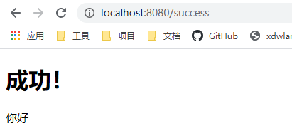

# 1. 简介

# 2. SpringBoot对静态资源的映射规则；

1.  所有 `/webjars/**` ，都去 `classpath:/META-INF/resources/webjars/` 找资源；

   `webjars`：以jar包的方式引入静态资源；(导入dependency依赖)

   ````xml
   <!--引入jquery-webjar-->在访问的时候只需要写webjars下面资源的名称即可
   <dependency>
     <groupId>org.webjars</groupId>
     <artifactId>jquery</artifactId>
     <version>3.3.1</version>
   </dependency>
   ````

   

   `localhost:8080/webjars/jquery/3.3.1/jquery.js`

2.  `"/**"` 访问当前项目的任何资源，都去（静态资源的文件夹）找映射

   ````
   "classpath:/META-INF/resources/", 
   "classpath:/resources/",
   "classpath:/static/", 
   "classpath:/public/" 
   "/"：当前项目的根路径
   ````

   localhost:8080/abc ===  去静态资源文件夹里面找abc

3.  欢迎页； 静态资源文件夹下的所有index.html页面；被`"/**"`映射；(将index.html放在static目录下，localhost:8080/   找index页面)

4.  所有的 `**/favicon.ico`  都是在静态资源文件下找；

# 3. 模板引擎

使用SpringBoot推荐的Thymeleaf；语法更简单，功能更强大；

### 3.1 引入thymeleaf

```xml
<dependency>
  <groupId>org.springframework.boot</groupId>
  <artifactId>spring-boot-starter-thymeleaf</artifactId>
</dependency>
```

### 3.2 thymeleaf使用

只要我们把HTML页面放在`classpath:/templates/`，`thymeleaf`就能自动渲染；

1.  导入thymeleaf的名称空间

   ````xml
   <html lang="en" xmlns:th="http://www.thymeleaf.org">
   ````

2.  使用thymeleaf语法

   ````HTML
   <!DOCTYPE html>
   <html lang="en" xmlns:th="http://www.thymeleaf.org">
     <head>
       <meta charset="UTF-8">
       <title>Title</title>
     </head>
     <body>
       <h1>成功！</h1>
       <!--th:text 将div里面的文本内容设置为 -->
       <div th:text="${hello}">这是显示欢迎信息</div>
     </body>
   </html>
   ````

   ```JAVA 
   @RequestMapping("/success")
   public String success(Map<String,String> map) {
     map.put("hello","你好");
     //classpath: /templates/success.html
     return "success";
   }
   ```

   

