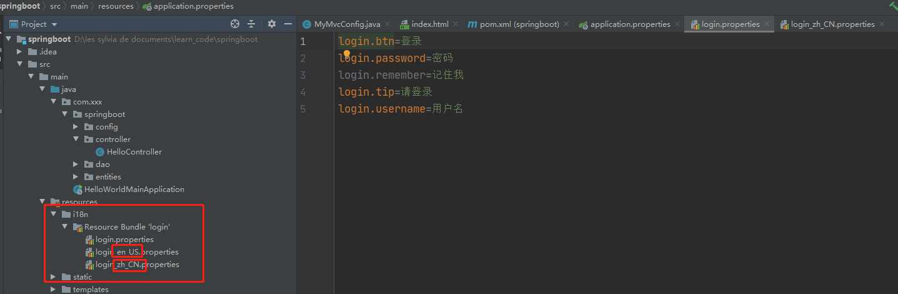
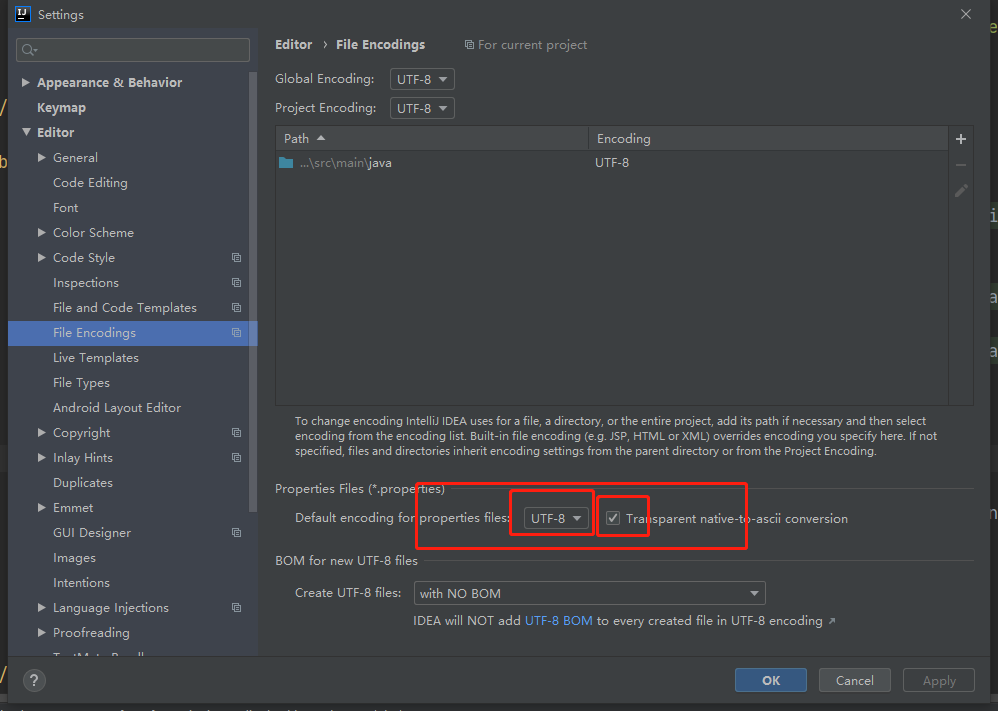

# 1. 默认访问首页

```Java
@Configuration
public class MyMvcConfig implements WebMvcConfigurer {
  @Override
  public void addViewControllers(ViewControllerRegistry registry) {
    // 将 "/" 或 "/index.html" 的 请求响应为返回 "index" 的视图 
    registry.addViewController("/").setViewName("index");
    registry.addViewController("/index.html").setViewName("index");
  }
}
```

# 2. 国际化

springMVC步骤：

1.  编写国际化配置文件
2.  使用ResourceBundleMessageSource管理国际化资源文件
3.  在页面使用fmt:message取出国际化内容

### 2.1 springboot步骤：

1.  编写国际化配置文件，抽取页面需要显示的国际化消息。

   

2.  SpringBoot自动配置好了管理国际化资源文件的组件；

   我们的配置文件可以直接放在类路径下叫messages.properties；

   ```properties
   spring.messages.basename=i18n.login
   ```

3.  去页面获取国际化的值；

   使用thymeleaf获取值

   ````html
   <form class="form-signin" action="dashboard.html">
     
     <h1 class="h3 mb-3 font-weight-normal" th:text="#{login.tip}">Please sign in</h1>
     <label class="sr-only">Username</label>
     <input type="text" class="form-control" placeholder="Username" th:placeholder="#{login.username}" required="" autofocus="">
     <label class="sr-only">Password</label>
     <input type="password" class="form-control" placeholder="Password" th:placeholder="#{login.password}" required="">
     <div class="checkbox mb-3">
       <label>
         <input type="checkbox" value="remember-me"> [[#{login.remember}]]
       </label>
     </div>
     <button class="btn btn-lg btn-primary btn-block" type="submit" th:text="#{login.btn}">Sign in</button>
     <p class="mt-5 mb-3 text-muted">© 2017-2018</p>
     <a class="btn btn-sm">中文</a>
     <a class="btn btn-sm">English</a>
   </form>
   ````

   中文会乱码：

   

### 2.2 点击链接切换国际化

```Java
/**
 * 可以在连接上携带区域信息
 * <a class="btn btn-sm" th:href="@{/index.html(l='zh_CN')}">中文</a>
 * <a class="btn btn-sm" th:href="@{/index.html(l='en_US')}">English</a>
 */
public class MyLocaleResolver implements LocaleResolver {
  @Override
  public Locale resolveLocale(HttpServletRequest request) {
    String l = request.getParameter("l");
    if (StringUtils.isEmpty(l)) {
      //路径上没有国际化语言参数，采用默认的（从请求头中获取）
      return request.getLocale();
    } else {
      String[] split = l.split("_");
      //语言、国家构造器
      return new Locale(split[0], split[1]);
    }
  }

  @Override
  public void setLocale(HttpServletRequest httpServletRequest, HttpServletResponse httpServletResponse, Locale locale) {

  }
}
```

# 3. 登录

开发期间模板引擎页面修改以后，要实时生效，就要禁用模板引擎的缓存。

```properties
spring.thymeleaf.cache=false
```

### 3.1 登录代码实现

```HTML
<!--表单提交-->
<form class="form-signin" action="dashboard.html" th:action="@{/user/login}" method="post">
  
  <!--用户名或密码错误提示-->
  <p style="color: red" th:text="${msg}" th:if="${not #strings.isEmpty(msg)}"></p>
```

```Java
@Controller
public class LoginController {

  @PostMapping(value = "/user/login")
  public String login(@RequestParam("username") String username,
                      @RequestParam("password") String password,
                      Map<String,String> map) {
    if(!StringUtils.isEmpty(username) && "123456".equals(password)) {
      //登录成功
      return "dashboard";
    }else {
      map.put("msg","用户名或密码错误");
      return "login";
    }
  }
}
```

### 3.2 首页刷新问题

登陆后进入首页，页面刷新后，405错误。

**解决：**给首页页面进行重定向

在`MyMvcConfig.java`写：、

```Java
//将main.html的请求响应为dashboard的页面
registry.addViewController("/main.html").setViewName("dashboard");
```

在`LoginController.java`里写

```Java
if(!StringUtils.isEmpty(username) && "123456".equals(password)) {
  //登录成功，防止表单重复提交，重定向到首页
  //return "dashboard";
  return "redirect:/main.html";  //登陆成功，重定向到main.html页面 --> dashboard
```

### 3.3 拦截器进行登录检查

1.  登录后存储将用户名存储到session

   ```Java
   if(!StringUtils.isEmpty(username) && "123456".equals(password)) {
     //登录成功，防止表单重复提交，重定向到首页
     //            return "dashboard";
     session.setAttribute("loginuser",username);
     return "redirect:/main.html";
   }
   ```

2.  添加拦截器

   ```java
   public class LoginHandlerInterceptor implements HandlerInterceptor {
     @Override
     public boolean preHandle(HttpServletRequest request, HttpServletResponse response, Object handler) throws Exception {
       Object user = request.getSession().getAttribute("loginuser");
       if(user == null) {//未登录，返回登陆界面
         request.getRequestDispatcher("/index.html").forward(request,response);
         return false;
       }else {//已登录，继续访问
         return true;
       }
     }
   }
   ```

3.  在`MyMvcConfig.java`注册拦截器

   ```Java
   /**
        * 注册拦截器
        * @param registry
        */
   @Override
   public void addInterceptors(InterceptorRegistry registry) {
     //springboot已经做好了静态资源映射，不用管静态资源
     registry.addInterceptor(new LoginHandlerInterceptor()).addPathPatterns("/**")
       .excludePathPatterns("/index.html","/","/user/login","/asserts/**");
   }
   ```

# 4. CRUD-员工列表

实验要求：RestfulCRUD：CRUD满足Rest风格；

|      | 普通CRUD（uri来区分操作） | RestfulCRUD       |
| ---- | ------------------------- | ----------------- |
| 查询 | getEmp                    | emp---GET         |
| 添加 | addEmp?xxx                | emp---POST        |
| 修改 | updateEmp?id=xxx&xxx=xx   | emp/{id}---PUT    |
| 删除 | deleteEmp?id=1            | emp/{id}---DELETE |

实验的请求架构:

| 实验功能                             | 请求URI | 请求方式 |
| ------------------------------------ | ------- | -------- |
| 查询所有员工                         | emps    | GET      |
| 查询某个员工(来到修改页面)           | emp/1   | GET      |
| 来到添加页面                         | emp     | GET      |
| 添加员工                             | emp     | POST     |
| 来到修改页面（查出员工进行信息回显） | emp/1   | GET      |
| 修改员工                             | emp     | PUT      |
| 删除员工                             | emp/1   | DELETE   |

#### thymeleaf公共页面元素抽取

```HTML
1、抽取公共片段
<div th:fragment="copy">
&copy; 2011 The Good Thymes Virtual Grocery
</div>

2、引入公共片段
<div th:insert="~{footer :: copy}"></div>
~{templatename::selector}：模板名::选择器
~{templatename::fragmentname}:模板名::片段名

3、默认效果：
insert的公共片段在div标签中
如果使用th:insert等属性进行引入，可以不用写~{}：
行内写法可以加上：[[~{}]];[(~{})]；
```

三种引入公共片段的th属性：

**th:insert**：将公共片段整个插入到声明引入的元素中

**th:replace**：将声明引入的元素替换为公共片段

**th:include**：将被引入的片段的内容包含进这个标签中

```HTML
<footer th:fragment="copy">
&copy; 2011 The Good Thymes Virtual Grocery
</footer>

引入方式
<div th:insert="footer :: copy"></div>
<div th:replace="footer :: copy"></div>
<div th:include="footer :: copy"></div>

效果
<div>
    <footer>
    &copy; 2011 The Good Thymes Virtual Grocery
    </footer>
</div>

<footer>
&copy; 2011 The Good Thymes Virtual Grocery
</footer>

<div>
&copy; 2011 The Good Thymes Virtual Grocery
</div>
```


### 4.1 查询所有员工返回数据到列表页面

创建`EmployeeController.java` 

```Java
//<a class="nav-link" href="" th:href="@{/emps}">

@Controller
public class EmployeeController {
  @Autowired
  EmployeeDao employeeDao;

  /*查询所有员工返回列表页面*/
  @GetMapping("/emps")
  public String list(ModelAndView mav) {
    Collection<Employee> employees = employeeDao.getAll();
    mav.addObject("emps",employees);
    return "emp/list";
  }
}
```

# 5. 员工添加

### 5.1 新增add.html页面

```html
<main role="main" class="col-md-9 ml-sm-auto col-lg-10 pt-3 px-4">
  <!--提交表单发送请求-->
  <form th:action="@{/emp}" method="post">
    <div class="form-group">
      <label>LastName</label>
      <input name="lastName" type="text" class="form-control" placeholder="zhangsan" th:value="${emp!=null}?${emp.lastName}">
    </div>
    <div class="form-group">
      <label>Email</label>
      <input name="email" type="email" class="form-control" placeholder="zhangsan@atguigu.com" th:value="${emp!=null}?${emp.email}">
    </div>
    <div class="form-group">
      <label>Gender</label><br/>
      <div class="form-check form-check-inline">
        <input class="form-check-input" type="radio" name="gender" value="1" th:checked="${emp!=null}?${emp.gender==1}">
        <label class="form-check-label">男</label>
      </div>
      <div class="form-check form-check-inline">
        <input class="form-check-input" type="radio" name="gender" value="0" th:checked="${emp!=null}?${emp.gender==0}">
        <label class="form-check-label">女</label>
      </div>
    </div>
    <div class="form-group">
      <label>department</label><br/>
      <select class="form-control" name="department.id">
        <option value="" th:value="${dept.id}" th:each="dept:${depts}" th:text="${dept.departmentName}"></option>
      </select>
    </div>
    <div class="form-group">
      <label>birth</label><br/>
      <input type="text" name="birth" class="form-control" placeholder="zhangsan">
    </div>
    <button type="submit" class="btn btn-sm btn-primary">添加</button>

  </form>
</main>
```

### 5.2 Controller

#### 5.1 点击添加按钮跳转到add.html页面

在`EmployeeController.java` 里写：

```java 
//来到添加页面
@GetMapping("/emp")
public ModelAndView toAddPage() {
  ModelAndView mav = new ModelAndView("emp/add.html");
  Collection<Department> departments = departmentDao.getDepartments();
  mav.addObject("depts",departments);
  return mav;
}
```

#### 5.2 add.html提交表单

```java 
//员工添加
//SpringMVC自动将请求参数与入参对象的属性进行一一绑定：要求请求参数的名字name与Javabean入参对象里的属性名一致
@PostMapping("/emp")
public String addEmp(Employee employee) {
  employeeDao.save(employee);
  //添加成功后还是要来到员工列表list页面
  return "redirect:/emps";
}
```

提交的数据格式不对：生日：日期；

2017-12-12；2017/12/12；2017.12.12；

日期的格式化；SpringMVC将页面提交的值需要转换为指定的类型;

2017-12-12---Date； 类型转换，格式化;

默认日期是按照/的方式；