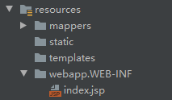

1. 需要引入依赖

   ```xml
   <!--        JSP核心引擎依赖-->
           <dependency>
               <groupId>org.apache.tomcat.embed</groupId>
               <artifactId>tomcat-embed-jasper</artifactId>
           </dependency>
   <!--        JSTL-->
           <dependency>
               <groupId>javax.servlet</groupId>
               <artifactId>jstl</artifactId>
           </dependency>
   ```

2. 创建webapp以及WEB-INF去存放JSP页面

   

3. 创建Controller并制定view的前缀和后缀

   ```java 
   @Controller
   public class JSPController {
       @GetMapping("/index")
       public String index(Model model) {
           model.addAttribute("name","张三");
           return "index";
       }
   }
   ```

   ```yml
   spring: 
    mvc:
   #    视图的前缀和后缀
       view:
         prefix: /WEB-INF/
         suffix: .jsp
   ```

   

