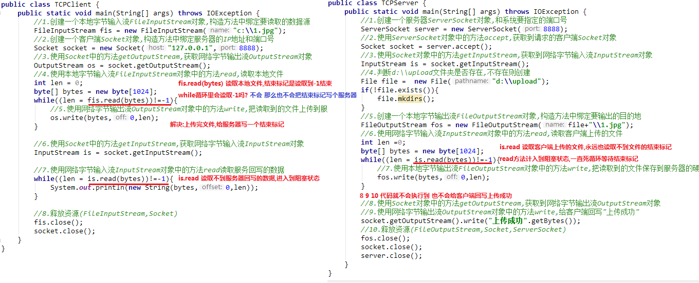

# 1. 文件上传案例

## 1.1 文件上传的原理


## 1.2 文件上传代码实现

### 阻塞问题



### 代码实现

1. 客户端实现

   ```Java
   public class TCPClient {
       public static void main(String[] args) throws IOException {
           //创建本地字节输入流，读取要上传文件
           FileInputStream fis = new FileInputStream("advancedStudy\\Out.txt");
           //2.创建客户端Socket对象
           Socket socket = new Socket("127.0.0.1",8888);
           //3.获取网络字节输出流对象，
           OutputStream os = socket.getOutputStream();
           //4.本地字节输入流读取文件
           byte[] bytes = new byte[1024];
           int len;
           while ((len = fis.read(bytes)) != -1) {
               //5.网络字节输出流用write方法，将读取的文件上传到服务器
               os.write(bytes,0,len);
           }
           //上传完文件，给服务器写一个结束标记
           socket.shutdownOutput();
           //6.读取服务器返回的数据
           InputStream is = socket.getInputStream();
           while ((len = is.read(bytes)) != -1) {
               System.out.println(new String(bytes,0,len));
           }
           //7.释放资源
           fis.close();
           socket.close();
       }
   }
   ```

2. 服务器端

   ```Java
   public class TCPServer {
       public static void main(String[] args) throws IOException {
           ServerSocket serverSocket = new ServerSocket(8888);
           Socket socket = serverSocket.accept();
           InputStream is = socket.getInputStream();
           File file = new File("d:\\upload");
           if (!file.exists()) {
               file.mkdirs();
           }
           FileOutputStream fos = new FileOutputStream(file + "\\out.txt");
           byte[] bytes = new byte[1024];
           int len;
           while ((len = is.read(bytes)) != -1) {
               fos.write(bytes,0,len);
           }
           //给客户端返回数据
           socket.getOutputStream().write("上传成功".getBytes());
           fos.close();
           socket.close();
           serverSocket.close();
       }
   }
   ```

### 优化

**1. 文件名称写死的问题**

服务端，保存文件的名称如果写死，那么最终导致服务器硬盘，只会保留一个文件，建议使用系统时间优化，保证文件名称唯一，代码如下：

```Java
//随机命名名称
String fileName = "demo" + System.currentTimeMillis() + ".txt";
FileOutputStream fos = new FileOutputStream(file + "\\" + fileName);
```

**2. 循环接收的问题**

服务端，指保存一个文件就关闭了，之后的用户无法再上传，这是不符合实际的，使用循环改进，可以不断的接收不同用户的文件，代码如下：

```Java
//让服务器一直处于监听状态（死循环accep方法）
//有一个客户端上传文件，就保存一个文件
while (true) {
    Socket socket = serverSocket.accept();
	.....
}
```

**3. 效率问题**

服务端，在接收大文件时，可能耗费几秒钟的时间，此时不能接收其他用户上传，所以，使用多线程技术优化，代码如下：（Runnable没有throws，子类必须try catch）

```Java
while (true) {
    Socket socket = serverSocket.accept();
    //使用多线程技术
    new Thread(new Runnable() {
        @Override
        public void run() {
            try {
                InputStream is = socket.getInputStream();
                File file = new File("d:\\upload");
                if (!file.exists()) {
                    file.mkdirs();
                }
                //随机命名名称
                String fileName = "demo" + System.currentTimeMillis() + ".txt";
                FileOutputStream fos = new FileOutputStream(file + "\\" + fileName);
                byte[] bytes = new byte[1024];
                int len;
                while ((len = is.read(bytes)) != -1) {
                    fos.write(bytes,0,len);
                }
                socket.getOutputStream().write("上传成功".getBytes());
                fos.close();
                socket.close();
            } catch (IOException e) {
                System.out.println(e);
            }
        }
    }).start();
}
```

# 2. 模拟B/S服务器

模拟网站服务器，使用浏览器访问自己编写的服务端程序，查看网页效果。

## 2.1 分析


## 2.2 实现

服务器端：

```Java
public class TCPServerThread {
    public static void main(String[] args) throws IOException {
        ServerSocket serverSocket = new ServerSocket(8080);
        Socket socket = serverSocket.accept();
        InputStream is = socket.getInputStream();
//        byte[] bytes1 = new byte[1024];
//        int len1;
//        while ((len1 = is.read(bytes1)) != -1) {
//            System.out.println(new String(bytes1,0,len1));
//        }
        //把网络字节输入流对象，转换为字符缓冲输入流
        BufferedReader br = new BufferedReader(new InputStreamReader(is));
        //把客户端请求信息的第一行读出来  GET /advancedStudy/web/index.html HTTP/1.1
        String line = br.readLine();
        //对读取信息进行切割，只要中间部分
        String[] arr = line.split(" ");
        //将路径前的/去掉
        String htmlPath = arr[1].substring(1);

        //创建本地字节输入流对象
        FileInputStream fis = new FileInputStream(htmlPath);
        //获取网络字节输出流对象
        OutputStream os = socket.getOutputStream();
        //写固定的三行
        // 写入HTTP协议响应头,固定写法
        os.write("HTTP/1.1 200 OK\r\n".getBytes());
        os.write("Content-Type:text/html\r\n".getBytes());
        // 必须要写入空行,否则浏览器不解析
        os.write("\r\n".getBytes());

        //一读一写复制文件，把服务器读取的HTML文件，写回到服务器
        int len;
        byte[] bytes = new byte[1024];
        while ((len = fis.read(bytes)) != -1) {
            os.write(bytes,0,len);
        }
        fis.close();
        socket.close();
        serverSocket.close();
    }
}
```

效果：


发现浏览器中出现很多的叉子,说明浏览器没有读取到图片信息导致。

浏览器工作原理是遇到图片会开启一个线程进行单独的访问,因此在服务器端加入线程技术。

> 浏览器解析服务器回写的HTML页面，页面中如果有图片，那么浏览器就会单独的开启一个线程，读取服务器的图片
>
> 我们就得让服务器一直处于监听状态，客户端请求一次，服务器就回写一次

```Java
public class TCPServerThread {
    public static void main(String[] args) throws IOException {
        ServerSocket serverSocket = new ServerSocket(8080);
        while (true) {
            Socket socket = serverSocket.accept();
            new Thread(new Runnable() {
                @Override
                public void run() {
                    try {
                        InputStream is = socket.getInputStream();
                        //        byte[] bytes1 = new byte[1024];
                        //        int len1;
                        //        while ((len1 = is.read(bytes1)) != -1) {
                        //            System.out.println(new String(bytes1,0,len1));
                        //        }
                        //把网络字节输入流对象，转换为字符缓冲输入流
                        BufferedReader br = new BufferedReader(new InputStreamReader(is));
                        //把客户端请求信息的第一行读出来  GET /advancedStudy/web/index.html HTTP/1.1
                        String line = br.readLine();
                        System.out.println(line);
                        //对读取信息进行切割，只要中间部分
                        String[] arr = line.split(" ");
                        //将路径前的/去掉
                        String htmlPath = arr[1].substring(1);

                        //创建本地字节输入流对象
                        FileInputStream fis = new FileInputStream(htmlPath);
                        //获取网络字节输出流对象
                        OutputStream os = socket.getOutputStream();
                        //写固定的三行
                        // 写入HTTP协议响应头,固定写法
                        os.write("HTTP/1.1 200 OK\r\n".getBytes());
                        os.write("Content-Type:text/html\r\n".getBytes());
                        // 必须要写入空行,否则浏览器不解析
                        os.write("\r\n".getBytes());

                        //一读一写复制文件，把服务器读取的HTML文件，写回到服务器
                        int len;
                        byte[] bytes = new byte[1024];
                        while ((len = fis.read(bytes)) != -1) {
                            os.write(bytes,0,len);
                        }
                        fis.close();
                        socket.close();
                    } catch (IOException e) {
                        e.printStackTrace();
                    }

                }
            }).start();
        }

//        serverSocket.close();
    }
}
```

效果：


输出：`System.out.println(line);`

```
GET /advancedStudy/web/index.html HTTP/1.1
GET /advancedStudy/web/img/logo2.png HTTP/1.1
GET /advancedStudy/web/img/header.jpg HTTP/1.1
GET /advancedStudy/web/img/1.jpg HTTP/1.1
GET /advancedStudy/web/img/title2.jpg HTTP/1.1
GET /advancedStudy/web/img/big01.jpg HTTP/1.1
GET /advancedStudy/web/img/middle01.jpg HTTP/1.1
GET /advancedStudy/web/img/small03.jpg HTTP/1.1
GET /advancedStudy/web/img/ad.jpg HTTP/1.1
GET /advancedStudy/web/img/footer.jpg HTTP/1.1
GET /favicon.ico HTTP/1.1
```

