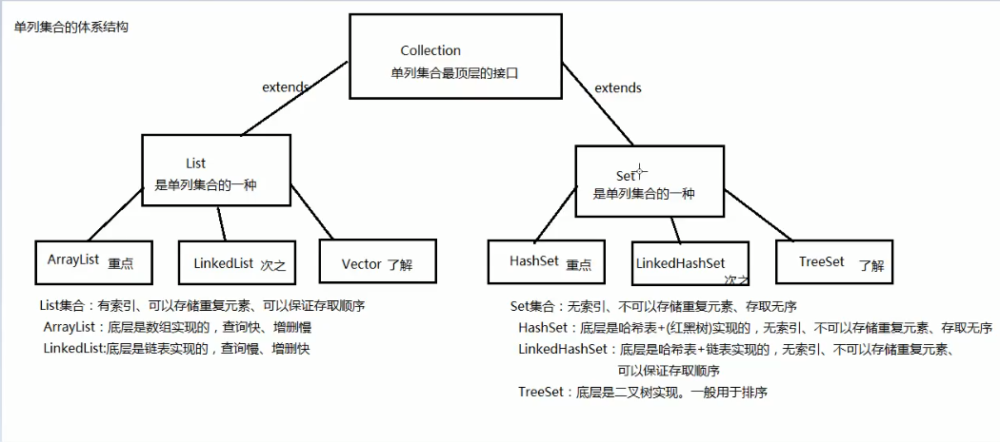

### 1. 集合概述

- 集合：集合是Java中提供的一种容器，可以用来存储多个数据

集合和数组都是容器，它们有什么区别？

- 数组的长度是固定的。集合的长度是可变的

- 数组中存储的是同一类型的元素，可以存储基本数据类型值。

  集合存储的都是对象（基本数据类型要用包装类），对象的类型可以不一致。开发中一般当对象多的时候，使用集合进行存储。

### 2. 集合框架




集合按照其存储结构可以分为两大类，分别是单列集合`java.util.Collection`和双列集合`java.util.Map`，

- **Collection**：单列集合类的根接口，用于存储一系列符合某种规则的元素，它有两个重要的子接口，分别是`java.util.List`和`java.util.Set`。其中，`List`的特点是**元素有序、元素可重复**。`Set`的特点是**元素无序，而且不可重复**。`List`接口的主要实现类有`java.util.ArrayList`和`java.util.LinkedList`，`Set`接口的主要实现类有`java.util.HashSet`和`java.util.TreeSet`。

### 3. collection常用功能

 Collection是所有单列集合的父接口，因此在Collection中定义了单列集合(List和Set)通用的一些方法，这些方法可用于操作所有的单列集合。方法如下：

* `public boolean add(E e)`：  把给定的对象添加到当前集合中 。
* `public void clear()` :清空集合中所有的元素。
* `public boolean remove(E e)`: 把给定的对象在当前集合中删除。
* `public boolean contains(E e)`: 判断当前集合中是否包含给定的对象。
* `public boolean isEmpty()`: 判断当前集合是否为空。
* `public int size()`: 返回集合中元素的个数。
* `public Object[] toArray()`: 把集合中的元素，存储到数组中。

```Java
 //创建集合对象，可以使用多态写法
 Collection<String> coll = new ArrayList<>();
 System.out.println(coll);   //打印的不是地址值，重写了toString方法，[]
 
 //1.add方法，返回Boolean值
 coll.add("张三");
 coll.add("李四");
 coll.add("王五");
 coll.add("田六");
 System.out.println(coll);  //[张三, 李四, 王五, 田六]
 
 //2.remove方法，删除元素，返回Boolean值
 coll.remove("王五");
 System.out.println(coll);  //[张三, 李四, 田六]
 
 //3.contains，判断集合中是否包含此元素，返回Boolean值
 boolean b = coll.contains("张三");
 System.out.println(b);   //true
 
 //4.isEmpty：判空
 coll.isEmpty();
 
 //5.size：返回集合个数
 coll.size();
 
 //6.toArray：把集合中元素，存储到数组中
 Object[] arr = coll.toArray();
 
 //7.clear：清空集合元素
 coll.clear();
 System.out.println(coll.isEmpty());   //true
```

