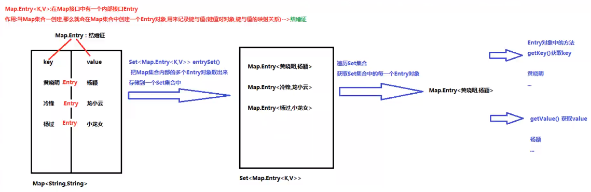

### 1. Map集合概述

`java.util.Map<k,v>`集合

Map集合的特点：

- Map集合是一个双列集合，一个元素包含两个值（一个key，一个value）
- Map集合中的元素，key和value的数据类型可以相同，也可以不同
- Map集合中的元素，key是不允许重复的，value是可以重复的
- Map集合中的元素，key和value一一对应

### 2. Map常用子类

1. `jav.util.HashMap<k,v>` 集合 `implements Map<k,v>` 接口

   HashMap 集合的特点：

   - HashMap 集合底层是哈希表：查询的速度特别快

     ​	JDK 1.8 之前：数组 + 单向链表

     ​	JDK 1.8 之后：数组 + 单向链表/红黑树（链表的长度超过8）：提高查询的速度

   - HashMap集合是一个**无序**的集合，存储元素和取出元素的顺序有可能不一致

2. `java.util.LinkedHashMap<k,v>` 集合 `extends HashMap<k,v>` 集合

   LinkedHashMap 的特点：

   - LinkedHashMap集合底层是哈希表 + 链表（保证迭代的顺序）
   - LinkedHashMap集合是一个有序的集合，存储元素和取出元素的顺序是一致的

### 3. Map接口中的常用方法（put、remove、get、containsKey)

* `public V put(K key, V value)`:  把指定的键与指定的值添加到Map集合中。

  ​	**返回值V**：存储键值对时，key不重复，返回值V时=是null

  ​					  存储键值对时，key重复，会使用新的value替换旧的value，返回被替换的value值

  ```Java
  Map<String,String> map = new HashMap<>();
  String v1 = map.put("aaa", "AAA");
  System.out.println(v1);  //null，key不重复，返回null
  System.out.println(map);  //{aaa=AAA}
  map.put("bbb","BBB");
  String v2 = map.put("aaa", "BBB");
  System.out.println(v2);   //AAA，key重复，返回被替换的value值
  System.out.println(map);  //{aaa=BBB, bbb=BBB}
  ```

  

* `public V remove(Object key)`: 把指定的键 所对应的键值对元素 在Map集合中删除，返回被删除元素的值。

  ​	**返回值V**：key存在，V返回被删除的值

   					 key不存在，V返回null

  ```Java
  System.out.println(map);  //{aaa=BBB, bbb=BBB}
  String a = map.remove("aaa");
  System.out.println(a);    //BBB
  String c = map.remove("ccc");
  System.out.println(c);    //null
  ```

  

* `public V get(Object key)` 根据指定的键，在Map集合中获取对应的值。

* `boolean containsKey(Object key)  ` 判断集合中是否包含指定的键。

  

* `public Set<K> keySet()`: 获取Map集合中所有的键，存储到Set集合中。

* `public Set<Map.Entry<K,V>> entrySet()`: 获取到Map集合中所有的键值对对象的集合(Set集合)。

### 4. Map集合遍历找值

1. Map集合的第一种遍历方式：通过键找值得方式

   Map集合中的方法：

   ​	`public Set<K> keySet()`: 获取Map集合中所有的键，存储到Set集合中。

   实现步骤：

   - 使用Map集合中的方法 keySet()，把Map集合所有的key取出来，存储到一个Set集合中
   - 遍历Set集合，获取Map集合中的每一个key
   - 通过Map集合中的方法get(key)，通过key找到value

   

   ```Java
   Map<String,Integer> map = new HashMap<>();
   map.put("aaa",165);
   map.put("bbb",166);
   map.put("ccc",167);
   
   Set<String> keySet = map.keySet();
   Iterator<String> it = keySet.iterator();
   while (it.hasNext()) {
   	String key = it.next();
   	Integer val = map.get(key);
   	System.out.println(key + ":" + val);  //aaa:165 ccc:167 bbb:166
   }
   
   //增强for循环
   for (String key : map.keySet()) {
       Integer val = map.get(key);
       System.out.println(key + ":" + val);  //aaa:165 ccc:167 bbb:166
   }
   ```

2. Map集合的第二种遍历方式：使用Entry对象遍历

   Map集合中的方法：

   ​	`public Set<Map.Entry<K,V>> entrySet()`：获取到Map集合中所有的键值对对象的集合(Set集合)。

   实现步骤：

   - 使用Map集合中的方法 entrySet()，把Map集合中多个Entry对象取出来，存储到一个Set集合
   - 遍历Set集合，获取每一个Entry对象
   - 使用Entry对象中的方法 getKey() 和 getValue() 获取键与值

   

   

   ```Java
   public static void main(String[] args) {
       Map<String,Integer> map = new HashMap<>();
       map.put("aaa",165);
       map.put("bbb",166);
       map.put("ccc",167);
   	//迭代器循环
       Set<Map.Entry<String, Integer>> set = map.entrySet();
       Iterator<Map.Entry<String, Integer>> it = set.iterator();
       while(it.hasNext()) {
           Map.Entry<String, Integer> entry = it.next();
           System.out.println(entry);  //aaa=165 ccc=167  bbb=166
           System.out.println(entry.getKey());   //aaa ccc bbb
           System.out.println(entry.getValue());   //165 167 166
       }
       //增强for循环
       for (Map.Entry<String, Integer> entry : set) {
           System.out.println(entry);
       }
   }
   ```

### 5. HashMap存储自定义类型键值

HashMap存储自定义类型键值：

​	当 key 为自定义类型时：自定义类型必须重写 hashcode 方法和 equals 方法，以保证key唯一

​	value值可重复

> 注意：作为key值必须重写 hashcode 方法和 equals 方法

### 6. LinkedHashMap集合

`java.util.LinkedHashMap<k,v> extends HashMap<k,v>`：有序集合

底层原理：哈希表 + 链表（记录元素的顺序）

```Java
HashMap<String,String> map = new HashMap<>();
map.put("a","A");
map.put("c","C");
map.put("b","B");
map.put("a","D");
System.out.println(map);  //key不允许重复，无序 {a=D, b=B, c=C}

LinkedHashMap<String,String> linked = new LinkedHashMap<>();
linked.put("a","A");
linked.put("c","C");
linked.put("b","B");
linked.put("a","D");
System.out.println(linked);  //key不允许重复，有序 {a=D, c=C, b=B}
```

### 7. Hashtable集合

`java.util.Hantable<k,v>`集合 `implements Map<k,v>`接口

- Hashtable：底层是一个哈希表，是一个线程安全的集合，即单线程集合，速度慢
- HashMap：底层是一个哈希表，是一个线程不安全的集合，即多线程集合，速度快


- HashMap集合（之前学的所有集合）：可以存储null值，null键
- Hashtable集合：不能存储null值，null键


- Hashtable和Vector集合一样，在jdk1.2版本之后被更先进的集合（HashMap、ArrayList）取代了
- Hashtable的子类Properties依然活跃在历史舞台
- Properties集合是唯一一个和IO流相结合的舞台

### 8. 计算一个字符串中每个字符出现次数

.png)

```Java
public static void main(String[] args) {
    //1.输入字符串
    Scanner sc = new Scanner(System.in);
    System.out.println("请输入一个字符串：");
    String str = sc.next();
    //2.创建一个Map集合，存储key(字符)和value(字符个数）
    HashMap<Character,Integer> map = new HashMap<>();
    //3.将字符串toCharArray转换为字符串数组，遍历
    for (char c : str.toCharArray()) {
        //4.判断map集合key值是否含有这个字符
        if(map.containsKey(c)) {
            //key存在，value++，将新value存到map中
            Integer val = map.get(c);
            val++;
            map.put(c,val);
        } else {
            //key不存在，put(key,1)
            map.put(c,1);
        }
    }
    //5.输出集合
    System.out.println(map);
}
```

