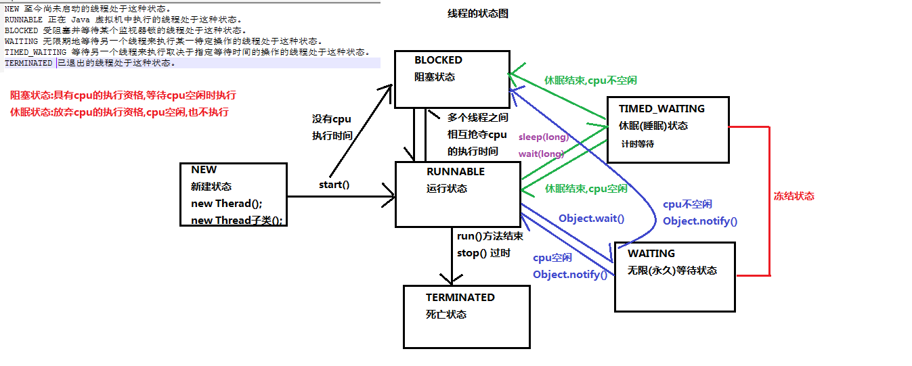

### 1. 线程状态概述




### 2. Timed Waiting（计时等待）

我们调用了sleep方法之后，当前执行的线程就进入到“休眠状态”，其实就是所谓的Timed Waiting(计时等待)。

注意：

- 进入 TIMED_WAITING 状态的一种常见情形是调用的 sleep 方法，单独的线程也可以调用，不一定非要有协作关系。 
- 为了让其他线程有机会执行，可以将Thread.sleep()的调用放线程run()之内。这样才能保证该线程执行过程 中会睡眠 。
- sleep与锁无关，线程睡眠到期自动苏醒，并返回到Runnable（可运行）状态。


### 3. Blocked（锁阻塞）


### 4. Waiting（无限等待）

1. 分析

   

2. 案例

   - 等待唤醒案例：线程之间的通信

   ​		创建一个顾客线程（消费者）：告知老板要的包子种类和数量，调用wait方法，放弃CPU的执行，进入Waiting状态。

   ​		创建一个老板线程（生产者）：花了5秒做包子，做好包子之后，调用notify方法，唤醒顾客吃包子。

   - 注意：

     ​	顾客和老板线程必须使用同步代码块包裹起来，保证等待和唤醒只能有一个在执行

     ​	同步使用的锁对象必须保证唯一

     ​	只有锁对象才能调用wait和notify方法

   - Object类中的方法

     ​	void wait()：在其他线程调用此对象的notify()方法或notifyAll()方法前，导致当前线程等待

     ​	void notify()：唤醒在此对象监视器上等待的单个线程，继续执行wait方法后的代码。

```Java
public class Demo02WaitAndNotify {
    public static void main(String[] args) {
        //创建一个锁对象
        Object obj = new Object();

        //顾客线程
        new Thread() {
            @Override
            public void run() {
                synchronized (obj) {
                    System.out.println("告知老板要买的包子种类和数量");
                    try {
                        obj.wait();
                    } catch (InterruptedException e) {
                        e.printStackTrace();
                    }
                    System.out.println("包子做好了，吃包子");
                }
            }
        }.start();

        //老板线程
        new Thread() {
            @Override
            public void run() {
                try {
                    Thread.sleep(5000);
                } catch (InterruptedException e) {
                    e.printStackTrace();
                }
                synchronized (obj) {
                    System.out.println("告知顾客包子做好了");
                    obj.notify();
                }
            }
        }.start();
    }
}
```

### 5. Object类中wait带参方法和notifyAll方法

1. 进入到TimeWaiting(计时等待)有两种方式
   - 使用sleep(long m)方法，在毫秒值结束之后，线程睡醒进入到Runnable/Blocked状态
   - 使用wait(long m)方法，wait方法如果在毫秒值结束之后，还没有被notify唤醒，就会自动醒来

2. 唤醒的方法
   - void notify()：唤醒在此对象监视器上等待的单个线程
   - void notifyAll()：唤醒在此对象监视器上等待的所有线程

