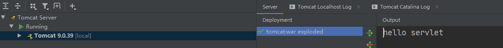

### 1. 概念

运行在服务器端的小程序

* Servlet就是一个接口，定义了Java类被浏览器访问到(tomcat识别)的规则。
* 将来我们自定义一个类，实现Servlet接口，复写方法。

### 2. 快速入门

1.  创建JavaEE项目

2. 定义一个类，实现Servlet接口

  ```Java
  public class servletDemo01 implements Servlet {
    ...
    /*提供服务的方法*/
    @Override
    public void service(ServletRequest servletRequest, ServletResponse servletResponse) throws ServletException, IOException {
      System.out.println("hello servlet");
    }
    ...
  }
  ```

3.  实现接口中的抽象方法

4.  配置Servlet

    在web.xml中配置：

    ```xml
    <!--配置Servlet -->
    <servlet>
      <servlet-name>demo1</servlet-name>
      <servlet-class>cn.itcast.web.servlet.ServletDemo1</servlet-class>
    </servlet>
    
    <servlet-mapping>
      <servlet-name>demo1</servlet-name>
      <url-pattern>/demo1</url-pattern>
    </servlet-mapping>
    ```

**运行结果**：


访问如上路径，控制台输出“hello servlet”



### 3. 执行原理


1.  当服务器接收到客户端浏览器的请求后，会解析请求URL路径，获取访问的servlet的资源路径。
2.  查找`web.xml`文件，看是否有对应的 `<url-pattern>`标签体内容
3.  如果有，则找到对应的 `<servlet-class>` 全类名
4.  tomcat会将字节码文件加载进内存，并且创建其对象
5.  调用其方法

### 4. 生命周期

```Java
public class servletDemo02 implements Servlet {
  /**
     * 在servlet被创建时执行，只执行一次
     */
  @Override
  public void init(ServletConfig servletConfig) throws ServletException {

  }

  /**
     * 获取ServletConfig对象
     * ServletConfig：servlet的配置对象
     */
  @Override
  public ServletConfig getServletConfig() {
    return null;
  }

  /**
     * 提供服务的方法
     * 每一次servlet被调用时执行，执行多次
     */
  @Override
  public void service(ServletRequest servletRequest, ServletResponse servletResponse) throws ServletException, IOException {
    System.out.println("hello servlet");
  }

  /**
     * 获取servlet的一些信息，版本作者等
     */
  @Override
  public String getServletInfo() {
    return null;
  }

  /**
     * 销毁方法
     * 在服务器正常关闭时执行，执行一次
     */
  @Override
  public void destroy() {

  }
}
```

1.  被创建：执行init方法，只执行一次

   **servlet什么时候被创建？**：默认情况下，第一次被访问时，servlet被创建。

   **配置servlet的创建时机**：在 `<servlet>`标签下配置

   * 第一次被访问时创建：`<load-on-startup>`的值为负数

   * 服务器启动时创建：`<load-on-startup>`的值为0或正整数

   **Servlet的init方法，只执行一次，说明一个Servlet在内存中只存在一个对象，Servlet是单例的**

   * 多个用户同时访问时（访问的是同一个对象），可能存在线程安全问题。
   * 解决：尽量不要在Servlet中定义成员变量。即使定义了成员变量，也不要修改值。（可以在service方法中定义变量）

2.  提供服务：执行service方法，执行多次

   每次访问Servlet时，Service方法都会被调用一次。

3.  被销毁：执行destroy方法，执行一次

   * Servlet被销毁时执行。服务器关闭时，Servlet被销毁
   * 只有服务器正常关闭时，才会执行destroy方法。
   * destroy方法在Servlet被销毁之前执行，一般用于释放资源

### 5. servlet3.0+

支持注解配置。可以不需要web.xml了。

**步骤**：

1. 创建JavaEE项目，选择Servlet的版本3.0以上，可以不创建web.xml
2. 定义一个类，实现Servlet接口
3. 复写方法
4. 在类上使用@WebServlet注解，进行配置
  * `@WebServlet("资源路径")`：`@WebServlet("/demo")`

### 6. servlet的体系结构

Servlet -- 接口

​	|   实现

GenericServlet -- 抽象类：`public abstract class GenericServlet implements Servlet, ServletConfig, Serializable`

​	|   继承

HttpServlet  -- 抽象类：`public abstract class HttpServlet extends GenericServlet`

1.  **GenericServlet**：

将Servlet接口中其他的方法做了默认空实现，只将service()方法作为抽象

* 将来定义Servlet类时，可以继承GenericServlet，只用实现service()方法即可

  ```Java
  @WebServlet("/demo2")
  public class servletDemo02 extends GenericServlet {
    @Override
    public void service(ServletRequest servletRequest, ServletResponse servletResponse) throws ServletException, IOException {
      System.out.println("GenericServlet...demo02...");
    }
  }
  ```

2.**HttpServlet**：

对http协议的一种封装，简化操作

* 定义类继承HttpServlet

* 复写doGet/doPost方法

  ```Java
  @WebServlet("/demo3")
  public class servletDemo03 extends HttpServlet {
    @Override
    protected void doGet(HttpServletRequest req, HttpServletResponse resp) throws ServletException, IOException {
      System.out.println("doGet.....");
    }
  
    @Override
    protected void doPost(HttpServletRequest req, HttpServletResponse resp) throws ServletException, IOException {
      System.out.println("doPost.....");
    }
  }
  ```

  > 浏览器默认是get方法。
  >
  > ```HTML
  > <!-- post方法 -->
  > <form action="/servlet/demo3" method="post">
  >   <input name="username">
  >   <input type="submit" value="提交">
  > </form>
  > ```

### 7. servlet的相关配置

1.  urlpartten:Servlet访问路径

    一个Servlet可以定义多个访问路径 ： @WebServlet({"/d4","/dd4","/ddd4"})

    **路径定义规则：**

    1. /xxx：路径匹配
    2. /xxx/xxx:多层路径，目录结构
    3. *.do：扩展名匹配