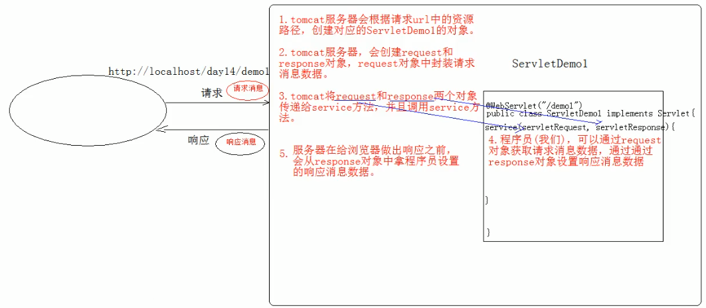

# 1. HTTP

### 1.1 概念

Hyper Text Transfer Protocol：超文本传输协议

**传输协议**：定义了客户端和服务器端通信时，发送数据的格式

**特点**：

1.  基于TCP/IP的高级协议
2.  默认端口号:80
3.  基于请求/响应模型的:一次请求对应一次响应
4.  无状态的：每次请求之间相互独立，不能交互数据

**历史版本**：

​	1.0：每一次请求响应都会建立新的连接

​	1.1：复用连接（一个资源使用完毕后，先不断开连接，等待一段时间，看有没有下一个资源）

### 1.2 请求消息数据格式

```
请求行
请求头
请求空行(分隔post请求的请求头和请求体)
请求体(正文)
```

1.  请求行

   `请求方式 请求URL 请求协议/版本`
   `GET /login.html HTTP/1.1`

   **请求方式**：HTTP协议有7中请求方式，常用的有2种

   * GET：
     1.  请求参数在请求行中，在url后。
     2.  请求的url长度有限制的
     3.  不太安全
   * POST：
     1.  请求参数在请求体中
     2.  请求的url长度没有限制的
     3.  相对安全

2.  请求头：客户端浏览器告诉服务器一些信息

   **格式**:`请求头名称: 请求头值`

   **常见的请求头**：

   1.  **User-Agent**：浏览器告诉服务器，我访问你使用的**浏览器版本信息**
   				* 可以在服务器端获取该头的信息，解决浏览器的兼容性问题

   2.  **Referer**：http://localhost/login.html
       * 告诉服务器，我(当前请求)从哪里来？
       * 作用：
       		1. 防盗链：
       	2. 统计工作：

       

3.  请求体：封装POST请求消息的请求参数的

# 2. Request

### 2.1 request对象和response对象的原理



1.  request和response对象是由服务器创建的。我们来使用它们
2.  request对象是来获取请求消息，response对象是来设置响应消息

### 2.2 request对象继承体系结构

ServletRequest	    -- 接口
		|	继承
HttpServletRequest	-- 接口
		|	实现
org.apache.catalina.connector.RequestFacade 类(tomcat服务器实现的)

### 2.3 request功能

#### 2.3.1 获取请求消息数据

1.  获取请求行数据

   GET /day14/demo1?name=zhangsan HTTP/1.1

   **方法**：

   - 获取请求方式 GET：`String getMethod()`

   - **(掌握)**获取虚拟目录 /day14：`String getContextPath()`

   - 获取Servlet路径 /demo1：`String getServletPath()`

   - 获取get方式请求参数 name=zhangsan：`String getQueryString()`

   - **(掌握)**获取请求URI /day14/demo1

     * `getRequestURI()`: /day14/demo1
     * `StringBuffer getRequestURL()`：http://localhost/day14/demo1

     > URL：统一资源定位符 ： http://localhost/day14/demo1	中华人民共和国
     > URI：统一资源标识符 : /day14/demo1					共和国

   - 获取协议及版本 HTTP/1.1：`String getProtocol()`

   - 获取客户机的IP地址：`String getRemoteAddr()`

2.  获取请求头数据

   **方法**：

   * **(掌握)**`String getHeader(String name)`：通过请求头的名称获取请求头的值

        ```Java
        @Override
        protected void doGet(HttpServletRequest req, HttpServletResponse resp) throws ServletException, IOException {
          //获取请求头数据：user-agent
          String header = req.getHeader("user-agent");
          System.out.println(header);
          if(header.contains("Chrome")) {
            System.out.println("谷歌...");
          } else if (header.contains("Firefox")){
            System.out.println("火狐...");
          }
          
          //获取请求头数据：referer(防盗链)
          //login.html：<a href="/servlet/requestDemo03">看电影</a>
          String referer = req.getHeader("referer");
          System.out.println(referer);  //http://localhost:8080/servlet/login.html
        
          //防盗链
          if (referer != null) {
            if (referer.contains("/servlet")) {
              //System.out.println("播放电影...");
              resp.setContentType("text/html;charset=utf-8");
              resp.getWriter().write("播放电影...");
            }else {
              //System.out.println("想看电影吗？来...");
              resp.setContentType("text/html;charset=utf-8");
              resp.getWriter().write("想看电影吗？来...");
            }
          }
        }
        ```

   * `Enumeration<String> getHeaderNames()`：获取所有的请求头名称

        ```Java
        @Override
        protected void doGet(HttpServletRequest req, HttpServletResponse resp) throws ServletException, IOException {
          Enumeration<String> headerNames = req.getHeaderNames();
          while (headerNames.hasMoreElements()) {
            String name = headerNames.nextElement();
            //根据名称获取请求头的值
            String value = req.getHeader(name);
            System.out.println(name + "----" + value);
          }
        }
        ```

3.  获取请求体数据

   请求体：只有POST请求方式，才有请求体，在请求体中封装了POST请求的请求参数。

   **步骤**：

   - 获取流对象

     `BufferedReader getReader()`：获取字符输入流，只能操作字符数据

     ```Java
     @Override
     protected void doPost(HttpServletRequest req, HttpServletResponse resp) throws ServletException, IOException {
       BufferedReader br = req.getReader();
       String line = null;
       while ((line = br.readLine()) != null) {
         System.out.println(line);
       }
     }
     ```

     `ServletInputStream getInputStream()`：获取字节输入流，可以操作所有类型数据(后面讲)

   - 再从流对象中拿数据

#### 2.3.2 其他功能

1.  获取请求参数通用方式：不论get还是post请求方式都可以使用下列方法来获取请求参数。

   - `String getParameter(String name)`：根据参数名称获取参数值 
   - `String[] getParameterValues(String name)`：根据参数名称获取参数值的数组
   - `Enumeration<String> getParameterNames()`：获取所有请求的参数名称
   - `Map<String,String[]> getParameterMap()`：获取所有参数的map集合

   ```Java
   @WebServlet("/requestDemo05")
   public class RequestDemo05 extends HttpServlet {
     @Override
     protected void doPost(HttpServletRequest req, HttpServletResponse resp) throws ServletException, IOException {
       String username = req.getParameter("username");
       //        System.out.println(username);
       String[] hobbies = req.getParameterValues("hobby");
       //        System.out.println(Arrays.toString(hobbies));
       Enumeration<String> parameterNames = req.getParameterNames();
       //        while (parameterNames.hasMoreElements()) {
       //            String name = parameterNames.nextElement();
       //            String value = req.getParameter(name);
       //            System.out.println(name + "---" + value);
       //        }
       Map<String, String[]> parameterMap = req.getParameterMap();
       Set<String> names = parameterMap.keySet();
       for (String name : names) {
         System.out.println(name);
         String[] values = parameterMap.get(name);
         for (String value : values) {
           System.out.println(value);
         }
         System.out.println("---------");
       }
     }
   
     @Override
     protected void doGet(HttpServletRequest req, HttpServletResponse resp) throws ServletException, IOException {
       this.doPost(req,resp);
     }
   }
   ```

   **中文乱码问题：**

   - get方式：Tomcat 8 已经将get方式乱码问题解决了

   - post方式：会乱码

     **解决**：在获取参数前，设置request的编码 `request.setCharacterEncoding("utf-8");`

2.  请求转发

   **步骤**：

   - 通过request对象获取请求转发器对象：`RequestDispatcher getRequestDispatcher(String path)`
   - 使用RequestDispatcher对象来进行转发：**forward(ServletRequest request, ServletResponse response)** 

   ```Java
   //requestDemo06转发到requestDemo07
   @WebServlet("/requestDemo06")
   public class RequestDemo06 extends HttpServlet {
     @Override
     protected void doPost(HttpServletRequest req, HttpServletResponse resp) throws ServletException, IOException {
       System.out.println("demo6被访问了。。。。。");
   
       //存储数据到request域中
       req.setAttribute("msg","hello");
   
       //转发到demo7资源
       req.getRequestDispatcher("/requestDemo07").forward(req,resp);
     }
   
     @Override
     protected void doGet(HttpServletRequest req, HttpServletResponse resp) throws ServletException, IOException {
       this.doPost(req,resp);
     }
   }
   
   @WebServlet("/requestDemo07")
   public class RequestDemo07 extends HttpServlet {
     @Override
     protected void doPost(HttpServletRequest req, HttpServletResponse resp) throws ServletException, IOException {
       System.out.println("demo7被访问了。。。。。");
   
       //获取转发的数据
       Object msg = req.getAttribute("msg");
       System.out.println(msg);
     }
   
     @Override
     protected void doGet(HttpServletRequest req, HttpServletResponse resp) throws ServletException, IOException {
       this.doPost(req,resp);
     }
   }
   ```

   **特点**：

   - 浏览器地址栏路径不会发生变化
   - 只能转发到当前服务器内部资源中
   - 转发是一次请求

3.  共享数据

   **域对象**：一个有作用范围的对象，可以在范围内共享数据

   **request域**：代表一次请求的范围，一般用于请求转发的多个资源中共享数据

   

   **方法**

   - `void setAttribute(String name,Object obj)`：存储数据
   - `Object getAttitude(String name)`：通过键获取值
   - `void removeAttribute(String name)`：通过键移除键值对

4.  获取ServletContext：`ServletContext getServletContext()`

   