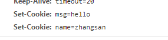
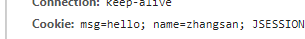
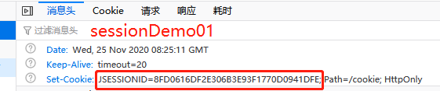
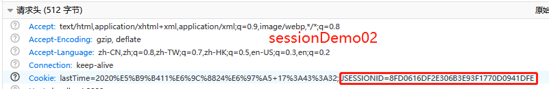

# 1. 会话技术

**会话：**一次会话中包含多次请求和响应

* 一次会话：浏览器第一次给服务器资源发送请求，会话建立，直到有一方断开为止。

**功能：**在一次会话的范围内的多次请求间，共享数据。

**方式：**

* 客户端会话技术：Cookie
* 服务器端会话技术：Session

# 2. Cookie

### 2.1 概念

客户端会话技术，**将数据保存到客户端**

### 2.2 快速入门：

```Java
@WebServlet("/cookieDemo1")
public class CookieDemo1 extends HttpServlet {
  protected void doPost(HttpServletRequest request, HttpServletResponse response) throws ServletException, IOException {
    //创建cookie对象，绑定数据
    Cookie cookie = new Cookie("msg","hello");
    //发送cookie对象
    response.addCookie(cookie);
  }
  ...
}
```

```java 
@WebServlet("/cookieDemo2")
public class CookieDemo2 extends HttpServlet {
  protected void doPost(HttpServletRequest request, HttpServletResponse response) throws ServletException, IOException {
    Cookie[] cookies = request.getCookies();
    if(cookies != null) {
      for (Cookie c : cookies) {
        String name = c.getName();
        String value = c.getValue();
        System.out.println(name + ":" + value);  //... msg:hello ...
      }
    }
  }
  ...
}
```

### 2.3 实现原理

基于响应头set-cookie和请求头cookie实现


.png)

.jpg)

### 2.4 cookie的细节

#### 1. 一次可不可以发送多个cookie?

可以创建多个Cookie对象，使用response调用多次addCookie方法发送cookie即可。

创建servlet对象@WebServlet("/cookieDemo3")：

```Java
//创建cookie对象，绑定数据
Cookie c1 = new Cookie("msg","hello");
Cookie c2 = new Cookie("name","zhangsan");
//发送cookie对象
response.addCookie(c1);
response.addCookie(c2);
```



#### 2. cookie在浏览器中保存多长时间？

1.  默认情况下，当浏览器关闭后，Cookie数据被销毁
2.  持久化存储：`setMaxAge(int seconds)`
   - 正数：将Cookie数据写到硬盘的文件中。持久化存储。并指定cookie存活时间，时间到后，cookie文件自动失效
   - 负数：默认值
   - 零：删除cookie信息

#### 3. cookie能不能存中文？

在tomcat 8 之前 cookie中不能直接存储中文数据。

* 需要将中文数据转码---一般采用URL编码(%E3)

在tomcat 8 之后，cookie支持中文数据。特殊字符还是不支持，建议使用URL编码存储，URL解码解析

#### 4. cookie共享问题？

1.  假设在一个tomcat服务器中，部署了多个web项目，那么在这些web项目中cookie能不能共享？

   - 默认情况下cookie不能共享

   - `setPath(String path)`：设置cookie的获取范围。默认情况下，设置当前的虚拟目录。

     如果要共享，则可以将path设置为"/"

2.  不同的tomcat服务器间cookie共享问题？

   `setDomain(String path)`：如果设置一级域名相同，那么多个服务器之间cookie可以共享

   `setDomain(".baidu.com")`,那么`tieba.baidu.com`和`news.baidu.com`中cookie可以共享

### 2.5 cookie的特点和作用

1.  cookie存储数据在客户端浏览器
2.  浏览器对于单个cookie 的大小有限制(4kb) 以及 对同一个域名下的总cookie数量也有限制(20个)

**作用：**

1.  cookie一般用于存出少量的不太敏感的数据
2.  在不登录的情况下，完成服务器对客户端的身份识别

### 2.6 案例：记住上一次访问时间

**需求：**

1.  访问一个Servlet，如果是第一次访问，则提示：您好，欢迎您首次访问。
2.  如果不是第一次访问，则提示：欢迎回来，您上次访问时间为:显示时间字符串

**分析：**

1.  可以采用Cookie来完成
2.  在服务器中的`Servlet`中判断是否有一个名为`lastTime`的`cookie`
   - 有：不是第一次访问
     * 响应数据：欢迎回来，您上次访问时间为:+ 时间
     * 写回`Cookie`：`lastTime=这次访问的时间`
   - 没有：是第一次访问
     * 响应数据：您好，欢迎您首次访问
     * 写回`Cookie`：`lastTime=这次(第一次)访问的时间`

**代码实现：**

```Java
@WebServlet("/cookieTest")
public class CookieTest extends HttpServlet {
  protected void doPost(HttpServletRequest request, HttpServletResponse response) throws ServletException, IOException {
    response.setContentType("text/html;charset=utf-8");

    Cookie[] cookies = request.getCookies();
    boolean flag = false;
    if(cookies != null && cookies.length > 0) {
      for (Cookie c : cookies) {
        String name = c.getName();
        if ("lastTime".equals(name)) {//有lastName，不是第一次访问
          flag = true;
          //获取value值,响应数据
          String time = c.getValue();
          time = URLDecoder.decode(time, "utf-8");
          response.getWriter().write("欢迎回来，您上次的访问时间是：" + time);

          //设置这次访问的time
          Date date = new Date();
          SimpleDateFormat sdf = new SimpleDateFormat("yyyy年MM月dd日 HH:mm:ss");
          String newTime = sdf.format(date);
          newTime = URLEncoder.encode(newTime, "utf-8");
          c.setValue(newTime);
          c.setMaxAge(30 * 24 * 60 * 60);  //存储一个月
          response.addCookie(c);
        }
      }
    }
    if (cookies == null || cookies.length == 0 ||flag == false) {//第一次访问
      Date date = new Date();
      SimpleDateFormat sdf = new SimpleDateFormat("yyyy年MM月dd日 HH:mm:ss");
      String time = sdf.format(date);
      time = URLEncoder.encode(time, "utf-8");
      Cookie cookie = new Cookie("lastTime",time);
      response.addCookie(cookie);
      response.getWriter().write("<h1>您好，欢迎您首次访问</h1>");
    }
  }

  protected void doGet(HttpServletRequest request, HttpServletResponse response) throws ServletException, IOException {
    this.doPost(request, response);
  }
}
```

# 3. JSP

### 3.1 概念

`Java Server Pages`： java服务器端页面

可以理解为：一个特殊的页面，其中既可以指定定义html标签，又可以定义java代码。

用于简化书写！！！

### 3.2 原理

JSP本质上就是一个Servlet


### 3.3 JSP的脚本：JSP定义Java代码的方式

1.  `<% Java代码 %>`：定义的java代码，在service方法中。service方法中可以定义什么，该脚本中就可以定义什么。(此处定义的变量是局部变量)
2.  `<%! Java代码 %>`：定义的java代码，在jsp转换后的java类的成员位置。(此处只能定义成员变量)
3.  `<%= Java代码 %>`：定义的java代码，会输出到页面上。输出语句中可以定义什么，该脚本中就可以定义什么。

### 3.4 JSP的内置对象

在 jsp 页面中不需要获取和创建，可以直接使用的对象。

jsp 一共有9个内置对象。今天学习3个：

1.  `request`

2.  `response`

3.  `out`：字符输出流对象。可以将数据输出到页面上。和`response.getWriter()`类似

   `response.getWriter()`和`out.write()`的区别：

   - 在tomcat服务器真正给客户端做出响应之前，会先找response缓冲区数据，再找out缓冲区数据。
   - `response.getWriter()`数据输出永远在`out.write()`之前

# 4. Session

### 4.1 概念

**服务器端会话技术**，在一次会话的多次请求间共享数据，将数据保存在服务器端的对象中。HttpSession

### 4.2 快速入门

1.  获取`HttpSession`对象：`HttpSession session = request.getSession();`
		
2.  使用`HttpSession`对象：

  `Object getAttribute(String name)`

  `void setAttribute(String name, Object value)`

  `void removeAttribute(String name)`  

```Java
@WebServlet("/sessionDemo01")
public class SessionDemo01 extends HttpServlet {
  protected void doPost(HttpServletRequest request, HttpServletResponse response) throws ServletException, IOException {
    //使用session共享数据
    //获取session
    HttpSession session = request.getSession();
    //存储数据
    session.setAttribute("msg","hello session");
  }
}

@WebServlet("/sessionDemo02")
public class SessionDemo02 extends HttpServlet {
  protected void doPost(HttpServletRequest request, HttpServletResponse response) throws ServletException, IOException {
    //使用session获取数据
    HttpSession session = request.getSession();
    Object msg = session.getAttribute("msg");
    System.out.println(msg);
  }
}
```

### 4.3 原理

Session的实现是依赖于Cookie的。




### 4.4 细节

#### 1. 当客户端关闭后，服务器不关闭，两次获取session是否为同一个？

1.  默认情况下，不是。

   `org.apache.catalina.session.StandardSessionFacade@673d8f9c`
   `org.apache.catalina.session.StandardSessionFacade@189f0a03`

2.  如果需要相同，则可以创建Cookie,键为JSESSIONID，设置最大存活时间，让cookie持久化保存。

   ```Java
   HttpSession session = request.getSession();
   System.out.println(session);
   Cookie cookie = new Cookie("JSESSIONID",session.getId());
   cookie.setMaxAge(60*60);
   response.addCookie(cookie);
   ```

#### 2. 客户端不关闭，服务器关闭后，两次获取的session是同一个吗？

不是同一个，但是要确保数据不丢失。tomcat自动完成以下工作

- session的钝化：

  在服务器正常关闭之前，将session对象系列化到硬盘上

- session的活化：

  在服务器启动后，将session文件转化为内存中的session对象即可。

#### 3. session什么时候被销毁？

1.  服务器关闭
		
2.  session对象调用方法`invalidate()`。

3.  session默认失效时间 30分钟

  选择性配置修改	

  ```xml
  <session-config>
    <session-timeout>30</session-timeout>
  </session-config>
  ```

### 4.5 Session的特点

1.  session用于存储一次会话的多次请求的数据，存在服务器端
2.  session可以存储**任意类型**，**任意大小**的数据

**cookie和session的区别：**

1.  session存储数据在服务器端，Cookie在客户端
2.  session没有数据大小限制，Cookie有
3.  session数据安全，Cookie相对不安全