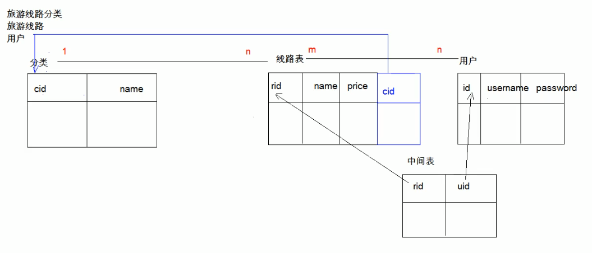

# 数据库的设计

### 1. 多表之间的关系

#### 1. 分类

1.  **一对一**(了解)：
			* 如：人和身份证
	* 分析：一个人只有一个身份证，一个身份证只能对应一个人
2.  **一对多(多对一)**：
  * 如：部门和员工
  * 分析：一个部门有多个员工，一个员工只能对应一个部门
3.  **多对多**：
  * 如：学生和课程
  * 分析：一个学生可以选择很多门课程，一个课程也可以被很多学生选择

#### 2. 实现

1.  一对多(多对一)

   * 部门和员工

   * **实现方式：在多的一方建立外键，指向一的一方的主键**。

     

2.  多对多：

   * 学生和课程

   * **实现方式：多对多关系实现需要借助第三张中间表。中间表至少包含两个字段，这两个字段作为第三张表的外键，分别指向两张表的主键**

     

3.  一对一（了解）

   * 人和身份证号

   * 实现方式：**可以在任意一方添加唯一外键指向另一方的主键**

     

#### 3. 案例

**需求**：一个**旅游线路分类**中有多个**旅游线路**；一个**用户**收藏多个线路，一个线路被多个用户收藏。



1.  创建旅游线路表

   ```mysql
   -- 创建旅游线路表 tab_route
   /*
   rid 旅游线路主键，自动增长
   rname 旅游线路名称非空，唯一，字符串 100
   price 价格
   rdate 上架时间，日期类型
   cid 外键，所属分类
   */
   create table tab_route(
     rid int primary key auto_increment,
     rname varchar(100) not null unique,
     price double,
     rdate date,
     cid int,
     foreign key (cid) references tab_category(cid)
   )
   ```

2.  创建线路的分类表

   ```mysql
   -- 创建旅游线路分类表 tab_category
   -- cid 旅游线路分类主键，自动增长
   -- cname 旅游线路分类名称非空，唯一，字符串 100
   
   create table tab_category(
   	cid int primary key auto_increment,
     cname varchar(100) not null unique
   )
   ```

3.  创建用户表

   ```mysql 
   create table tab_user (
     uid int primary key auto_increment,
     username varchar(100) unique not null,
     password varchar(30) not null,
     name varchar(100),
     birthday date,
     sex char(1) default '男',
     telephone varchar(11),
     email varchar(100)
   )
   ```

4.  用户表与旅游线路表的中间表(用户收藏旅游线路)

   ```mysql
   /*
   创建收藏表 tab_favorite
   rid 旅游线路 id，外键
   date 收藏时间
   uid 用户 id，外键
   rid 和 uid 不能重复，设置复合主键，同一个用户不能收藏同一个线路两次
   */
   create table tab_favorite(
   	rid int,  -- 线路id
     foreign key (rid) references tab_route(rid),
     date datetime,  
     uid int,  -- 用户id
     foreign key (uid) references tab_user(uid),
     primary key (rid,uid)  -- 联合主键
   )
   ```

