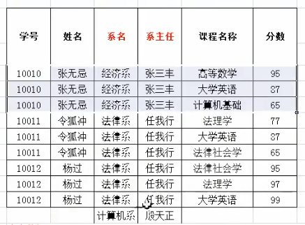
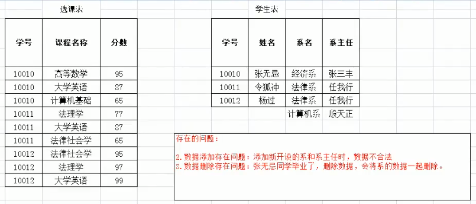
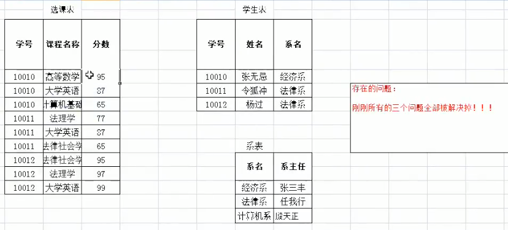

### 2. 数据库设计的范式

#### 1. 概念

**设计数据库时，需要遵循的一些规范。要遵循后边的范式要求，必须先遵循前边的所有范式要求。**

​	设计关系数据库时，遵从不同的规范要求，设计出合理的关系型数据库，这些不同的规范要求被称为不同的范式，各种范式呈递次规范，越高的范式数据库冗余越小。
​	目前关系数据库有**六种范式**：第一范式（1NF）、第二范式（2NF）、第三范式（3NF）、巴斯-科德范式（BCNF）、第四范式(4NF）和第五范式（5NF，又称完美范式）。

#### 2. 分类

1.  第一范式（1NF）：每一列都是不可分割的原子数据项

   

   > **存在的问题：**
   >
   > 1.  存在非常严重的数据冗余：姓名、系名、系主任
   > 2.  数据添加存在问题：添加新开设的系和系主任时，数据不合法
   > 3.  数据删除存在问题：张无忌同学毕业了，删除数据，会将系的数据一起删除

2.  第二范式（2NF）：在1NF的基础上，非码属性必须完全依赖于码（即：**在1NF基础上消除非主属性对主码的部分函数依赖**）

   几个概念：

   1.  **函数依赖**：

      ​	A-->B,如果通过A属性(属性组)的值，可以确定唯一B属性的值。则称B依赖于A
      ​	例如：学号-->姓名。  （学号，课程名称） --> 分数

   2.  **完全函数依赖**：

      ​	A-->B， 如果A是一个属性组，则B属性值得确定需要依赖于A属性组中所有的属性值。
      ​	例如：（学号，课程名称） --> 分数

   3.  **部分函数依赖**：

      ​	A-->B， 如果A是一个属性组，则B属性值得确定只需要依赖于A属性组中某一些值即可。
      ​	例如：（学号，课程名称） -- > 姓名

   4.  **传递函数依赖**：

      ​	A-->B, B -- >C . 如果通过A属性(属性组)的值，可以确定唯一B属性的值，在通过B属性（属性组）的值可以确定唯一C属性的值，则称 C 传递函数依赖于A
      ​	例如：学号-->系名，系名-->系主任

   5.  **码**：

      ​	如果在一张表中，一个属性或属性组，被其他所有属性所完全依赖，则称这个属性(属性组)为该表的码。
      ​	例如：该表中码为：（学号，课程名称）

      * **主属性：码属性组中的所有属性**
      * **非主属性：除过码属性组的属性**

   

3.  第三范式（3NF）：在2NF基础上，任何非主属性不依赖于其它非主属性（即：**在2NF基础上消除传递依赖**）

   