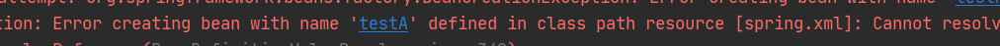

```
ioc:我使用它主要是用来管理一个对象的，像以前的一个MVC经典三层，他们各层之间的对象都是new每一层，才能够调用到每一层，而我使用ioc能够对这个mvc三层进行一个解偶。具体做法是在spring的一个配置文件中取一个bean标签使用一个叫做class的一个属性，然后将这个对象加入到这个ioc容器中，但也要取一个id属性，方便对这个对象的一个取用。也可以使用一个叫@configration这么一个类，然后在相应的一个方法上面将return回来的对象，通过@bean的一个注解，把它加入到一个spring的ioc容器中，它的方法名就是一个默认的id，也可以使用一个在这个@bean注解里面，起一个id，改一下这个名字，在启用这个ioc对象中的时候，可以使用两个注解一个是@resource可以取出这个对象，一个是@autowire注解也可以取出这个对象，而@resource他取出来是按一个名字来取的，而@autowire取得话他是按一个类型来取这个对象的，而这个ioc的一个底层，它使用的是有一个map来做这个ioc的容器
app:这个aop的话它是横切性的编程思想，这就是将这个代码横切性的编入到代码中，而这个aop的编程思想，主要有两种方式，一种的话是使用aspect的一个方式，还有一种就是使用springAOP的一个方式。springAOP的话，他是借助了这个aspectj的语法实现了这个aoo的编程思想。配置这个springaop就要在它的spring配置文件上面，配置上它的切面，还有它需要增强的类型以及相应的切入点，当然也可以使用注解的方式进行配置，就是起一个叫@aspect的一个切面类，然后在类里面起方法，这个方法里面的内容呢就是相应你要植入到目标类的一个逻辑代码，然后并加上一个增强类型的一个注解，比如说@before @after，然后用@pointcut来指定这个目标类上面的哪个方法执行。而我使用比较多的场景，这个aop的场景的话，就是这个监控日志，还有个事物控制，以及权限管理这一块。
aop的一个底层是怎么实现的？
它使用的是一个jdk的一个动态代理和这个cglib的一个动态代理。
被代理类如果有实现接口，就是jdk代理，如果有继承父类，就是cglib代理，默认是jdk代理
```


#### 1. java bean 与 spring bean

java bean：符合一定规范写的java类。

- 所有属性都为private
- 为所有属性提供public的getter和setter方法。

spring bean：所有受spring容器管理的对象都可以成为 spring bean。

#### 2. Spring中容器指的是什么

spring容器是用来管理对象，管理他们的整个生命周期，从创建到销毁。

从代码上说，一个容器就是实现了ApplicationContext接口的类的实例。

spring提供了两种不同的类型的容器：

- ApplicationContext（适用单例）：创建对象采用立即加载，只要一读取完配置文件就创建配置文件中配置的对象。
- BeanFactory（适用多例）：采用延迟加载的方式，什么时候根据id获取对象，什么时候才创建对象。

#### 3. spring创建bean的几种方式

##### 3.1  使用XML方式

1.  配置<bean id="" class=""/\>标签

2.  使用工厂的方法来创建

   先把工厂的创建交给spring来管理，再使用工厂的bean来调用创建对象的方法。

3.  使用工厂的静态方法来创建

##### 3.2 使用 @bean 注解

（相同作用的注解有：@Component @Service @Controller @Repository）

```java
public class Config {
  @Bean
  public User user() {
    return new User();
  }
}

AnnotationConfigApplicationContext annotationConfigApplicationContext = new AnnotationConfigApplicationContext(Config.class);
User user = annotationConfigApplicationContext.getBean("user", User.class);
System.out.println(user);
```

#### 4. IOC与AOP

​		**IOC控制反转，就是我们将对象的创建交给spring去管理，所有的类都会在容器中登记，需要使用时去spring容器获取对象。**这样控制对象生命周期的不再是引用它的对象，而是spring。

​		之前的MVC三层结构，每一层之间的调用都要通过new来创建对象，耦合度过高，通过spring获取对象可以做到三层的一个解耦。spring创建对象，可以配置文件里创建bean标签，也可以使用@bean注解。bean标签的class属性为类的全限定类名，spring就可以使用反射去创建对象。在代码调用该对象时就可以使用依赖注入将其注入到需要的类中。

#### 5. 依赖注入的方式

**依赖注入**：IOC有一点是在系统运行过程中，动态的向某个对象提供他所需要的其他对象，这就是通过依赖注入来实现的。

也就是说，当在一个类中需要使用另一个对象时，我们不需要在这个类中创建这个对象，而是找spring来注入该对象。

依赖注入可以帮IOC容器更好的管理各个bean之间的依赖关系，从而更好的实现了IOC思想。

##### 5.1 构造函数注入

```xml
<bean>
	<constructor-arg name/index/type value></constructor-arg>
</bean>
```

##### 5.2 setter方法注入

```xml
<bean>
	<property name ref></property>
</bean>
```

##### 5.3 注解注入

1.  @Autowired：自动按照类型注入。

- 首先找IOC容器中有没有任何bean类型和要注入的类型匹配，没有就报错
- 如果有多个类型匹配，就按照变量名称去找。

2.  @ Qualifier：在自动按照类型注入的基础之上，再按照 Bean 的 id 注入。它在给字段注入时不能独立使用，必须和`@Autowired` 一起使用；但是给方法参数注入时，可以独立使用。

3.  @Resource：直接按照 Bean 的 id 注入。

#### 6. 循环依赖

指两个或多个bean互相引用对方，比如A引用B，B引用A，最终形成一个闭环。

https://zhuanlan.zhihu.com/p/84267654

##### 6.1 通过构造函数循环依赖（无解）

通过构造器注入构成的循环依赖，此依赖是无解的，强行依赖只能抛出异常（BeanCreationException）。

```java
public class TestA {
    private TestB testB;

    public TestA(TestB testB) {
        this.testB = testB;
    }
}

public class TestB {
    private TestA testA;

    public TestB(TestA testA) {
        this.testA = testA;
    }
}
```

```xml
<!--    通过构造函数循环依赖-->
    <bean id="testA" class="com.xxx.circularDependency.TestA">
        <constructor-arg name="testB" ref="testB"></constructor-arg>
    </bean>
    <bean id="testB" class="com.xxx.circularDependency.TestB">
        <constructor-arg name="testA" ref="testA"></constructor-arg>
    </bean>
```



##### 6.2 setter循环依赖（单例可，多例不可）

正确输出：

##### 6.3 循环依赖可以解决的原因

spring内部有三级缓存：

- singletonObjects一级缓存：用于保存实例化、注入、**初始化完成的bean实例**。
- earlySingletonObjects二级缓存：用于保存**实例化完成的bean实例**
- singletonFactories三级缓存：用于保存bean创建工厂，以便于后面扩展有机会创建代理对象。


#### 7. bean的生命周期

