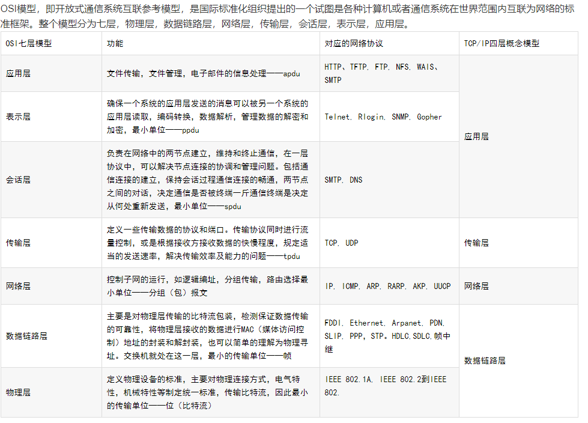
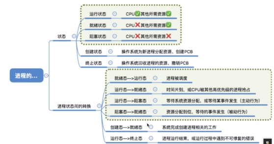

# 一．Java基础

## 1 java集合

### 1.1 Hashmap底层结构

​	Hashmap底层是**数组+链表/红黑树**。它是基于hash算法实现的，put一个map时，会先计算出key的hash值，根据hash值将value加入桶中。当计算出的hash值相同时，称发生了hash冲突，hashmap的做法是用链表来存储相同hash值的value，冲突个数大于8时，先判断数组长度是否大于64，大于64链表转换为红黑树；小于64对数组进行扩容。

大部分情况下hash冲突是比较少的，链表和红黑树的查询性能差不多，转换成树新增成本高，所以使用链表。链表查询时间复杂度是O(n)，红黑树是O(log N)，当有大量冲突时，红黑树可以加快检索速度。

 #### 红黑树


### 1.2 HashMap扩容机制 

https://blog.csdn.net/pange1991/article/details/82347284 

两种情况进行扩容：

- 容器中个数个数大于等于容器的阈值（数组长度 * 加载因子）
- 某个桶的冲突到达8时（桶<64扩容，否则转红黑树）

向容器中添加元素时，会判断容器中元素的个数，如果容器中个数个数大于等于容器的阈值（数组长度 * 加载因子）时，就要自动扩容resize()；如果已经达到最大容量，就不扩容了。

扩容就是让一个容量大的数组代替现在容量小的数组，一般新容量是旧容量的2倍，然后（JDK1.7）遍历旧数组元素重新计算hash值，放入新的数组。遇到hash冲突，使用头插法插入链表。

并发操作会导致死循环。

 

### 1.3 Hashmap hashtable区别？

- hashmap允许key和value值为null；hashtable不允许。

- hashtable是同步的，hashmap不是，所以多线程用hashtable，单线程用hashmap。

- 可以使用hashmap的子类linkedhashmap保证有序，hashtable不行。

 

### 1.4 ConCurrentHashMap的实现原理

ConCurrentHashMap底层也是使用**（1.7 segment数组+数组+链表）**（**1.8 Node数组+链表+红黑树）**来实现的，但ConCurrentHashMap使用**synchronized锁+CAS机制（JDK1.8）+分段锁（1.7）**来保证线程安全。

（JDK1.7）分段锁将数据分为一段一段存储，每一段加一个锁，当一个线程占用锁访问一个段的数据时，其他段的数据也能被其他线程访问，实现并发访问。

ConCurrentHashMap定位到一个元素要经过两次hash，第一次hash定位到segment，第二次hash定位到元素所在的链表头部。

（JDK1.8）取消segments字段，直接采用transient volatile HashEntry<K,V>[] table保存数据，采用table数组元素作为锁，从而实现了对每一行数据进行加锁，并发控制使用Synchronized和CAS来操作。

**CAS机制**：**使用了三个操作数，内存地址值，旧的预期值，要修改的新值**

更新一个变量时，只有当预期值与内存地址的值相同时，才会将新值放入内存地址。不然就获取内存地址的值，重新进行计算（自旋过程）

 

### 1.5 ArrayList线程安全吗？底层结构？扩容机制？

ArrayList不是线程安全的类，它添加元素的操作是分为两个步骤进行的，第一步将元素放到数组中，第二步将size+1，他在多线程的条件下不能保证原子性，所以他是不安全的。

Arraylist的**底层是一个可变数组，数组元素的数据类型是object类型。**

- **扩容机制**：创建arraylist 对象时，初始化object类型数组的容量为0；当第一次添加元素时，才初始化数组容量为10。每次添加都要判断是否超过容量，如果没有超过的话，直接添加新元素到数组里，并将size+1；不够的话，需要扩容，将其扩容到旧容量1.5的倍，用新容量创建新数组，将老数组的数据拷贝过来。继续处理。

### 1.6 CopyOnWriteArrayList

可以做到读写分离，每次写操作在一个新复制的数组上进行，读操作还在原始数组中进行，读写互不影响，写操作的时候加锁做到写写隔离，结束后将将原始数组指向新的复制数组。

## 2. 其他

### 1.  Java创建对象的几种方式？

- 使用new关键字

- 通过反射创建对象，调用java.lang.Class或者java.lang.reflect.Constructor类的newInstance()实例方法。

- 调用对象的clone()方法（需实现Cloneable接口）

- 使用反序列化创建对象

**序列化与反序列化**：https://blog.csdn.net/cpcpcp123/article/details/51353851

Java**序列化是将对象转换为字节序列的过程。反序列化是将字节序列转换为目标对象。**

当java对象需要在网络中传输，或者需要持久化到文件中时需要序列化。

- 要序列化某个类的对象的话，则该类必须实现Serializable接口，这是一个空接口。
- 序列化的目的是为了保存对象的状态。
- 如果某些数据不想被序列化，在字段前面加上transient关键字。
- 进行序列化主要用到的流是FileOutputStream和ObjectOutputStream。FileOutputStream主要用于连接磁盘文件，并把字节写出到该磁盘文件；ObjectOutputStream主要用于将对象写出为可转化为字节的数据。

 

### 2. String，StringBuilder，StringBuffer区别

- String：字符串常量，String的值是不可变的，每次操作都生成新的对象，浪费内存。

- StringBuilder：字符串变量，线程不安全，效率高。

- StringBuffer：字符串变量，线程安全，效率低。（StringBuffer类中的方法都添加了synchronized关键字，也就是给这个方法添加了一个锁，用来保证线程安全。）

## 3. 线程与线程池 

### 3.1  线程创建的几种方式和区别

（1）继承Thread的子类，重写run方法，run方法里就是线程的执行体，创建子类的实例，就创建了线程，调用线程的start方法开启线程。

（2）实现runnable接口，重写run方法，但是runnable接口没有start方法，必须把实现类的实例作为thread对象的参数，thread对象才是真正的线程对象。

（3）实现callable接口，重写call方法，call方法相比run方法可以有返回值，也可以声明抛出异常。创建callable的实例，再用**futuretask**来包装对象，再把task对象作为thread对象的参数来创建和启动线程。Call方法的返回值可以通过futuretask的get方法来获取线程的返回值。

 

### 3.2 Start方法与run方法区别

Start方法是用来启动线程，一旦启动，线程就处于就绪状态，一旦得到时间片，线程就可以运行了。

Run方法知识Thread类的一个普通方法，只调用run方法，那程序中依然只有一个主线程，按顺序执行。


###  3.3 Wait和sleep区别

Wait和sleep方法都是**使线程暂停执行一段时间**。

但是，

（1）**sleep()方法是Thread类的静态方法**，他会使线程暂停一段时间，把执行机会让给其他线程，等时间一到，自动恢复，不涉及线程通信，所以调用sleep方法不会释放锁。

**Wait()方法是object类的方法**，用于线程间的通信，这个方法会释放它所占用的锁，让当前线程等待，直到其他线程调用notify()方法才将其唤醒。

（2）因为wait方法涉及到锁，它必须放在同步控制方法或同步语句块中使用，而sleep方法可以放在任何地方使用。

### 3.4 线程状态

1）初始状态：new 一个thread实例出来，线程就进入了初始状态

2）运行：获得时间片就进入运行状态

3）可运行（就绪）：调用了start方法，就处于可运行状态

4）阻塞：执行过程中因某事件受阻，就进入阻塞状态。比如调用sleep方法（暂停当前线程，但不会释放资源）就进入阻塞状态。Sleep结束后进入可运行状态。等待用户输入也进入阻塞状态。

5）死亡状态：run方法或main方法执行完成。

 

### 3.4 ThreadLocal类

提供一个线程内的局部变量，使各个线程之间不会干扰，处理多线程间数据隔离的问题。

**底层实现：每个thread维护一个ThreadLocalMap映射表，map的key为ThreadLocal实例**（实际上key并不是ThreadLocal本身，而是它的一个弱引用）**，value是真正需要存储的变量。**ThreadLocal本身并不存储值，它只是作为一个key来让线程从ThreadLocalMap获取value。

 

内存泄漏问题：

当threadLocal使用完被回收后，key为null，但是value可能不为空，但是value不会再被使用到了，造内存泄漏。

Set方法：先判断map是否存在

 

***\*Hash冲突\****：（Set方法）

（1）通过hash计算后的槽位entry数据为空，直接放入

（2）槽位数据不为空，但key值一致，直接更新

（3）槽位数据不为空，key不一致，先行向后查找，找到entry为null的放入，或者找到key值相同的更新

（4）在找到entry为null的槽位前，找到了key为null的槽位，会执行replaceStaleEntry()方法，替换过期数据。

\- replaceStaleEntry()方法：记录当前槽位，从此槽位开始向前遍历，直到entry为null为止，找过期数据

 

### 3.5 ThreadLocal与synchronized的区别

- synchronized采用的是“以时间换空间”的方式，只提供一个变量，让各个线程排队去访问。（解决线程同步问题）

- ThreadLocal采用“以空间换时间”的方式，为每个线程都提供了一个变量副本，从而实现多个线程同时访问但互不干扰。（解决线程数据隔离问题）

 

### 3.6 线程池

在一个应用程序中，需要多个线程，线程的创建和销毁都是需要消耗资源的，频繁创建销毁会降低性能，所以出现了线程池，用来管理线程。线程池事先创建若干个可执行的线程放入池中，需要时从池中获取线程，使用完毕不是销毁，而是重新放入池中，减少了创建和销毁线程的开销。

线程池的工作流程：当提交一个新任务到线程池，

（1）判断核心线程池的线程是否都在执行任务，不是就创建一个新的工作线程执行任务，否则（2）

（2）判断工作队列是否已满，没有就将任务放入工作队列里。否则（3）

（3）判断线程池的线程是否都处于工作状态，没有，创建一个新的工作线程执行任务，否则交给饱和策略来处理任务。

 

**创建线程池的参数**：

- CorePoolSize（线程池的基本大小）

- MaximumPoolSize（线程池最大数量）

- KeepAliveTime：线程保持活动时间。

- RejectedExecutionHandler（饱和策略）：默认AbortPolicy直接抛出异常。

 

使用execute() 和 submit() 方法向线程池提交任务。

\- execute()用于提交不需要返回值的任务

\- submit()用于提交需要返回值的任务。

 

### 3.7 ThreadPoolExecutor

可以创建三种类型的ThreadPoolExecutor。

\- FixedThreadPool：可重用固定线程数的线程池。

\- singleThreadPool：创建单个线程。

\- cachedThreadPool：会根据需要创建新线程。

 

## 4. java锁机制

**锁是一种同步机制，使用锁可以保证在多线程环境下同步执行，解决可见性和原子性等问题。**

按照他**是否需要加锁锁住同步资源**来说：可以分为**乐观锁和悲观锁**。

- **悲观锁**是说一个线程占用了一个锁，其他线程就必须等待，一直到这个锁被释放，典型的悲观锁就是synchronized。

- **乐观锁**是指操作并不加锁，而是抱着尝试的态度去执行某项操作，如果操作失败或者操作冲突，那么就重试，一直到执行成功为止。（比如CAS）

如果给同步资源加锁，其他线程获取锁对象失败时，可以有**自旋锁**。就是说线程不阻塞，不放弃处理机的执行时间，看持有锁的线程能不能很快释放，为了让线程等待，就让线程自旋。（可以避免线程状态切换的开销）

- 公平锁和非公平锁：公平锁是先对锁进行请求的线程一定先被满足，非公平则不按顺序。

- 可重入锁：支持已经获取到锁的线程可以再次获取锁，不会被阻塞。

- 偏向锁/轻量级锁/重量级锁

  - 偏向锁：启用了偏向锁，当锁对象被第一个线程获取的时候，虚拟机会将该线程id放入对象头的mark Word中，并把偏向模式设为1，标志位（01），表示进入偏向模式。持有偏向锁的线程每次进入锁，不会进行任何的加锁解锁操作，减少了开销。

    一旦出现另一个线程获取这个锁，就升级为轻量级锁。

  - 轻量级锁：当一个线程获取了轻量级锁后，另一个线程会通过自旋的方式获取锁，不会阻塞，主要使用的是CAS操作。

    线程获取锁是，通过CAS操作尝试将对象的mark Word 更新为指向锁记录（在当前线程的栈帧中简历锁记录空间，存储锁对象mark Word的拷贝）的指针，更新成功，获取锁，更改mark Word的锁标志位。

  - 重量级锁：当线程在自旋了指定次数后仍然没有获取锁，轻量级锁就会膨胀为重量级锁，重量级锁会阻塞其他竞争锁的线程，性能低。

    


### 11. 什么是线程安全？如何实现？

线程安全就是在多线程访问时，使用了加锁机制，当一个线程访问该类的数据时进行保护，其他线程必须等到上个线程访问操作结束后才可以访问。

**互斥同步**：

- synchronized 关键字：当synchronized锁住一个对象后，别的线程要想获取锁对象，必须等这个线程释放之后才可以，否则就一直等待。Synchronized在发生异常时，会自动释放锁，不会造成死锁。

- Lock：lock和synchronized相比，需要手动加锁和释放锁。Lock发生异常如果没有手动释放锁，就会发生死锁，所以一般在finally中释放锁。

**非阻塞同步**：

- volatile关键字：保证内存的可见性，就是说一个线程修改的状态对另一个线程是可见的。

 

### 12. **Volatile和synchronized的区别？**

- synchronized 解决的主要是执行控制的问题，一个线程若获取锁对象，其他线程就必须等当前对象释放锁后才能获取锁，会造成线程阻塞。

- volatile 主要解决的的内存可见性的问题，根据java内存模型，线程在执行时，会先从主存拷贝数据到自己的工作区间，操作完成再将结果刷新回主存。使用volatile关键字，它的读写都会刷新到主存，一个线程的修改对另一个线程是可见的。他不会造成阻塞，但不能保证原子性。

- volatile只能修饰变量，synchronized修饰类，方法，变量，代码块。

 

### 13. **Lock 和 synchronized的区别？**

- **Synchronized是java的关键字**，他**不需要手动的去释放锁**。当前线程执行完代码块，就释放锁，或者发生异常，JVM也会让线程释放锁。但是如果占用锁的线程由于等待IO或者调用sleep方法被阻塞了，但是并没有释放锁，其他线程就必须一直等待。这个时候就需要lock。

- Lock是一个接口，**需要手动加锁和释放锁**，如果没有手动释放锁，可能会出现死锁。

Lock提供synchronized不具备的几个特性，**尝试非阻塞的获取锁**，用trylock()方法尝试获取锁，获取到返回true，否则返回false，不会因为获取不到锁一直等待。**可以定时获取锁**，在规定时间内获取不到锁返回false。

lockInterruptibly()来**让等待锁的线程响应中断**，当两个线程同时通过lock.lockInterruptibly()想获取某个锁时，假若此时线程A获取到了锁，而线程B只有在等待，那么对线程B调用threadB.interrupt()方法能够中断线程B的等待过程。

synchronized ：可重入、不可中断、非公平

lock：可重入、可中断、可公平


# 5. 其他

### 19. Hashcode()和equals()

 hashcode()是获取哈希值

equals()作用是判断两个对象是否相等。（重写equals比较内容，没有重写比较地址）

 如果两个对象equals相等，hashcode值一定相等

但hashcode相等，equals不一定相等。这就会出现哈希冲突。

**为什么重写equals还要重写hashcode？**

- 在Java的一些容器中，不允许插入两个完全相同的对象，比如set和map，会先判断hashcode，在判断equals，（hashcode是根据对象的存储地址转换形成的哈希值，）如果没有重写hashcode，可能会出现hashcode值不同，equals值却相同的问题，这样会造成相同的对象值散列到不同位置。（map的key重复，set出现相同的值）

  

### 20. 抽象类和接口

抽象类可以包含抽象方法和其他方法，接口只能包含抽象方法。

\- ***\*抽象类\****：抽象类必须使用abstract关键字来修饰，一类抽象类可以没有抽象方法，但有抽象方法的一定是抽象类。抽象类不能实例化，必须有一个子类继承并覆盖重写所有抽象方法。

\- ***\*接口\****：接口是抽象方法的集合。一个类实现了某接口，就必须覆盖重写该接口的所有抽象方法，如果没有覆盖重写全部抽象方法，那这个实现类就必须是抽象类。

抽象类和接口都不能直接实例化。必须由一个子类去继承或实现，才能实例化。

 

***\*什么时候使用抽象类和接口？\****

\- 如果想让类有自己的默认方法，就使用抽象类

\- 如果想实现多重继承，就使用接口。

\- 如果基本功能不断改变，就使用抽象类，因为改变接口，就得改变它的子类。

 

### 21. Finally、final、finalize

- finally

  Finally是一个关键字，在异常处理中使用。不管异常有没有被捕获，finally都会执行，通常用于释放资源。finally中若有return语句，会覆盖try 或 catch 中的return语句。

- final

  - 被final修饰的变量（基本数据类型，一旦初始化就不能被更改。引用数据类型对其初始化后不能指向另一个对象，但他指向的对象的内容是可变的）。
  - 被final修饰的类无法被继承
  - **被final修饰的方法无法被重写，但允许重载**

- finalize

  java虚拟机在回收对象时会调用该方法

### 22.  Error和exception区别

Error和exception都继承自Throwable类。

\- exception是程序运行过程中，可能会出现的一些意外情况，这些异常可以通过捕捉处理，使程序继续运行。（空指针，越界，非法参数）

\- error是java内部运行环境错误等，这些错误程序不能处理，只能避免。（OOM）

 

### 23. 反射机制

**Java的反射机制是指在程序运行时，可以动态加载并获取类的详细信息，从而操作类或对象的属性和方法。本质上是JVM得到class对象之后，通过class对象反编译获得对象的各种信息。**

应用：JDBC中，利用反射加载数据库驱动程序。许多框架也用到了发射机制，注入属性或调用方法，例如spring。

获得Class：主要有三种方法：

（1）Object-->getClass

（2）任何数据类型（包括基本的数据类型）都有一个“静态”的class属性

（3）通过class类的静态方法：forName(String className)（最常用）

 

### 24. 泛型中类型检查是在编译阶段还是运行阶段？

泛型中的类型检查在编译阶段。

 

### 25. 泛型？

泛型提供了编译时的类型安全检查机制，允许程序员在编译时检查非法的类型。泛型的本质是参数化类型，也就是说所操作的数据类型被指定为一个参数。

**类型擦除**：Java的泛型是伪泛型，Java在编译期间，所有的泛型信息都会被擦掉。所以在编译生成的字节码中是不包含泛型中的类型信息的。**使用泛型的时候加上类型参数，在编译器编译的时候会去掉，这个过程成为类型擦除。**

 

### 26. 浅拷贝与深拷贝

浅拷贝：对整个对象进行拷贝，但不会拷贝对象的对象属性。就是说对象属性是在原对象和它的副本之间共享的。**（调用clone方法）**

深拷贝：会拷贝所有的对象属性，并分配内存。**（通过序列化）**

 ### 27. JDK JRE JVM

- JDK：java开发工具包，提供了Java的开发环境和运行环境

- JRE：java运行环境，为java的运行提供所需环境

  JDK包含JRE，同时还包含java程序的编译器，调试和分析的工具。JRE包含JVM

  如果要运行java程序，只需安装JRE，要编写Java程序，要安装JDK。

  

### 28. 四种权限修饰符


# 二．Spring、springboot

### 1. @Autowired注解原理

自动按照类型注入。

\- 首先找IOC容器中有没有任何bean类型和要注入的类型匹配，没有就报错

\- 如果有多个类型匹配，就按照变量名称去找。

 

### 2.  IOC控制反转

为了降低程序间的耦合。把对象的创建交给spring，我们使用对象就去找spring获取对象。

使用Bean标签就是来配置对象，交给spring去创建。

Bean标签的属性，id：对象的命名。Class：对象的全限定类名。

 

### 3. Springboot的bean的生命周期和作用域

Bean标签作用：用于配置对象让spring去创建的。默认情况下它调用的是类中的无参构造函数。如果没有无参构造函数则不能创建成功。

***\*作用域\****：

\- singleton：单例的(默认值)

\- prototype：多例的

Web应用中使用的request session 和global-session

***\*生命周期\****：单例对象的生命周期，随着spring IOC容器的创建而产生，容器销毁，对象就被销毁。

多例对象是在我们使用时spring对象创建的，对象长时间不用且对象没有被其他对象引用的话，会由垃圾回收器回收。

 

### 4. AOP：面向切面编程

通过预编译方式和运行期间动态代理实现程序功能的统一维护的一种技术。利用AOP可以对业务逻辑的各个部分进行隔离，从而使得业务逻辑各部分之间的耦合度降低，提高程序的可重用性，同时提高了开发的效率。

简单的说它就是把我们程序重复的代码抽取出来，在需要执行的时候，***\*使用动态代理的技术\****，在不修改源码的基础上，对我们的已有方法进行增强。

 

动态代理：

 

 

### 5. Spring事务

Spring支持事务的两种方式：

（1）声明式事务：实质上是在方法执行前后进行拦截，然后在目标方法开始之前创建并加入事务，执行完目标方法后根据执行情况提交或回滚事务。

基于注解：@transactional注解

还有一种就是基于AOP名字空间的xml配置

（2）编程式事务

使用TransactionTemplate

 

### 6.  Controller对象单例还是多例？为什么？

单例。

一是：为了性能，每次请求不用创建新的对象，速度快

二是：不需要多例，只要不设置静态变量，那controller就是线程安全的。

 

### 7. Controller对象有很多线程访问怎么保证线程安全

Controller里只要不定义静态变量，那么它就是线程安全的。单例模式保证我们在controller里拿到的对象是同一个，不会发生线程安全问题。

如果一定要定义静态变量的话，可以使用注解@Scope(“prototype”)，将它设置为多例模式。

或者使用ThreadLocal类。

 

 

 

 

# 三．数据库

### 1. 三大范式

**1NF：每一列都是不可分割的原子数据项。**

**存在问题**：严重的数据冗余

数据添加和删除时会存在一些问题

**2NF：在1NF的基础上消除了非主属性对主码的部分函数依赖**。也就是说，非主属性必须完全依赖与主码。

部分函数依赖：B值的确定依赖A属性组中某些属性的值。

3NF：在2NF的基础上消除了传递依赖。

 

### 2. 事务

事务：一组操作，要么同时成功，要么同时失败。

事务的**四个特性**：

- **原子性**：一组操作同时成功，同时失败，

- **持久性**：当事务提交或回滚后，数据库持久化的保存数据。

- **隔离性**：多个事务之间相互独立。

- **一致性**：事务操作前后，数据的总量不变。

 

### 3.  四个隔离级别及存在的问题

- **读未提交**：脏读、不可重复读、幻读

- **读已提交**：不可重复读、幻读

- **可重复读**：幻读（mysql默认隔离级别）

- **串行化**：解决所有问题（因为只有一个事务可以操作）

**幻读**：一个事务提交后读到了另一个事务提交的insert/delete数据。

**不可重复读**：一个事务在未提交时读到了另一个事务已提交的insert/delete数据。两次读取数据不一致。（只要A提交，B就能读到）

**脏读**：一个事务读到了另一个事务没有提交的操作，这个操作可能会发生回滚。

 

### 4. 内连接、外链接

内连接：匹配两张表相关联的记录，交集

外链接：分为左外连接和右外连接。左外连接匹配左表全部记录，匹配右表满足条件的记录。

 

### 5. MVCC多版本并发控制

**目的**：为了实现对数据库的并发访问，提交并发的读写性能。

**主要适用于**：**读已提交和可重复读**的隔离级别下。

**读未提交隔离级别**总是读取最新的数据行，要求很低，无需使用 MVCC。

**可串行化隔离级别**需要对所有读取的行都加锁，单纯使用 MVCC 无法实现。

主要是为了提高数据库并发的性能，用更好的方式处理读 - 写冲突，做到即使有读写冲突，也能做到不加锁。

 #### 5.1 实现核心：

- 表的隐藏列：记录事务id和上个版本的数据地址
- undo log：记录数据的各版本修改历史，即版本链
- read view：读视图，用于判断哪些版本是可见的。

mysql 排它锁读写是相互阻塞的。mvcc可以实现读写的并发执行，提升系统性能。

**多个事务并行执行时可以使用锁来解决并发问题，但是读写锁写操作会阻塞其他的读操作和写操作，也会造成一些性能问题，在mvcc事务中，对数据进行修改时，对每条记录的修改历史都会在undo log 里面记录，记录有两个隐藏的列：事务id和上个版本的数据地址，这样会形成一个版本链。执行select操作时，会生成一个readview读视图，读视图里有个列表来存储未提交的事务。**

- **如果当前事务的版本号比列表里最小的版本号小，说明该数据是在所有未提交事务之前更改的，那么是可以访问的。**
- **如果在最大值和最小值之间，要判断这个版本号是否在列表内，如果在列表内，说明该事务还没提交，不能访问。如果不在，可以访问。**
- **如果大于最大值，也不能访问。该事务是在readview生成之后才发生的。**

**读已提交隔离级别，每次select都生成一个新的readview**

**可重复读还是使用第一次select时生成的readview**


### 6. Mysql如何实现事务

**重做日志、回滚日志和锁技术是实现事务的基础。**

- 原子性：使用 undo log ，从而达到回滚
- 持久性：使用 redo log，从而达到故障后恢复
- 隔离性：使用锁以及MVCC,运用的优化思想有读写分离，读读并行，读写并行
- 一致性：通过回滚，以及恢复，和在并发环境下的隔离做到一致性。

 事务的目的是实现可靠性和并发处理。

- 可靠性：insert/update操作时发生异常时保障数据操作前后的一致性。要做到这个，需要知道修改前和修改后的状态，所以有了undo log（重做日志）和 redo log（回滚日志）
- 并发处理：多个并发请求过来，要对各个事务之间进行读写隔离。

#### redo log 和 undo log

redo log 重做日志：**记录被修改后的信息**。由两部分组成，重做日志缓冲（redo log buffer，在内存）和重做日志文件（redo log，在磁盘）。

- 作用：记录已成功提交事务的修改信息，并将redo log 持久化到磁盘。

 undo log 回滚日志：记录被修改前的信息。

- 作用：在系统发生错误或rollback时可以根据undo log 的信息回滚到没被修改前的状态。


### 7. Mysql锁

（1）行锁：（innoDB）只对当前进行操作的行进行加锁

- **共享锁S**：允许多个线程占用一个锁，但是只能读数据，不能写。（select ... lock in share mode）

- **排它锁X**：一个锁在同一时间只能被一个线程占有，其他线程必须等待锁释放。（select ... for update）

- **间隙锁**：（解决可重复读级别下的幻读问题），就是保证两次当前读返回一致的记录，那么就要在可能插入/删除满足条件的记录间加上间隙锁。

  **产生间隙锁的条件（RR事务隔离级别下；）：**

  （1）使用普通索引锁定；

  （2）使用多列唯一索引；

  （3）使用唯一索引锁定多行记录。

- **记录锁**：锁定一个记录上的索引，而不是记录本身。

- **临键锁**：是记录锁和间隙锁的结合，不仅锁定一个机具上的索引，也锁定索引之间的间隙。锁定一个前开后闭区间。

**Update 和 delete 默认加排它锁。**

（2）表锁（myISAM）：意象所，表级别的锁

- 意向共享锁：lock table 表名 read

- 意向排他锁：lock table 表名 write

- 解锁：unlock tables

- **自增锁**是一种特殊的表级别锁（table-level lock），专门针对事务插入AUTO_INCREMENT类型的列。最简单的情况，如果一个事务正在往表中插入记录，所有其他事务的插入必须等待，以便第一个事务插入的行，是连续的主键值。

（4）页锁：介于行级锁和表级锁中间的一种锁，一次锁定相邻的一组记录。

 

 

### 8. 常用的存储引擎

（1）InnoDB（mysql5.5以后默认）：支持事务，支持外键。InnoDB是***\*聚集索引\****，使用B+树作为索引结构。

（2）myISAM：myISAM不支持事务，不支持外键。myISAM是***\*非聚集索引\****，也使用B+树作为索引结构。

 innodb可以在数据库异常崩溃后，重启恢复到崩溃前的状态，依赖于redo log（保证事务持久性）

### 9. 聚集索引和非聚集索引

（1）聚集索引：数据行的物理顺序与索引中键值（一般是主键的那一列）的逻辑顺序相同。***\*一个表中只能有一个聚集索引（一般是主键）\****。

（2）非聚集索引：索引存在一个地方，数据存在另一个地方，索引中有指针执行数据存储的地址。

 

### 10. 为什么选B+树索引

https://blog.csdn.net/weixin_30531261/article/details/79312676

**B+树相较于B树的优点**：

B树的叶子结点和非叶子节点都存储数据和索引，B+树非叶子节点只存储索引，关键字都存储在叶子节点中，并且叶子节点中有一个指针指向下一个节点。

1）更少的io次数：因为B+树的非叶子节点只存储索引，所以他每个节点可以存储的关键字就更多，对局部性原理利用更好，缓存命中率更高。

2）更适用于范围查询：B+树只需对链表进行遍历。B树需要找到范围的下限，再找到范围的上限。

3）查询效率更稳定：B+树的数据都存在叶子结点，所以它每次查询都查询到叶子结点。

 

**局部性原理**：

是指当一个数据被使用时，其附近的数据有较大概率在短时间内被使用。当访问其中某个数据时，会将这块区域的数据读到缓存中；当它临近的数据紧接着被访问时，可以直接在缓存中读取，无需进行磁盘IO；

 

（1）刚开始是二叉搜索树，但搜索树可能会长的不平衡搜索速度降为0(n)

（2）引入平衡二叉树（所有节点的左右子树高度差不能大于1），但插入和删除可能会需要旋转来使二叉树再次平衡，旋转操作耗时。数据量越大树越高，树高会影响磁盘IO次数。

（3）引入B树（多路平衡查找二叉树）。降低树高，使得磁盘的io次数降低。但是每个节点都存储键值+数据，而数据库的索引文件是存储在磁盘的，当利用索引查找时，不可能一下子把索引文件全部加载进内存，只能逐一加载每个磁盘页，B树它每一页存储的键值有限，数据过大就会导致树变高，影响查询效率。

（4）B+树，它的非叶子节点只存储键值，这样每一页存储的键值可以更多，减少磁盘的IO次数。而且叶子结点有指向下一个叶子节点的指针，更好的支持范围查询。

 

### 11.  数据库索引

**索引**：就是对数据库表中一列或多列的值进行排序的一种存储结构，索引以文件形式存储在磁盘中，使用索引可以加快查询速度。

 

**常见的索引类型**：

普通索引、唯一索引、主键索引：

- 普通索引：是mysql的基本索引类型，允许在定义索引的列中插入空值和重复值。

- 唯一索引：要求索引列的值必须唯一，**允许空值**。

- 主键索引：是一种特殊的唯一索引，**不允许有空值**。

**一个表只能有一个主键**，但可以有多个唯一索引。

单列索引和组合索引：

- 单列索引：一个索引只包含单个列。

- 组合索引：好几个字段组成的索引，组合索引遵循最左前缀匹配原则。

 

创建索引注意事项：


什么时候创建索引：

（1）主键自动建立唯一索引

（2）频繁作为查询条件的字段要创建索引

（3）查询中与其他表关联的字段

（4）查询中排好序的字段

（5）查询中统计或分组的字段

什么时候不创建索引：

（1）频繁更新的字段

（2）Where条件用不到的字段

（3）数据重复且平均分布的字段

（4）表记录较少

避免索引失效：

（1）遵守最左前缀原则

（2）不再索引列上做任何操作

（3）不能使用了索引中范围条件右边的列

（4）!= <> like ‘%abc’ or无法使用索引会导致全表扫描

 

 

### 12. 最有前缀匹配原则

会对联合索引的第一个字段进行排序，在第一个字段排序的基础上，再对第二个字段进行排序。检索数据时从联合索引的最左边开始匹配，知道遇到范围匹配停止。

 

 

# 四．JVM

### 1.  JVM各个区域

（1）**程序计数器**：记录当前字节码指令执行到哪一行了，他是线程私有的。也是java虚拟机里唯一一个不会内存溢出的区域。

（2）**虚拟机栈**：每个方法执行时，java虚拟机都会创建一个栈帧，放入虚拟机栈，**栈帧里存放局部变量表、操作数栈、方法出口等信息**。方法执行完出栈。

（3）**本地方法栈**：为java虚拟机提供本地方法服务的。

（4）**堆内存**：存放对象实例的区域。他有新生代和老生代两块区域，新生代有Eden和survivor区。老生代存放经过多次垃圾回收仍存活的对象。

（5）**方法区**：用于存储**已被虚拟机加载的类信息、常量、静态变量、即时编译器编译后的代码**等数据。

 

### 2. 怎么判断对象存活

**虚拟机不用）**引用计数法：给每个对象添加一个引用计数器，每有一个地方引用他，计数器加1，引用失效，计数器减1。计数器为0时，这个对象就可以回收了。但他不能解决循环引用的问题，所以不采用。

**（虚拟机使用）可达性分析算法**：扫描堆中的对象，看沿着GC Root对象的引用链是否能找到该对象，找不到的就回收。

**GC Root对象：虚拟机栈中引用的对象、方法区中类静态属性引用的对象、方法区中常量引用的对象、本地方法栈中本地方法引用的对象。**

 

### 3. GC ROOTS具体是怎么遍历的？

就是从GC Root对象开始，通过引用关系遍历对象图，遍历到的对象就是存活对象，没遍历到的就可以被回收。

 

### 4. 垃圾回收算法

**标记-清除算法**：在垃圾回收时，根据标记算法标记要回收的对象，垃圾回收器根据标记回收对象。缺点：会产生大量内存碎片。

**标记-整理算法**：也是先标记出要回收的对象，然后把存活对象都移到一端，然后清理端边界另一边的内存。

**复制算法**：将内存分为大小相等的两块，每次只使用其中一块，一块的内存用完后，将存活对象复制到另一块内存上，然后把用过的一块内存全部清理掉，再交换两个内存区域。

 

### 5. 为什么新生代要用复制算法，老年代要用标记清除/标记整理？

因为新生代对象生存时间较短，大部分对象都要回收，采用标记清除算法内存碎片化严重，标记整理又太耗时间，复制算法是灵活高效的，还可以整理空间。

老年代的空间大，采用复制算法占太多空间，因为复制算法要分两块大小相等的区域，所以不使用复制算法。

 

### 6. G1收集器

G1收集器把java堆划分成了一块块大小相等的region区域，每个region都可以按需要做新生代或老年代空间。

 

G1收集器的运行过程：

**（1）****初始标记**：标记GC Roots能直接关联到的对象，需停顿线程，耗时很短（STW）

**（2）****并发标记**：老年代占用堆空间比例达到阈值时，进行并发标记。从GC Root开始对堆对象进行可达性分析，找出要回收的对象。与线程并发执行

**（3）****最终标记**：处理并发阶段结束后仍遗留的对象（并发阶段，用户线程执行产生的垃圾对象）（STW）

**（4）****筛选回收**：将决定回收的Region的存活对象复制到空的Region中，再清理掉整个旧的Region的全部空间。（STW）

 

### 7. CMS收集器

 

**并发标记清除收集器**。

它的回收过程：

**（1）初始标记**：初始标记是标记GC root能直接关联到的对象，会触发STW，但标记时间特别快。

**（2）并发标记**：并发标记，就是沿着GC root的引用链找出存活对象，这个时候用户线程是和并发标记同时执行的。所以垃圾对象会发生变动，就要进入重新标记阶段。

**（3）重新标记**：重新标记会修正发生变动的对象，也会触发STW

**（4）并发清除**：对标记的对象进行清除。

 

### 8. 什么时候触发full GC

新生代：minor GC  老年代：major GC  整个堆：full GC

（1）老年代空间不足：创建一个大对象，新生代放不下，直接放入老年代，老年代空间不足时，触发full GC

（2）永久代空间不足：系统当中需要加载的类，调用的方法很多，同时持久代当中没有足够的空间，就出触发一次Full GC

（3）显示调用system.gc()

 

### 9. 什么时候会发生stackoverflow

在栈内存中，线程请求的栈深度大于虚拟机允许的最大深度，发生栈溢出。

 

### 10. 什么时候发生OOM

栈在动态扩展时无法申请到足够的内存，内存溢出。

在堆内存中，创建的对象过多，他们也没有被回收，内存不足就会发生OOM。

 

### 11. 强软弱虚四种引用

- 强引用：

最普遍的一种引用，例如String s = “abc”，s就是”abc”的强引用，只要强引用存在，垃圾收集器就不会回收这个对象。

- 软引用：

引用还有用但非必须的对象，在进行一次垃圾回收，内存仍不足时，软引用的对象就会被回收，软引用会被放入与之关联的引用队列中。

- 弱引用：

弱引用比软引用弱一点，在垃圾回收器工作时，不论当前内存是否足够，都会回收掉弱引用对象。

- 虚引用：

与其他几种引用都不同，如果一个对象只有虚引用，那他在任何时候都可能被垃圾收集器回收。虚引用**必须配合**引用队列使用。当垃圾回收器准备回收一个对象时，发现他还有虚引用，就会先把这个虚引用加入到引用队列中。

 

### 12. 类加载机制

Java虚拟机把描述类的数据从class文件加载到内存，并对数据进行校验、转换解析和初始化，最终形成可以被虚拟机直接使用的java类型，这个过程称作虚拟机的类加载机制。

一个类从加载到内存开始，到卸载出内存为止，它的整个生命光周期将经历七个阶段：

**加载 - 连接（验证 - 准备 - 解析） - 初始化 - 使用 - 卸载**

 

**加载**：**主要是为了生成当前类的class对象**

通过一个类的全限定名来获取定义此类的二进制字节流。
	将这个字节流所代表的静态存储结构转化为方法区的运行时数据结构。
	在Java堆中生成一个代表这个类的Java.lang.Class对象，作为方法区这些数据的访问入口。

**验证**：**确保class文件的字节流中的数据信息是否符合JVM的规范**。（文件格式、元数据、字节码）

**准备**：为类变量分配内存，并给默认值，随着类对象一起存放在堆中

**解析**：将常量池中的符号引用替换为直接引用。

**初始化**：执行类构造器`<clinit>`()方法的过程

 

什么时候进行类加载？

\- new一个实例对象

\- 调用静态方法或静态变量

\- 获取类的class对象时

 

### 13. JVM内存模型

JVM内存模型本身是一个抽象的概念，他定义了程序中各种变量（包括实例字段，静态字段和构成数组对象的元素）的访问规则。

 

### 14. 双亲委派模型

当一个类加载器收到一个类加载请求时，首先不会去尝试加载这个类，而是将这个类加载请求交给父类加载器去完成，每一级都是如此，只有当父类加载器反馈自己无法完成这个加载请求，子加载器才自己完成加载。

 

**自定义类加载器 --> 应用程序类加载器（负责加载用户类路径下的类） --> 扩展类加载器 --> 启动类加载器**

 

### 15. 为什么使用双亲委派模型

为了保证类的唯一性。判断两个类相同的前提是它们是由同一个类加载器加载的。如果用户自己编写了一个java.lang.Object的同名类，不使用双亲委派模型而是各个类加载器自行去加载的话，多个类加载器都把这个类加载到内存中，那类的唯一性无法保证，程序会出现混乱。

 

### 16. 如何破坏双亲委派模型

（1）重写loadclass()方法

（2）使用线程上下文类加载器

 

# 五．计网

### 1.  IP协议

IP协议是用来进行网络之间互连的一种协议，规定了将一个数据从一个网络转发到另一个网络的规则。IP为主机提供一种无连接、不可靠的、尽力而为的数据包传输服务，所以他传送的分组可能会出现重复、乱序、丢失等情况。

 

### 2. IP协议分组转发算法

（1）先从数据包的首部提取目的主机的IP地址，得到他的网络地址

（2）如果这个网络地址与路由器直接相连，直接把数据报交付给目的主机

（3）否则，通过路由表查看是否有该目的地址的特定路由，有的话转发。

（4）没有，就将数据包转发给路由表所指定的下一跳路由器

（5）否则，转发分组报错。

 

### 3. TCP（传输控制协议）和UDP（用户数据报协议）区别

TCP提供可靠的传输，需要建立连接，***\*面向字节流\****，有流量控制和拥塞控制，TCP连接一对一。

UDP是无连接的，尽最大可能交付，***\*面向报文的\****，没有阻塞控制，支持一对一、一对多、多对一、多对多交互通信。

 

### 4. TCP三次握手

 

**第一次握手**：客户端向服务器端发送SYN包（seq = x），请求建立连接，并进入SYN-SENT（同步已发送）状态，等待服务器确认。

**第二次握手**：服务器收到包后必须进行确认（ACK = x+1），自己也发出一个SYN包（seq=y），所以服务器向客户端发送SYN+ACK包，服务器进入SYN-RECV（同步收到）状态。

**第三次握手**：客户端收到服务器的报文后，向服务器发送确认ACK包（ACK = y+1），服务器和客户端都进入ESTABLISHED（连接已建立）状态。

 

### 5. TCP四次挥手

 

**第一次挥手**：客户端发出连接释放报文，并停止发送数据。客户端进入FIN-WAIT-1（终止等待1）状态。

**第二次挥手**：

- 服务器端收到连接释放报文段后发出确认，此时，服务器端进入CLOSE-WAIT（关闭等待）状态。TCP服务器进程通知高层应用进程，所以从客户端-服务器端这个方向的连接就释放了，这时TCP连接处于半关闭状态，即客户端没有数据要发送了，但服务器端发送的数据客户端仍要接收，这个CLOSE-WAIT状态持续一段时间。

- 客户端收到服务器发送的确认后，就进入FIN-WAIT-2（终止等待2）状态，等待服务器发出的连接释放报文段。

**第三次挥手**：服务器的数据发送完毕后，向客户端发送连接释放报文，服务器进入LAST-ACK（最后确认）状态，等待客户端的确认。

**第四次挥手**：

\- 客户端收到服务器发送的连接释放报文，发出确认，进入**TIME-WAIT（时间等待）**状态。**注意，**现在TCP连接还没有被释放掉。必须等待时间等待计时器设置的时间**2MSL**后，客户端才进入CLOSED状态。

\- 服务器收到客户端的确认后，立即进入CLOSED状态。

 

### 6. Timewait状态（为什么）

为了确认服务器端收到客户端发出的ACK确认报文。

当客户端发出最后的ACK确认报文时，并不能确定服务器端能够收到该段报文。所以客户端在发送完ACK确认报文之后，会设置一个时长为2MSL的计时器。MSL指的是Maximum Segment Lifetime：**一段TCP报文在传输过程中的最大生命周期**。**2MSL即是服务器端发出为FIN报文和客户端发出的ACK确认报文所能保持有效的最大时长。**

**服务器端在1MSL内没有收到客户端发出的ACK确认报文，就会再次向客户端发出FIN报文；**

这也是为什么客户端比服务器端晚进入CLOSED阶段的原因

 

 

### 7. TCP拥塞控制

拥塞：网络中某一资源的需求超过了该资源所能提供的可用部分。（对该资源的需求 > 该资源的可用资源）

**拥塞控制**就是防止过多的数据注入到网络中，这样可以使网络中的路由器或链路不致过载。

 

### 8. TCP拥塞控制算法

基于拥塞窗口的拥塞控制（发送发让自己的发送窗口=拥塞窗口）

（1）慢开始：不要一开始就发送大量的数据，先探测一下网络的拥塞程度 ，由小到大逐渐增大拥塞窗口的数值。没经过一次传输，拥塞窗口+1。

（2）拥塞避免：让拥塞窗口缓慢的增大，按线性规律缓慢增长。

（3）快重传：接收方收到数据立即发送确认，收到失序的报文段也要立即发出对已收到报文段的重复确认。快重传算法规定，发送发一连收到3个重复确认，就知道接收方没有收到下一个报文段，立即重传。

（4）快恢复：一般与快重传一起使用，收到三个重复确认后，将拥塞窗口缩小到一半

 

### 滑动窗口与流量控制


### 9. TCP怎么做到可靠传输

（1）确认机制

（2）超时重传机制：在发送某一个数据时就开启一个计时器，在一定时间内没有得到ACK报文，那么就重新发送数据，直到发送成功为止。

（3）滑动窗口机制：操作系统开辟了一个缓存空间，发送方在收到确认应答前，在缓存里保留已发送的数据，收到确认后，把数据从缓冲区清除。

（4）序列号

 

### 10. ARP

地址解析协议，用来将统一局域网内的IP地址转换为MAC地址。每一个主机上都有一个ARP 高速缓存，里面有本局域网每台主机和路由器的IP地址和物理地址的映射表，当一个主机向另一个主机发送IP数据报，就现在本机的ARP高速缓存中去找有没有另一台主机的IP地址，找到后，就把对应的硬件地址写入MAC帧；找不到，就自动运行ARP，在本局域网广播一个ARP请求分组，说我是谁，我要找IP地址为XX的硬件地址，所有主机都会收到这个请求，然后与要查询的IP地址一样的主机响应分组，同时在这个分组中写入自己的硬件地址。主机A收到分组后写入这个IP地址到MAC地址的映射。

 

### 11. HTTP

HTTP超文本传输协议，它使用TCP连接。

 

### 12.  https 与 http区别

http超文本传输协议，他是现在互联网使用最广泛的一种协议，用于在web浏览器和网站服务器之间传输信息。但是http协议是以明文的方式传输内容，不提供数据加密，所以传输的数据很容易被截取，不安全。

HTTPS是在http的基础上加入了SSL协议，SSL可以在数据传输前进行通信双方的身份验证，加密算法的协商和交换秘钥，为了保证数据传输的安全性。

 

### 13. http1.0 和 http1.1区别

http1.0：客户端每次请求都要建立一个连接，请求完本次连接后，就释放连接。

http1.1：默认使用的是长连接，只要一端没有明确提出要断开连接，就保持连接状态。他的持续连接有两种方式：非流水线方式和流水线方式。非流水线方式是说客户端在收到前一个响应后才能发送下一个请求。流水线方式是说客户端在收到响应前可以继续发送请求，服务器收到请求后持续返回响应报文。

 

### 14. http2.0与之前的区别

 http2.0有三大特性：

（1）头部压缩：（http请求都是由状态行、请求头部、请求体组成的），http1只压缩请求体，头部和状态行还是以纯文本的形式传输。http2.0支持头部的压缩，传输的数据变小，请求速度会变快。

（2）多路复用：使用多路复用技术，可以做到同一个连接并发发起多重的请求或响应消息。

（3）服务器推送：就是说在某次流中，服务器可以返回

客户端没有主动要的数据。

 

### 15.  http状态码

200：服务器成功接收请求，并将返回数据。

301：访问的链接移动到了位置，服务器发送给客户端连接变化，客户端向新连接发起请求，并返回结果。

404：没有找到请求的资源

500：服务器错误

 

### 16. http请求和响应消息头、消息体

请求行：请求方式 请求URL 请求协议/版本

请求头：

- User-Agent：请求使用的浏览器版本信息

- 可接受的字符集、编码格式

- 可接受的语言

- 浏览器请求的主机名和端口号

- 连接方式

请求空行(分隔post请求的请求头和请求体)

请求体(正文)

 

响应行：`协议/版本 响应状态码 状态码描述`(`HTTP/1.1 200 OK`)

响应头：

- Content-Type：响应体数据格式以及编码格式

- Content-disposition：服务器告诉客户端以什么格式打开响应体数据
  - in-line:默认值,在当前页面内打开
  -  attachment;filename=xxx：以附件形式打开响应体。文件下载

响应空行(分隔post请求的请求头和请求体)

响应体(正文)

 

 

### 17. HTTPS如何保证安全

https = http + SSL

https://wetest.qq.com/lab/view/110.html

通过混合加密和身份验证机制。

 

### 18. HTTPS建立连接流程

https://blog.csdn.net/qq_40149612/article/details/82795656

客户端发起HTTPS连接，解析IP将请求发送给服务器端，同时将自己支持的加密算法、证书以及它生成的一个随机数发送给服务器。

服务器收到后，会和自己支持的加密算法对比，不符合，就断开连接；符合的话将自己的证书、加密算法及生成的随机数（生成公私密钥，把公钥放在证书里）发送给客户端。

客户端验证证书后，生成一个随机数用服务器发来的公钥进行加密发送给服务器。

 

服务器收到后用自己的私钥解密随机数，接下来服务器和客户端就可以使用相同的加密算法将前三个随机数生成一个对话秘钥进行信息通信了。

 

 

**为什么不用非对称加密进行通信？**

因为非对称加密的加密解密算法效率低，不适合客户端-服务器端这种高频率的通信。非对称加密他可以很好地完成秘钥的交换，所以前期秘钥交换要使用非对称加密。

**为什么不直接使用对称秘钥**？

直接使用对称秘钥可能会被中间人劫持。如果服务器发送给客户端的公钥被中间人劫持，他会伪造一个公钥发送给客户端，客户端用这个伪造公钥加密的数据，中间人可以用自己的私钥解密，再用服务器的公钥加密发送给服务器。后续服务器和客户端通信的数据中间人都可以窃取到。所以要先使用非对称加密算法交换对称秘钥。

 

### 19. 浏览器输入一个URL的运行过程

首先进行域名解析，浏览器获得URL地址，向操作系统请求对应的IP地址，操作系统查询DNS获得对应的IP地址。

确认了IP地址和端口号，向IP对应的服务器发起TCP连接，需要三次握手。在两次握手完成后，客户端就将请求http报文发送给服务器，服务器响应请求，将数据返回给浏览器。

浏览器拿到数据，开始渲染页面，响应用户的操作。

 

 

### 20.  DNS解析URL

- **浏览器搜索自己的DNS缓存**，缓存中维护了一张域名和IP地址的对应表
- 若没有则**搜索操作系统**的DNS缓存
- 若没有则操作系统**将域名发送到本地域名服务器,**本地域名服务器在自己的DNS缓存查找（递归查询）
- 若没有则通过以下方式查找（递归查询/迭代查询）
  - 本地域名服务器**向根域名服务器**发送请求，根域名服务器返回com域顶级服务器域名地址
  - 本地域名服务器**向com域顶级域名发送请求**，com域顶级域名服务器返回权限域名服务器地址
  - 本地域名服务器**向权限域名服务器**发送请求，得到IP地址
- 本地域名将得到的IP地址返回操作系统，同时自己也将IP地址缓存起来
- 操作系统得到IP地址返回给浏览器，同时自己也将IP地址缓存起来
- 浏览器得到IP地址

### 21. session与cookie应用的区别

### 22.  IP地址与物理地址及区别

IP地址就是给互联网中的每一台主机或路由器的每个接口都分配了一个32位的标识符，他是一个逻辑地址，是可变的。他是网络层及以上层使用的地址。

物理地址是物理层和数据链路层使用的地址。他是网络设备生产时写在硬件内部的，是不可变的地址。

 

### 23. get 和 post 区别

get 和 post 都是http请求的两种基本方法。他们俩都是TCP连接。

最直观的区别就是get 把参数包含在URL中，post通过请求体来传递参数。

浏览器的URL长度一般是有限制的，所以get传递的参数大小有限制。

get把参数放在URL上，安全性较低。所以提交数据一般用post，查询用get。

get请求时，浏览器会把请求头和data一起发送，服务器响应200

post请求，浏览器先发送请求头，服务器响应100 continue，浏览器在发送data，服务器响应200.


### OSI七层模型




# 六．操作系统

### 1. 线程和进程

**进程**可以看成是程序执行的一个实例，进程是**系统资源分配**的最小单位，每个进程都拥有自己的独立空间。如果一个进程要访问另一个进程的资源，需要进行进程间通信。

**线程**是**CPU调度**的最小单位。它包含在进程中，是进程的实际运行单位。一个进程可以并发执行多个线程，线程共享进程的资源。

 

进程控制块PCB：

1）进程标识符：唯一的表示一个进程

2）处理机状态：程序计数器、用户栈指针

3）进程调度信息：进程当前状态、进程优先级、进程调度其他信息

4）进程控制信息：程序和数据的地址、进程同步和通信机制、资源清单（运行所需全部资源）

阻塞是进程本身的行为，调用阻塞原语block。由相关进程调用唤醒原语wakeup唤醒进程。

线程控制块TCB：

（1）线程标识符

（2）寄存器：程序计数器、状态寄存器等

（3）线程运行状态

（4）优先级

（5）堆栈指针

 

### 2. 协程

协程包含在线程里，一个线程可以包含多个协程，而且线程是完全由程序控制的，也就是说它一直运行在用户态。一句话说就是协程是一种用户态的轻量级线程。协程的切换不会像线程切换那样消耗资源。

**线程的阻塞是由操作系统内核来切换的，协程完全由应用程序控制，他比线程的开销小**。

 

### 3. 进程的三种状态及转换

就绪状态、执行状态、阻塞状态

 

 

 

 

 

### 4. 进程的用户态和内核态

**用户态**：进程在执行用户自己的代码时，就处于用户态。在用户态运行的进程或程序CPU可使用资源有限。

**内核态**：也叫特权态，当一个任务/进程因为系统调用而陷入到内核代码中执行时，称该进程处于内核态。这时CPU可以使用计算机的任何资源。

 

**为什么要有用户态和内核态？**

为了限制不同程序之间的访问能力，为了防止获取别的程序的内存数据，或者外围设备。

 

**用户态切换到内核态：**

系统调用、外围设备中断、异常（缺页异常）

 

系统调用的工作流程：

（1）

 

### 5. 进程间的通信方式

（1）管道通信

（2）消息队列

（3）共享内存：使得多个进程可以访问同一块内存空间，不同进程可以及时看到对方进程中对共享内存中数据的更新。这种方式需要依靠某种同步操作，如互斥锁和信号量等。

（4）信号量

（5）套接字socket

 

### 6. 进程同步（例如：生产者-消费者问题）

进程同步主要是让**多个并发进程能够按一定的规则去共享系统资源**。

临界资源：多个进程采用互斥方式，实现对临界资源的共享。

硬件同步机制：

（1）禁止中断：进入临界区关闭所有中断，这样的话不会把CPU让给其他的进程。离开临界区才打开中断。（不适用多CPU系统）

（2）机器指令：TSL指令、swap指令（和锁机制一样，但会让其他访问进程处于“忙等”状态）

软件同步机制：

（1）锁机制：给临界区加锁，进入临界区前，检查锁是否可用，可用的话就将锁置为不可用，并访问临界资源。访问完以后释放锁。不可用就等待。

（2）信号量机制（PV操作）：他通过两个原子操作P V来访问。原子操作在执行时是不可中断的，所以当一个进程再修改信号量时，没有其他进程可以修改。

 

 

### 7. 线程的通信方式

**（1）****wait/notify**

**（2）****使用volatile关键字/synchronized**，volatile的两个特性是可见性、有序性。可见性就是说一个线程改变了这个变量的值，修改后的值对所有线程是可见的。

所有被volatile修饰的变量一旦被某个线程更改，就把值立即刷新到主存

被volatile修饰的变量在使用前都必须在主存中读取值。

（3）管道输入/输出流

（4）Threadlocal

 

### 8. 线程的同步方式

线程同步是两个或多个共享关键资源的线程的并发执行。应该同步线程以避免关键的资源使用冲突。

（1）互斥量：采用互斥对象机制，只有拥有互斥对象的线程才有访问公共资源的权限。

（2）信号量

（3）事件

 

### 9. 进程资源哪些是线程共享的，哪些是线程独享的？

**线程独享**：程序计数器、虚拟机栈、本地方法栈

**线程共享**：堆内存、方法区（存储已被虚拟机加载的类信息、常量、静态变量、即时编译器编译后的代码等数据。） 


### 10. 调度算法

**进程调度算法**：

**（1）早期的计算机系统采用非抢占方式**。

先来先服务：顾名思义，就是按请求的顺序进行调度。（缺点：前面长作业运行时间过长，短作业等待时间较长）

短作业优先：那个进程预计运行的时间短，就先运行哪个进程。（缺点：长作业可能一直等不到调度）

（2）非抢占方式有很大的局限性，现在的操作系统大都使用**抢占方式进行调度**。

**时间片轮转**：给就绪队列的每个进程分配一个时间片，队首的时间片耗尽后进程还没执行完，就把他放到队尾，将CPU分配给新的队首进程。这样，可以保证就绪队列中的进程在一定时间段内，都可以得到CPU的一次运行。

**优先级调度**：就是把处理机分配给就绪队列中优先级最高的进程。但在其执行期间，只要出现了一个优先级更高的进程，调度程序就把处理机分配给新的优先级最高的进程。

**多级反馈队列**：在系统中设置多个就绪队列，为每个队列设置不同的优先级，第一队列的优先级最高，其余队列优先级逐个降低。每个队列的时间片也不相同，优先级越高，时间片越小。只有上一级队列空闲时，才能调度下一队列。

 

### 11. 生产者消费者模式

在生产者消费者模式中，一部分线程用于生产数据，另一部分线程用来消费数据。他们之间需要设立一个缓冲区，可以用来解耦生产者与消费者的关系，当生产者生产数据时，锁住缓冲区不让消费者访问；消费者消费数据时，锁住缓冲区不让生产者访问。

 

### 12. Wait和sleep区别

Wait和sleep方法都是**使线程暂停执行一段时间**。

但是，

（1）sleep()方法是Thread类的静态方法，他会使线程暂停一段时间，把执行机会让给其他线程，等时间一到，自动恢复，不涉及线程通信，所以调用sleep方法不会释放锁。

Wait()方法是object类的方法，用于线程间的通信，这个方法会释放它所占用的锁，让当前线程等待，直到其他线程调用notify()方法才将其唤醒。

（2）因为wait方法涉及到锁，它必须放在同步控制方法或同步语句块中使用，而sleep方法可以放在任何地方使用。

 

### 13.  虚拟内存

### 14.  死锁产生的条件和解决办法

**死锁原因**：两个或多个进程因为争夺资源而陷入了相互等待的状态，若无外力作用，他们都无法向前推进，这个状态就称为死锁。

**产生死锁的必要条件**：

（1）互斥条件：一个资源在一个时间只能被一个进程访问。如果其他进程请求该资源，必须等待占用的进程释放资源。

（2）请求并保持：一个进程在请求新的资源而陷入阻塞状态时，对自己持有的资源保持不放。

（3）不可抢占：一个进程在使用某资源，其他进程不能强行剥夺，只能等该进程自己释放资源。

（4）循环等待：存在进程-资源的循环链，就是说进程队列中后一个进程等待前一个进程占用的资源。

**解决办法**：

（1）**预防死锁**

- 破坏“请求和保持”条件，1）在进程开始运行前，一次性申请运行所需的全部资源。

- 破坏“不可抢占”条件：一个进程在提出新的资源请求不能满足时，必须释放现在所占有的资源。

- 破坏“循环等待”条件：对所有资源类型进行排序并赋予不同序号，每个进程必选序号递增的顺序请求资源。

（2）**避免死锁**：在资源动态分配过程中，防止系统进入不安全状态

（3）**检测死锁**

（4）**解除死锁**

 

### 15. 计网七层协议及作用


 

# 七．Redis

### 1. Redis数据类型

# 八. 数据结构与算法

### 1.  判断环形链表

使用快慢指针：快指针每次走两步，慢指针每次走一步，如果在环形链表，那快慢指针总会在某个节点相遇。不是环形链表的话，那快指针总在慢指针的前面，并比慢指针先到达链表的最后一个节点。所以用while做循环判断。

```java
public class Solution {
    public boolean hasCycle(ListNode head) {
        if (head == null || head.next == null) return false;
        ListNode fast = head;
        ListNode slow = head;
        while (fast.next != null && fast.next.next != null) {
            fast = fast.next.next;
            slow = slow.next;
            if (fast == slow) return true;
        }
        return false;

    }
}
```

### 2. 反转链表

头插法：

```java
class Solution {
    public ListNode reverseList(ListNode head) {
        ListNode pre = null;
        ListNode cur = head;
        while (cur != null) {
            ListNode next = cur.next;
            cur.next = pre;
            pre = cur;
            cur = next;
        }
        return pre;
    }
}
```

### 3. 前序/中序/后序/层序遍历

```java
//前序：根左右
public List<Integer> preorderTraversal(TreeNode root) {
  List<Integer> list = new ArrayList<>();
  if(root == null) return list;
  Deque<TreeNode> stack = new LinkedList<>();
  stack.push(root);
  while (!stack.isEmpty()) {
    TreeNode curRoot = stack.pop();
    list.add(curRoot.val);
    if(curRoot.right != null) stack.push(curRoot.right);
    if(curRoot.left != null) stack.push(curRoot.left);
  }
  return list;
}

//中序：左根右
List<Integer> res = new ArrayList<>();
if(root == null) return res;
Deque<TreeNode> stack = new LinkedList<>();
while(root != null || !stack.isEmpty()) {
  while(root != null) {
    stack.push(root);
    root = root.left;
  }
  root = stack.pop();
  res.add(root.val);
  root = root.right;
}
return res;

//后序：左右根
List<Integer> list = new ArrayList<>();
if (root == null) return list;
Deque<TreeNode> stack = new LinkedList<>();
stack.push(root);
while (!stack.isEmpty()) {
  TreeNode pop = stack.pop();
  list.add(pop.val);
  if (pop.left != null) stack.push(pop.left);
  if (pop.right != null) stack.push(pop.right);
}
Collections.reverse(list);
return list;

//层序
List<List<Integer>> res = new ArrayList<>();
if (root == null) return res;
Queue<TreeNode> queue = new LinkedList<>();
queue.add(root);
while (queue.size() > 0) {
  int size = queue.size();
  List<Integer> list = new ArrayList<>();
  while (size > 0) {
    TreeNode poll = queue.poll();
    list.add(poll.val);
    if (poll.left != null) queue.add(poll.left);
    if (poll.right != null) queue.add(poll.right);
    size--;
  }
  res.add(list);
}
return res;
```

### 4. 排序

```java
//冒泡
public static int[] bubbleSort(int[] arr) {
  if (arr.length == 0) return arr;
  for (int i = 0; i < arr.length-1; i++) {
    for (int j = 0; j < arr.length-1-i; j++) {
      if (arr[j] > arr[j+1]) {
        int temp = arr[j];
        arr[j] = arr[j+1];
        arr[j+1] = temp;
      }
    }
  }
  return arr;
}

//快排
private static void quickSort(int[] arr) {
  if (arr.length == 0) return;
  sort(arr, 0, arr.length-1);
}
private static void sort(int[] arr, int left, int right) {
  if (left > right) return;
  int base = arr[left];   //基准数
  int i = left;
  int j = right;
  while (i < j) {
    //一定要先从后往前找
    while (i < j && arr[j] >= base) {   //从后往前找第一个比base小的数
      j--;
    }
    while (i < j && arr[i] <= base) {   //从前往后找第一个比base大的数
      i++;
    }
    //交换两个数
    if (i < j) {
      int temp = arr[i];
      arr[i] = arr[j];
      arr[j] = temp;
    }
  }
  //将基准归位，交换base与当前指向的数
  arr[left] = arr[i];
  arr[i] = base;

  sort(arr, left, i - 1);
  sort(arr, i + 1, right);
}

//选择排序
private static int[] selectionSort(int[] arr) {
  if (arr.length == 0) return arr;
  for (int i = 0; i < arr.length; i++) {
    int minIndex = i;
    for (int j = i; j < arr.length; j++) {
      if (arr[j] < arr[minIndex]) {
        minIndex = j;
      }
    }
    int temp = arr[i];
    arr[i] = arr[minIndex];
    arr[minIndex] = temp;

  }
  return arr;
}

//插入排序
private static int[] insertionSort(int[] arr) {
  if (arr.length == 0) return arr;

  for (int i = 0; i < arr.length-1; i++) {
    int current = arr[i+1];
    int preIndex = i;
    while (preIndex >= 0 && arr[preIndex] > current) {
      arr[preIndex+1] = arr[preIndex];    //大于current的向后挪一位
      preIndex--;
    }
    arr[preIndex+1] = current;
  }
  return arr;
}
```

### 5. 翻转二叉树

```java
public TreeNode invertTree(TreeNode root) {
  if(root == null) return root;
  TreeNode temp = root.left;
  root.left = root.right;
  root.right = temp;
  invertTree(root.left);
  invertTree(root.right);
  return root;
}
```


# 九. mybatis

对于每一个mapper接口（dao接口），在他的映射文件xml文件里，都会有一个mapper标签，标签里有一个属性namespace，属性的值就是接口的全限定类名。这就把接口和xml文件做了一个映射。

接口中的方法名，在xml文件里，有唯一的id去执行该方法的SQL语句，并将查询结果封装返回。

### 1. Dao 接口里的方法，参数不同时，方法能重载吗？

可以。通过mybatis的动态SQL可以实现

```java
public interface StuMapper {
  List<Student> getAllStu();

  List<Student> getAllStu(@Param("id") Integer id);
}
```

```xml
<select id="getAllStu" resultType="com.pojo.Student">
  select * from student
  <where>
    <if test="id != null">
      id = #{id}
    </if>
  </where>
</select>
```

### jdbc使用流程

```java
//        1.  导入驱动jar包 mysql-connector-java-5.1.37-bin.jar
//        2.  注册驱动
Class.forName("com.mysql.cj.jdbc.Driver");
//        3.  获取数据库连接对象 Connection
Connection conn = DriverManager.getConnection("jdbc:mysql://localhost:3306/db1?serverTimezone=UTC", "root", "xxx1234567");
//        4.  定义SQL
String sql = "update account set balance = 500 where id = 1";
//        5.  获取执行SQL语句的对象 statement
Statement stmt = conn.createStatement();
//        6.  执行SQL，接受返回结果
int count = stmt.executeUpdate(sql);
//        7.  处理结果
System.out.println(count);
//        8.  释放资源
stmt.close();
conn.close();
```

SQL注入问题：在拼接SQL时，有一些SQL的特殊关键字参与字符串的拼接，会造成安全性问题。

解决SQL注入问题：使用PreparedStatement对象来解决

1. 定义SQL

   * **注意**：SQL的参数使用 ? 作为占位符。如：`select * from user where username = ? and password = ?;`

2. 获取执行SQL语句的对象 PreparedStatement `Connection.prepareStatement(String sql)` 

3. 给 ? 赋值

   方法：setXxx(参数1，参数2)

   * 参数1：? 的位置编号，从1开始
   * 参数2：? 的值